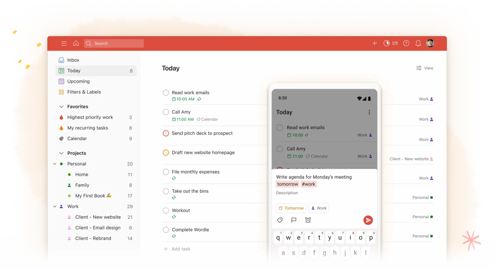
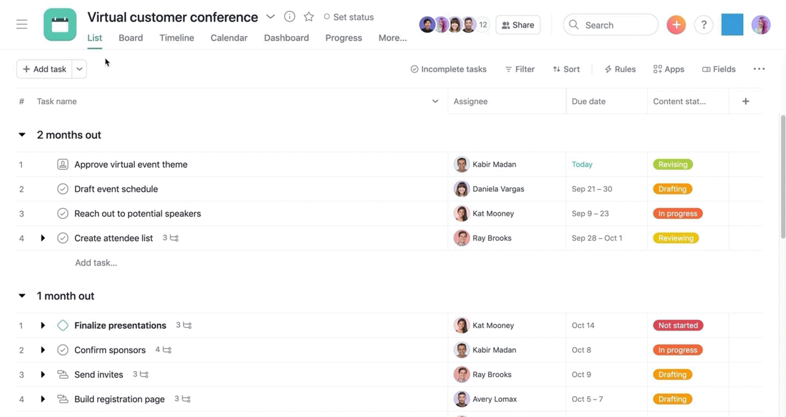
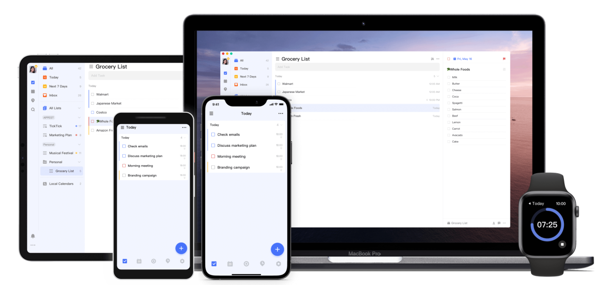
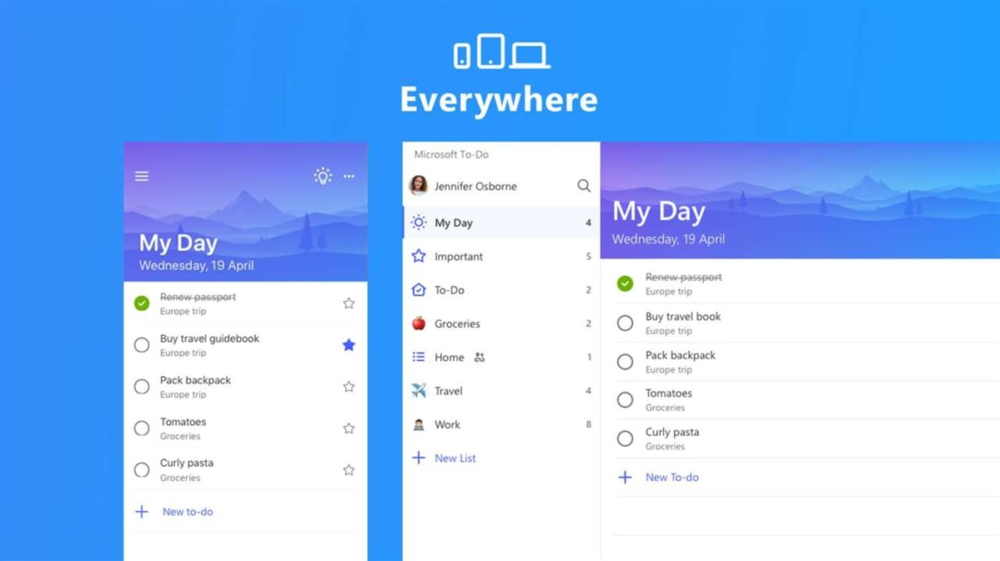
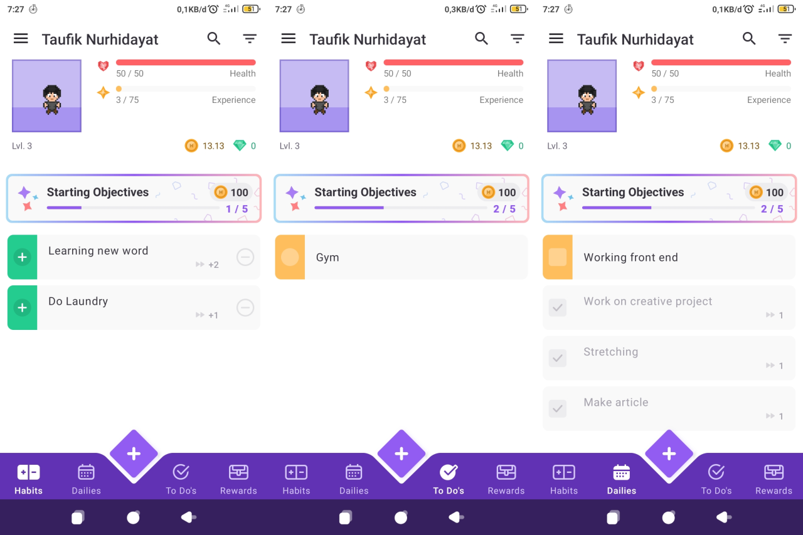

Banyak aplikasi To-Do List dengan berbagai macam fitur dan fungsi yang bisa kamu dapatkan secara gratis maupun berbayar. Kami memilih yang terbaik dan didasarkan pada keunikan masing-masing aplikasi tersebut.

## Apa itu To-Do List?

To-Do atau dalam bahasa Indonesia berarti “melakukan”, sedangkan “To-Do List” bisa kita artikan sebagai daftar yang akan atau harus dilakukan. Untuk membuat list to-do kamu bisa menulis atau mencetak nya di kertas lalu bisa kamu tempel di dinding atau dibawa. Lebih praktis lagi dengan aplikasi to-do yang bisa di Install di smartphone atau komputer kamu.

Dengan adanya To-Do List kegiatan-mu akan lebih terorganisir juga akan mengingatkan kamu jika lupa dengan apa yang akan kamu lakukan karena mungkin kamu terlalu sibuk. To-Do List bisa digunakan dalam pekerjaan maupun kegiatan sehari-hari.

Contohnya kamu pergi ke pasar untuk membeli banyak barang, supaya kamu tidak lupa kamu membawa secarik kertas bertuliskan daftar barang belanjaan. Ketika kamu selesai membeli suatu barang maka kamu coret nama barang dalam kertas tersebut, sehingga kamu tidak akan lupa dengan apa yang akan kamu beli.

## Todoist

**Harga**: Gratis | $3/bulan | $6/bulan

**Untuk**: Pengguna individu dan tim kecil.

**Platform**: Android, IOS, Windows, Linux, Mac, Web, Wearable

Todoist adalah aplikasi To-Do dengan banyak fitur namun mudah digunakan. Todoist bukan yang paling efektif jika digunakan untuk keperluan tim besar, namun sangat efektif bagi pengguna individu atau tim kecil. Todoist tersedia di semua perangkat yang ada sekarang, baik mobile dan desktop maupun ekstensi browser dan wearable. Todoist adalah aplikasi To-Do paling populer ketika postingan ini dibuat.

Kamu bisa menambahkan tugas dengan cepat disertai waktu yang akan dilaksanakan. Misalkan menambahkan tasks “Membuat To-Do every day at 19”, maka akan membuat tugas untuk dilakukan setiap hari pada pukul 19.00. Ketika kamu bingung mau menempatkan tugas mu dimana maka kamu bisa menyimpan tugas tersebut di bagian Inbox, yang nantinya bisa kamu pindahkan ke bagian yang dirasa tepat.

Kamu bisa menambahkan label dan prioritas suatu tugas. Kamu juga bisa menampilkan daftar tugasmu dalam bentuk List atau Board dan bisa menyortir daftar tugasmu berdasarkan prioritas, waktu atau alpabet. Versi pro dari todoist dihargai $4/bulan dan versi bisnis seharga $6/bulan, dengan limit ditingkatkan dan fitur reminder serta fungsi auto backup juga beberapa manfaat lainnya.

## Asana

**Harga**: Gratis | $10.99 | $24.99

**Untuk**: Tim dengan alur kerja lebih kompleks

**Platform**: Android, iOS, Windows, Mac, Web

Jika untuk tim dengan proyek yang lebih rumit maka sangat cocok dengan aplikasi asana. Aplikasi To-Do yang satu ini dikhususkan untuk tim yang mengatur alur kerja secara real time dan tugas yang diberikan dari orang ke orang. Asana mungkin tidak cocok bagi pengguna individu meskipun masih bisa digunakan.

Meski sedikit membingungkan saat pertama kali menggunakan asana, tapi hal ini sebanding dengan fitur yang ditawarkan. Asana dapat kamu install secara gratis ataupun langsung di akses dari website asana.

## TickTick

**Harga**: Gratis | $27.99/tahun

**Untuk**: pelacakan waktu dan kalender

**Platform**: Android, iOS, Windows, Mac, Web, Apple Watch

Bagi kamu yang suka menunda-nunda aktivitas maka TickTick sangat cocok. Dengan fitur timer dan kalender yang terintegrasi dengan aplikasi ini, sangat cocok dengan metode GTD (Get Things Done) atau Pomodoro.

TickTick juga menawarkan fitur habit tracker, dengan fitur ini kamu bisa membuat kebiasaan baru dan menampilkan statistik dari kebiasaan yang telah kamu lakukan.

## Microsoft To Do

**Harga**: Gratis

**Untuk**: integrasi produk microsoft

**Platform**: Android, iOS, Windows, Mac, Web

Anda pengguna produk microsoft? Mungkin aplikasi Microsoft To Do cocok untukmu, aplikasi ini bisa terintegrasi dengan Outlook, Office 365, Cortana dan produk Microsoft lainya. Pertimbangkan aplikasi yang satu ini jika ingin mendapatkan integrasi dengan Microsoft, karena tidak ada yang spesial dari Microsoft To Do kecuali integrasi tersebut dan tampilan yang bagus.

## Habitica

**Harga**: Gratis

**Untuk**: membuat tugasmu lebih menyenangkan

**Platform**: Android, iOS

Berbeda dengan aplikasi To-Do List lainya, habitica memiliki gaya sendiri. Dalam aplikasi ini kamu akan seperti bermain game RPG, namun kamulah karakter utama dalam game tersebut. Seperti slogan aplikasinya “Gamify Your Tasks”, buatlah tugasmu seolah dalam sebuah permainan.

Di Habitica, terdapat 4 menu Utama Habits, Dailies, Todo's dan Reward. Menu Habits berfungsi sebagai pembuat kebiasaan baru, Dailies berfungsi untuk tugas yang kamu lakukan secara berulang, sedangkan Todo's berfungsi untuk tugas yang kamu lakukan sekali saja dan Reward adalah hadiah yang kamu dapatkan dari menyelesaikan tugas dan kebiasaan.

## Pilihan Aplikasi To-Do List Lainya

Memilih aplikasi To-Do List tidak bisa berdasarkan rekomendasi saja, kamu juga harus mencobanya sendiri karena aplikasi ini bisa bersifat privasi. Mungkin kamu juga bisa mencoba aplikasi opsional lainya:

1.  **Google Tasks**: Untuk pengguna produk google dan hanya memerlukan aplikasi To-Do List sederhana.
    
2.  **Trello**: Untuk manajemen alur kerja, alternatif asana.
    
3.  **OmniFocus dan Things**: Untuk pengguna produk Apple.
    
4.  **Notion**: Pengatur produktivitas dan pembuat catatan, alternatif lain asana.
    

Apakah kamu sudah memilih aplikasi To-Do List yang kami rekomendasikan? Mungkin kami tidak bisa menyebutkan semua aplikasi To-Do List di luar sana mengingat keterbatasan kami, apabila ada aplikasi To-Do List luar biasa diluar sana silahkan tuliskan di komentar.