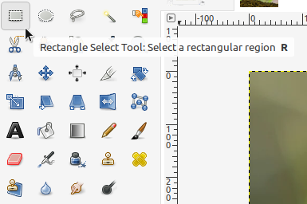
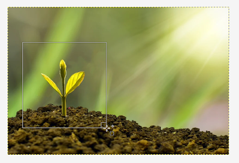
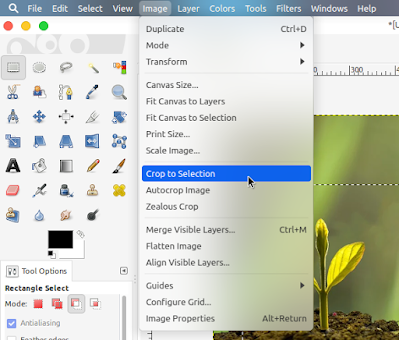
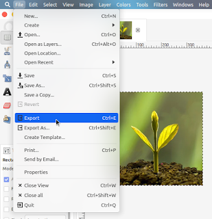
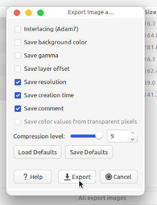
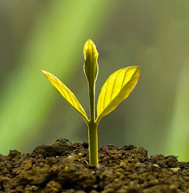

Pada kali ini kita akan memotong gambar dengan menggunakan GIMP. Caranya sangat mudah, namun mungkin dari kalian yang membaca postingan ini tidak tahu cara memotong atau crop gambar dengan GIMP.

## Buka GIMP dan Open File

Anda haru membuka dulu GIMP dan open file gambar yang akan anda crop atau potong.

## Pilih Rectangle Selection Tool

Setelah anda membukanya filih Rectangle Selection Tool.

## Pilih Area yang Akan Dipotong atau Crop

Klik dan tahan lalu seret untuk memilih area yang akan di crop / potong. Jika ingin kotak seleksi berbentuk persegi sempurna gunakan **Shift** saat menyeret.

## Potong Gambar

Potong gambar dengan cara klik Image > Crop to Selection pada menu bar.

## Export Hasil

Export gambar yang sudah dipotong / crop tadi dengan cara klik File > Export lalu filih folder dan klik export.

  

## Buka File Hasil Export

Buka file hasil crop atau potongan gambar tadi.

<table><tbody><tr><td colspan="1" rowspan="1"></td></tr><tr><td colspan="1" rowspan="1">
Hasil Akhir
</td></tr></tbody></table>