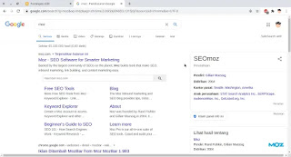
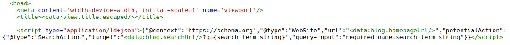

**Sitelink Search Box** atau dalam bahasa Indonesia disebut Kotak Penelusuran Sitelink akan membuat web atau blog mu memunculkan search box di halaman pencarian google.

## Fungsi Utama Sitelink Search Box

Dengan menambahkan sitelink search box, akan memudahkan orang untuk menelusuri web kamu langsung dari pencarian Google. Coba cari moz di google, maka kamu akan melihat sitelink search box di bawah nama web moz dan kotak penelusuran sitelink tersebut akan menyarankan kontent untuk pengguna.



Tanpa menambahkan schema sitelink search box terlebih dahulu pun situs web kamu tetap akan memunculkanya secara otomatis, kecuali kamu memasang meta tag nositelink. Namun lebih baik untuk menambahkannya supaya bot google lebih paham dengan blog kamu.

## Cara Memasang

Untuk memasang sitelink search box kamu bisa mengikuti cara berikut.

Buka blogger dan silahkan buka bagian Tema klik pada bagian sebelah kanan tombol sesuaikan dan  Edit Html.

Silahkan copy kode berikut dan pastekan diantara tag \<head> dan \</head>.

```
<script type="application/ld+json">{"@context":"https://schema.org","@type":"WebSite","url":"<data:blog.homepageUrl/>","potentialAction":{"@type":"SearchAction","target":"<data:blog.searchUrl/>?q={search_term_string}","query-input":"required name=search_term_string"}}</script>
```

Contohnya seperti berikut.



Sekarang save dan silahkan cek di [Google Rich Search Result Test](https://search.google.com/test/rich-results) apakah sudah benar atau belum.

## Akhir Kata

Sekian dari saya semoga bermanfaat untuk tutorial Cara Memasang Sitelink Search Box di Blogger.