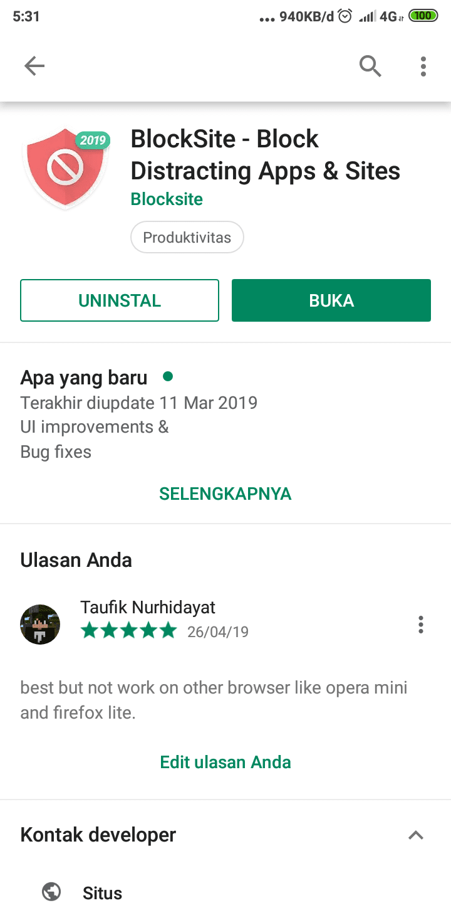
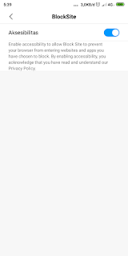
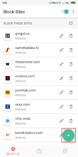
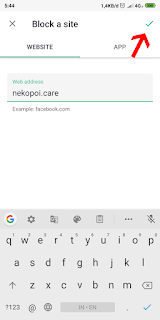
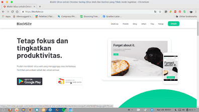
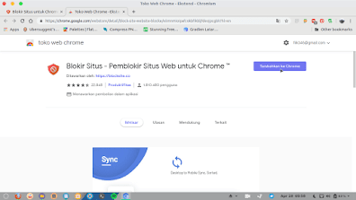
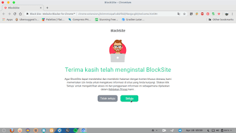
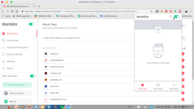
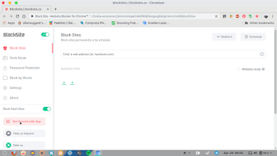
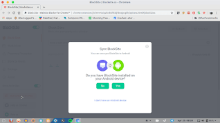

Terkadang kita mungkin kesal dengan sebuah situs web yang sering kita kunjungi, misalkan web tersebut malah membuat kita tidak fokus dengan apa yang sedang kita kerjakan, atau mungkin kita malah nyasar ke situs porno. Untuk mengakali hal tersebut adalah dengan cara memblokir url dari web tersebut. Untuk memblokir url tersebut lakukan langkah berikut:

## Memblokir Url Situs Web di Smartphone

Buka play store di smartphone android mu dan install BlockSite.

Buka aplikasinya dan akan ada arahan untuk mengaktifkan aksebilitas bagi aplikasi BlockSite. Silahkan klik "Go to Setting" dan cari BlockSite lalu aktifkan.

Tambahkan url yang akan diblokir.

Jika sudah klik centang.

Sekarang url yang anda blokir akan menampilkan peringatan jika dibuka. 

## Memblokir Url Situs Web Pada PC

Untuk memblokir url pada PC kalian harus memastikan bahwa kalian adalah pengguna chrome, dan ikuti langkah berikut:

Buka [BlockSite.co](http://BlockSite.co) pada browser dan klik available for chrome extension.

Tambahkan ekstensi BlockSite dari Chrome Webstore.

Setujui kebijakan privasi dari ekstensi tersebut.

Sekarang anda sudah bisa memblokir situs web dengan ekstensi ini pada google chrome. 

## Mengaktifkan Fitur Sync

Perlu diketahui bahwa fitur sync ini memungkinkan tersinkronisasinya antar perangkat, untuk menggunakan fitur ini silahkan ikuti langkah berikut.

Silahkan klik ikon blocksite di atas kanan browser, dan akan muncul popup blocksite maka klik icon setting / gear.

Selanjutnya klik pada Not sync with app.

Sekarang klik yes.

Nanti akan muncul QR Code. Scan QR Code tersebut dengan aplikasi yang ada pada smartphone dengan cara tap ikon 3 titik pada pojok kanan atas>Setting>Sync BlockSite> Scan lalu scan QR Code tadi.

Begitulah cara untuk memblokir url atau web pada smartphone maupun pc, ada juga fitur memblokir aplikasi dan konten dewasa yang sangat penting sehingga anda tak perlu cemas kalau tiba-tiba membuka konten dewasa. Meskipun masih banyak cara, namun itulah cara yang paling simple menurut saya.