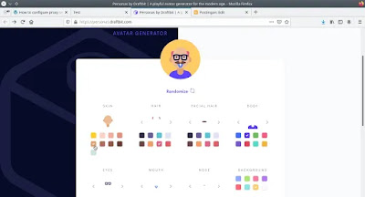
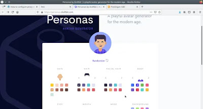

Avatar merupakan gambar profil dari sebuah akun yang ada pada internet, avatar sering digunakan sebagai ganti dari gambar manusia bahkan brand seseorang juga bisa menggunakan avatar.

## Cara Membuat Avatar

Banyak cara untuk membuat sebuah avatar, mulai dari cara manual seperti menggunakan adobe illustrator, coreldraw dan inkscape ataupun dengan cara otomatis dengan menggunakan avatar generator. Kali ini kita gunakan avatar generator dari Draftbit, silahkan buka [personas.draftbit.com](http://personas.draftbit.com).

Sekarang pilih warna kulit seperti berikut.

Pilih juga rambut, bulu di muka, badan, mata, hidung, mulut dan background sesuai keinginan dan hasil saya seperti berikut.

Sekarang klik tombol download avatar dan avatar kamu pun telah berhasil dibuat.