**Blogger API Key** digunakan sebagai autentikasi yang mengidentifikasi apakah akses yang dilakukan bukan orang yang tidak bertanggung jawab.

## APA Itu API Key

API Key atau bisa juga disebut token adalah sebuah kode yang digunakan untuk mengidentifikasi pengguna, pengembang, atau program pemanggil ke situs web.

API Key juga digunakan untuk melacak serta mengontrol bagaimana API digunakan, sehingga mencegah terjadinya penyalahgunaan API.

Begitulah yang saya baca dari [rapidapi.com](http://rapidapi.com).

## APA Itu Blogger API Key

Blogger API Key tentunya sama fungsi dengan API Key itu sendiri. Blogger API Key tidak hanya digunakan untuk Blogger jika kamu menggunakannya untuk beberapa API seperti youtube dan firebase, karena API Key yang diambil adalah API Key Google Cloud Console sehingga satu API Key dalam satu project mencakup semua produk Google Cloud. Jika disetting untuk blogger saja maka API Key tersebut hanya dapat digunakan dengan Blogger API.

## Cara Mendapatkan Blogger API Key

Untuk mendapatkanya kamu harus punya akun google yang terhubung dengan blogger, dimana akun blogger tersebut kamu adalah admin.

### **1\. Membuat Project**

Sekarang buka [Google Cloud Console](https://console.cloud.google.com/), jika kamu pertama kali menggunakan Google Cloud Console, akan muncul Popup seperti berikut. 

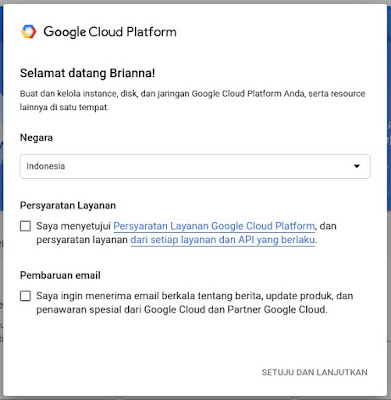

Silahkan pilih negara dan centang persyaratan layanan, kamu juga bisa membaca terlebih dahulu persyaratan layan dengan mengklik link yang tersedia. Jika kamu centang Pembaruan Email, nantinya akan ada newsletter, norifikasi, update produk dan promosi dari layanan google cloud dan partner nya ke Email kamu. Silahkan klik setuju dan lanjutkan jika sudah mencentang persyaratan layanan.

Sekarang kamu klik Pilih project dibagian navbar sebelah kiri dari kolom pencarian.

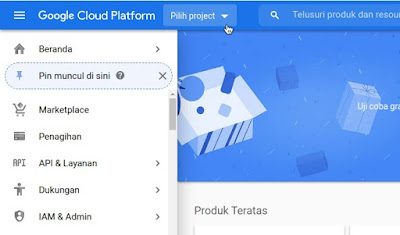

Akan muncul popup baru yang berisi project, jika kamu pernah membuat project disana maka akan terdapat beberapa project. Jika kamu masih baru menggunakan silahkan klik Project Baru yang ada disebelah kanan atas popup

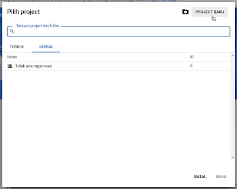

Dan sekarang kamu akan diberi formulir pembuatan project, silahkan isi sesuai keinginan pada nama project dan untuk id project kamu bisa menggunakan default atau disesuaikan.

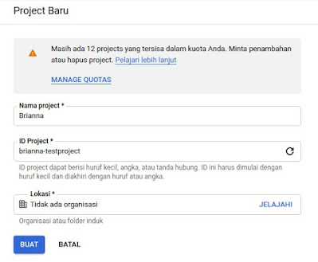

Silahkan klik buat jika selesai mengisi, jika project berhasil dibuat akan muncul notifikasi seperti berikut.

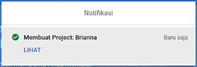

**2\. Membuat Blogger API Key**

Sekarang kamu klik pada bagian API & Layanan lalu klik lagi bagian Library, atau hanya dengan mengarahkan cursor ke bagian tersebut dan pilih Library.

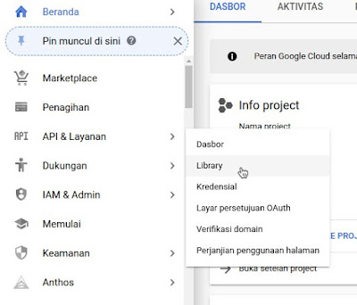

Sekarang isi Blogger pada kolom pencarian, sehingga muncul seperti berikut silahkan klik Blogger API v3

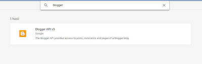

Silahkan klik aktifkan, karena saya sudah mengaktifkan Blogger API v3 jadi tombol sudah berubah menjadi kelola.

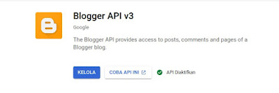

Lalu kita bisa buat kredensial mau dari tombol Buat Kredensial supaya google menyarankan API Key sesuai kebutuhan atau ke bagian Kredensial terlebih dahulu. Tapi disini kita langsung ke Kredensial saja supaya tidak lama.

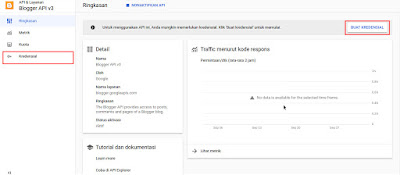

Sekarang klik Buat Kredensial dan klik lagian Kunci API

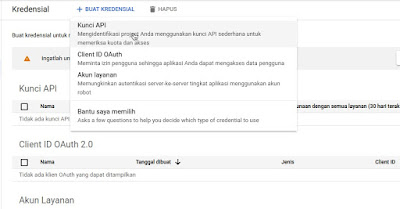

Maka akan muncul popup seperti berikut, bagian yang saya tutupi dengan warna merah adalah API Key yang bisa kamu gunakan nantinya klik batasi kunci untuk membatasi.

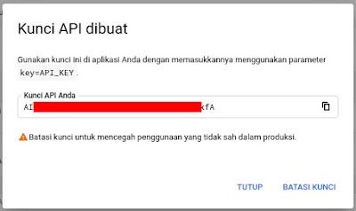

Ikuti video di bawah ini untuk lebih jelasnya, sedangkan untuk bagian kolom item harus domain kamu sendiri. Pada bagian layanan kamu bisa memilih Blogger API v3 atau semuanya.

Setelah disimpan, api key bisa digunakan dan tentunya hanya dari domain kamu. Jika blog kamu masih menggunakan subdomain blogspot juga masih bisa cuma ada sedikit resiko, silahkan dicoba.

## Akhir Kata

Pada postingan mendatang saya akan membuat widget related posts dan juga tombol next prev berdasarkan label, kamu bisa berlangganan email untuk mengetahui update terbaru dari saya.

Mungkin kamu juga perlu membaca postingan ini [Mengenal Blogger API v3](https://www.nurhidayat.web.id/2020/10/mengenal-blogger-api-v3.html)