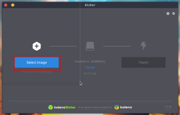
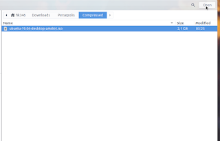
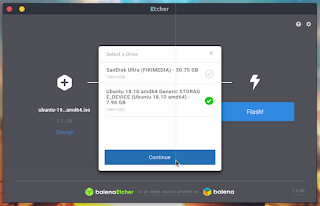
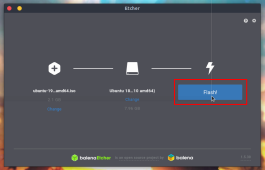
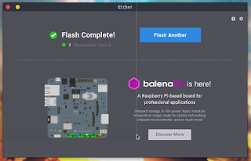

Untuk membuat bootable ubuntu atau berbagai jenis linux lainya cukup mudah. Bahkan yang masih baru dalam hal ini juga bisa melakukanya. Silahkan simak artikel berikut untuk membuat bootable linux ubuntu atau os linux lainya pada usb flashdisk.

## Alat yang diperlukan:

-   Flashdisk dengan kapasitas yang sesuai dengan file iso, jika anda ingin menginstall ubuntu maka kapasitas minimal adalah 8GB.
    
-   balenaEtcher, bisa didownload dari [link ini](https://fiksafe.blogspot.com/2017/01/blusukan-di-rusun-tkbm-agus-yudhoyono.html#?o=d1ab2c03ab30691a971c11b01f097703713c97b0e43560139f756a9f6adcb676b4dad25b10b35499) pastikan sesuai dengan os kamu.
    
-   File iso ubuntu
    
-   PC
    

Langkah untuk membuat bootable:

1.  Masukan USB flashdisk anda yang ingin dibuat bootable, lalu buka balenaEtcher yang sudah didownload tadi. Klik pada yang diberi tanda merah.
    
    
2.  Lalu pilih file iso yang akan di burn ke flashdisk.
    
    
3.  Sekarang pilih flashdisk yang ingin dijadikan bootable dengan cara klik change dan pilih medianya. klik continue.
    
    
4.  Sekarang klik flash dan proses pembuatan bootable ubuntu sedang dimulai.
    
    
5.  Jika pada linux biasanya akan disuruh memasukan kata sandi tapi jika diwindows tidak perlu. Tunggu proses hingga muncul seperti ini.
    
    
6.  Sekarang media bootable sudah selesai dibuat.
    

Begitulah cara membuat bootable linux ubuntu dari usb flashdisk, bukankah cukup mudah?

balenaEtcher sangat cocok dengan file iso linux, untuk file iso windows sebaiknya menggunakan software lain saja.