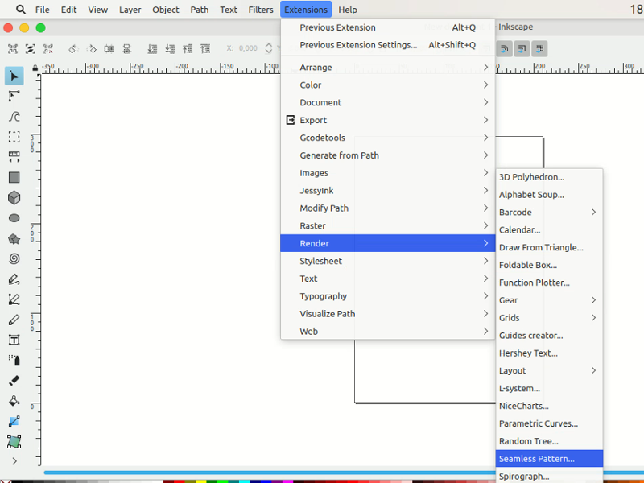
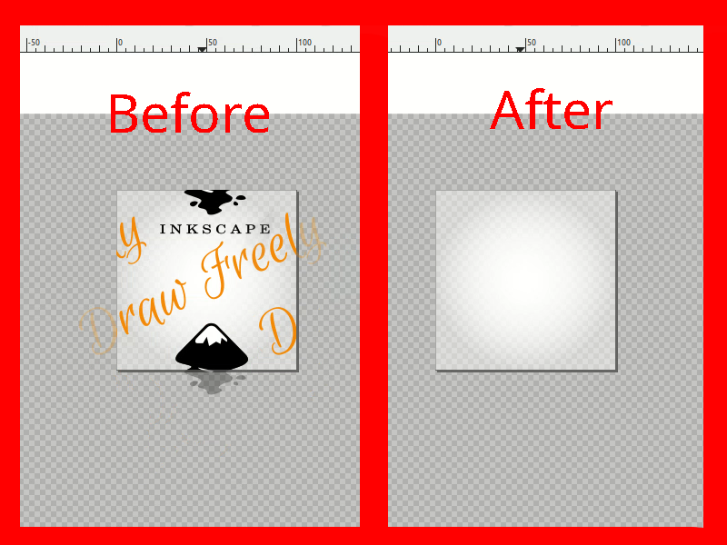
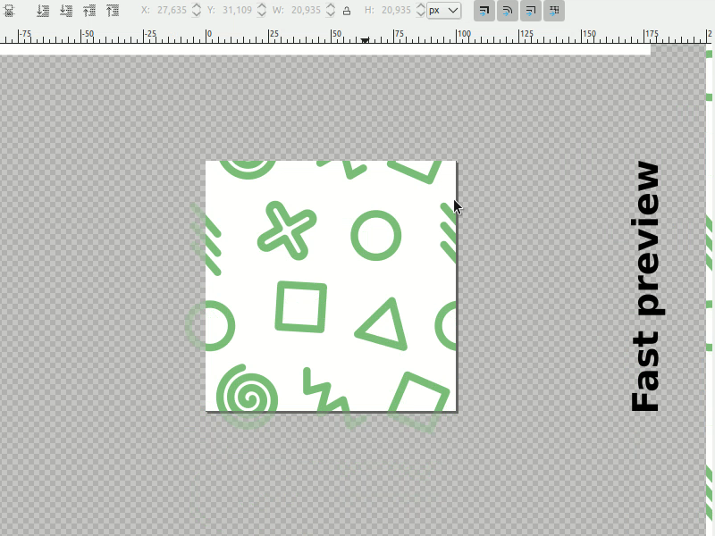
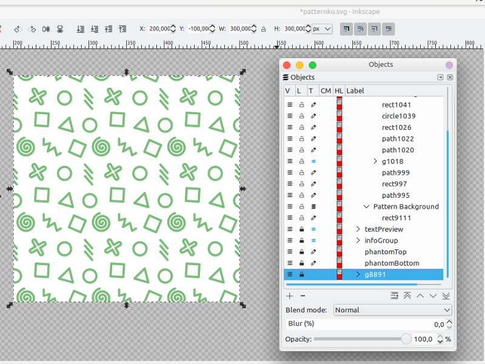
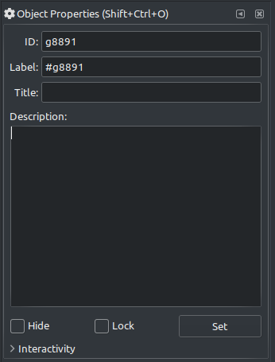
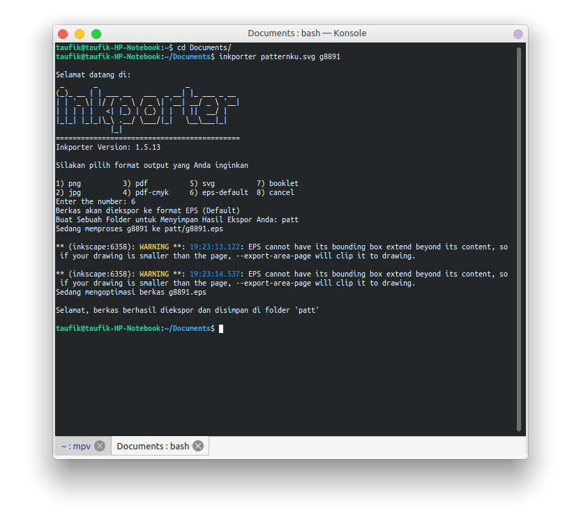

Seamless Pattern merupakan sebuah pola yang bisa berulang horizontal maupun vertikal. Desain ini bisa digunakan untuk background maupun dipakai langsung contohnya pada sebuah bantal. Membuat Desain Seamless Pattern Dengan Inkscape sangat mudah.  
  
Untuk membuat seamless pattern tersebut, pastikan anda sudah menggunakan Inkscape versi terbaru dan anda sudah memasang Inkporter yang bisa dilihat di [https://catatan.raniaamina.id/tools/inkporter](https://catatan.raniaamina.id/tools/inkporter).. Langkah selanjutnya anda bisa mengikuti dibawah ini.  
  
1\. Klik Extensions > Render > Seamless Pattern. Setting ukuran canvasnya, atau biarkan default saja karena tidak berpengaruh lalu Apply dan setelah terender template Seamless Pattern maka tinggal di Close dialognya.



2\. Setelah tampilan muncul silahkan di hapus terlebih dahulu Object yang sudah ada, jangan rubah background terlebih dahulu.



  
3\. Sekarang tambahkan object yang akan anda jadikan pattern jikalau sudah anda tambahkan object maka anda bisa merubah bakground yang berwarna gradient putih tersebut.



  
  
4\. Sekarang lihat di bagian fast preview sebelah kanan, apakah Seamless Pattern buatan anda terlihat bagus? Atau penempatan object terasa kurang? Maka bisa diperbaiki terlebih dahulu. Buka Object > Objects lalu klik pada bagian paling bawah sehingga memunculkan seleksi pada preview setelah itu buka Object > Object Properties lihat nama object id atau bisa anda rubah namanya.  



  
5\. Selanjutnya adalah menggunakan Inkporter untuk mengekspor hasil tadi. Buka terminal lalu open folder dimana Seamless Pattern tadi disimpan dengan menggunakan

```
cd Folder
```

  
6\. Sekarang ketikan perintah berikut

```
inkporter filename.svg objectid
```

  
7\. Pilih extensi apa yang akan anda gunakan dengan mengetikan nomor pilihan dan enter, sebaiknya menggunakan eps default atau svg, untuk memudahkan mengedit kembali Seamless Pattern anda.  
Sekarang buat folder untuk menempatkan hasil export.



Untuk hasil yang lebih baik silahkan buka hasil export Seamless Pattern dari inkporter dengan inkscape dan edit kembali background. Jika hasilnya terdapat garis pemisah maka cukup di duplikat semua object dengan cara Ctrl+A lalu Ctrl+D. Begitulah [Cara Membuat Desain Seamless Pattern Dengan Inkscape](https://www.nurhidayat.web.id/2020/03/cara-membuat-desain-seamless-pattern.html). Bila kurang paham silahkan tanya di komentar!