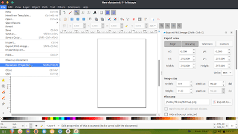
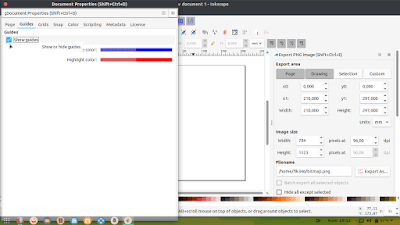
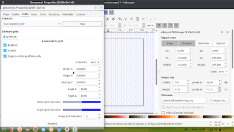
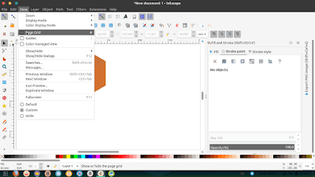

Untuk membuat design isometric di Inkscape cukup mudah, lebih mudah daripada saat membuatnya pada Corel Draw. Kemudahan tersebut ialah kita tak perlu membuat garis guide manual, cukup klik dan jadi. 

  
Lalu bagaimana caranya, ikuti langkah berikut.  
  
\-Buka inkscape dan silahkan klik file>document properties.  

  
\- Centang show guides pada Tab Guides.  
  

  
\- Pindah pada tab Grids, pilih axonometric dan klik new.  
  

  
\- Sekarang silahkan buat design isometric anda sesuai keinginan.  
  
Untuk menghilangkan grids silahkan klik view lalu hilangkan centang pada page grids.  

Jika sudah selesai silahkan anda duplikat semua object, supaya tidak ada garis putih pada setiap pertemuan object. Caranya pilih semua object tekan CTRL+Adan tekanCTRL+D. Selesai.  
  
Untuk membuatnya Anda harus mengandalkan ide kreatif sendiri atau mencoba untuk mencontoh dari yang sudah berpengalaman. Silahkan dipraktikan [Cara Membuat Design Isometric Pada Inkscape](https://www.nurhidayat.web.id/2019/04/cara-membuat-design-isometric-pada.html) dari saya. Mudah-mudahan bermanfa'at.