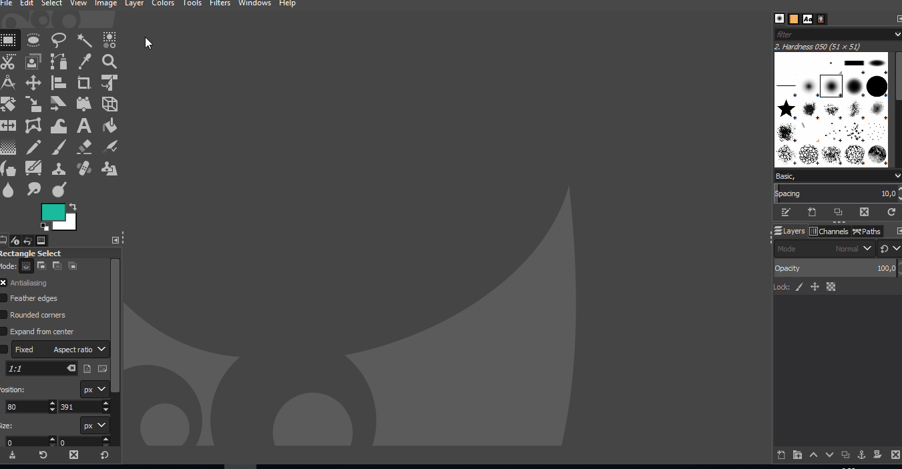
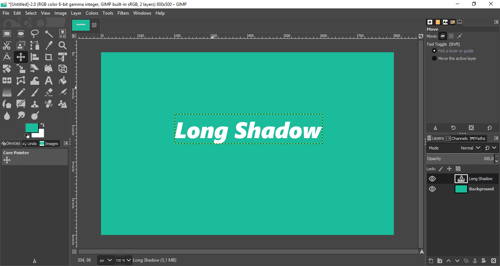
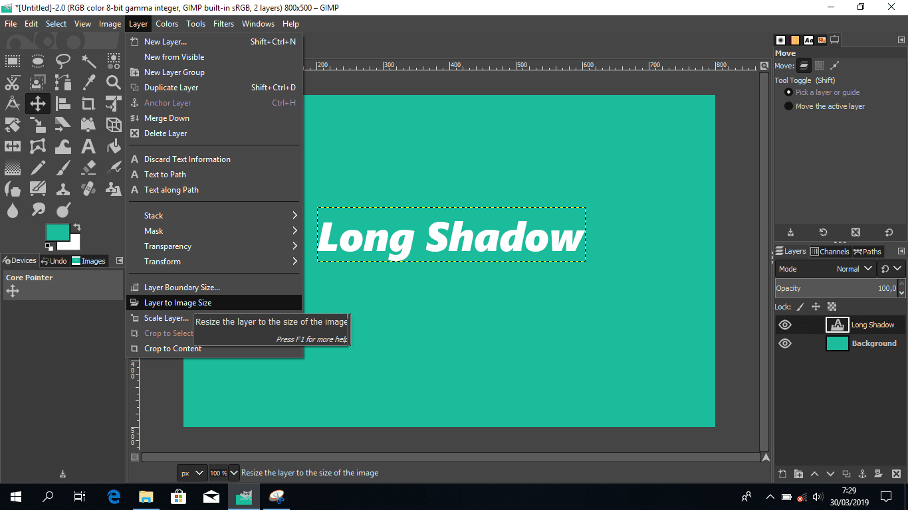
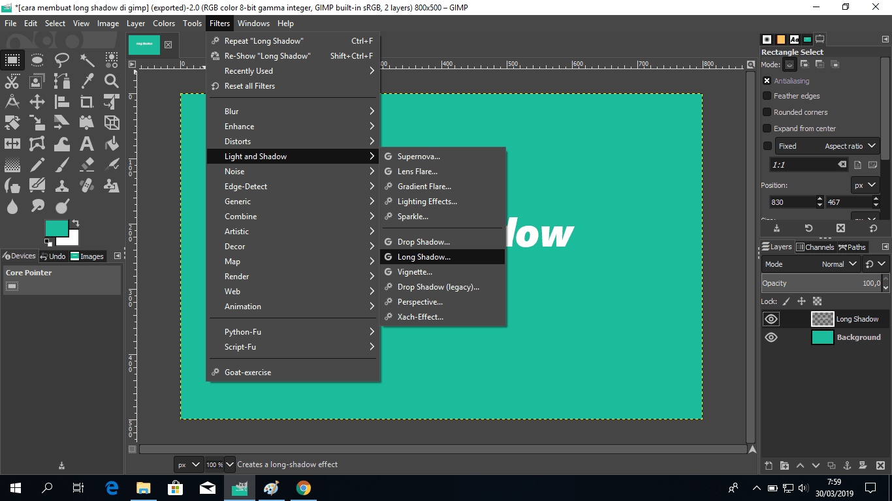
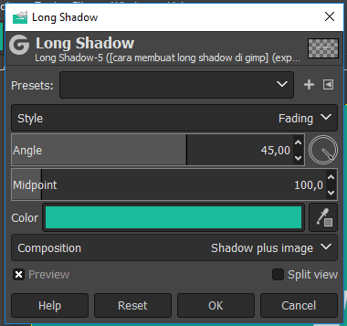
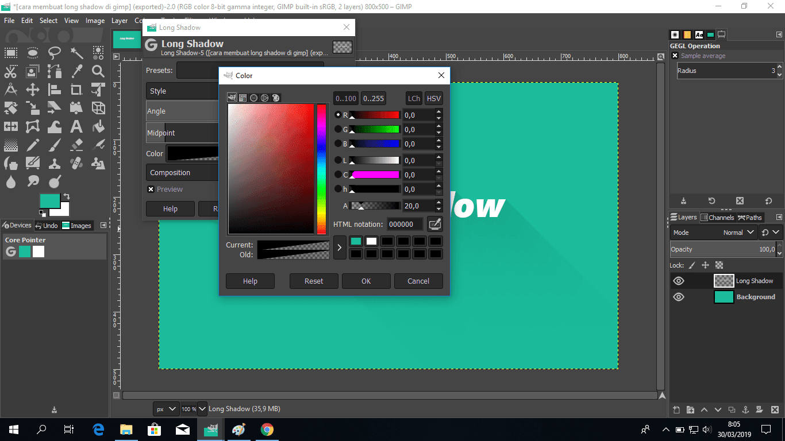
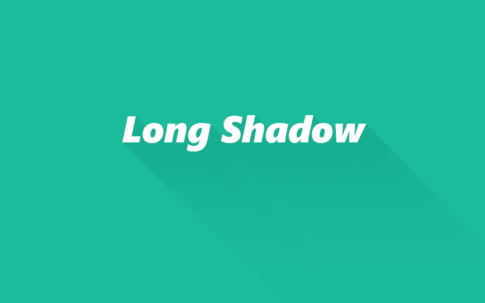

Untuk membuat efek long shadow lebih mudah jika menggunakan gimp. Berbeda dengan photoshop yang terbilang cukup ribet, meskipun ada cara yang lebih cepat juga sih tapi bagi orang awam rasanya cukup ribet aja.  
  
Langkah-langkahnya adalah sebagai berikut:  
  
1\. Buka GIMP  
2\. Buat project baru.

  
3\. Silahkan ubah warna sesuai selera, jika anda tidak menemukan warna yang sesuai bisa kunjungi [flatuicolors.com](http://flatuicolors.com). Sekarang tambahkan teks atau icon sesuai keinginan sebagai objek yang akan mempunyai long shadow.  
  

4.Sekarang ubahlah layernya menjadi sesuai ukuran layarnya. Supaya nantinya long shadow tidak terpotong oleh layer objek. Caranya klik layer>layer to image size, pada toolbar.

  
5\. Sekarang klik leyer object yang akan menampilkan long shadow, klik filter>light and shadow>long shadow.  
  

6.Tambahkan long shadownya, atur style menjadi fading dan warna hitam dengan transparansi (alpha) 20 atau bisa disesuaikan sendiri.  

  

<table><tbody><tr><td colspan="1" rowspan="1"></td></tr><tr><td colspan="1" rowspan="1">
Style fading
</td></tr></tbody></table>

<table><tbody><tr><td colspan="1" rowspan="1"></td></tr><tr><td colspan="1" rowspan="1">
Sesuaikan warna
</td></tr></tbody></table>

<table><tbody><tr><td colspan="1" rowspan="1">

</td></tr><tr><td colspan="1" rowspan="1">

</td></tr></tbody></table>

Nah sekarang tinggal save atau export gambar yang sudah diberi effect long shadow tadi. Seperti ini hasilnya.  

Ya begitulah [cara membuat long shadow pada gimp](https://www.nurhidayat.web.id/2019/03/cara-membuat-effect-long-shadow-di-gimp.html), sangat mudah bukan. Untuk membuat long shadow yang lebih bagus silahkan dikreasikan sendiri.