Highlight atau sorotan pada screenshoot membantu untuk menunjukan sesuatu yang sangat penting pada gambar screenshoot. Sobat bisa menggunakan software gratis seperti GIMP untuk membuat highlight pada gambar screenshoot sobat.

## Tujuan Highlight Screenshoot

Dengan menerapkan Highlight pada gambar screenshoot akan membuat gambar yang ada pada artikel sobat terlihat lebih profesional. Orang yang melihat gambar screenshot pun akan semakin mudah menemukan apa yang sangat penting untuk dilakukan sehingga pembaca blog sobat tidak terlihat bingung dengan screenshoot yang sobat lampirkan karena pembaca mudah menemukan tujuan yang sudah ditandai.

## Contoh Highlight Screenshoot

Sebelumnya kita coba buat perbandingan antara gambar screenshoot yang sudah menerapkan highlight dan belum menerapkan highlight. Coba cari label pada gambar berikut (klik untuk resolusi tinggi). 

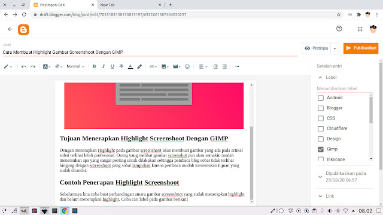

Apalah sobat sudah menemukannya? Berapa lama menemukan kata label? Mungkin bisa cepat bagi yang sudah mengenal tata letak blogger tetapi kecil kemungkinan bagi yang tidak mengenal tata letak blogger untuk menemukan kata label dengan cepat, kenapa? Karena tidak ada tanda atau sorotan mana yang paling penting dan mana yang tidak penting atau kita sebut highlight.

Sekarang coba menemukan kata "Javascript Fundamental" pada gambar screenshoot yang sudah diberi highlight dibawah, supaya sobat tidak familiar dengan gambar diatas maka gambarnya saya rubah dengan gambar yang berbeda.

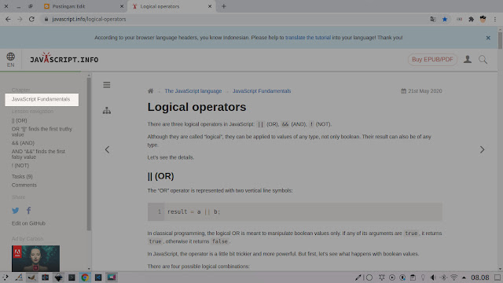

Apakah sudah menemukanya? Seberapa cepat? Sangat cepat? Saya yakin sobat menemukanya dalam sekejap, kecuali (mohon maaf) ada masalah penglihatan pada mata sobat. Karena bagian yang diberi tanda atau highlight akan terlihat berbeda dari yang lain sehingga mata langsung terfokus pada gambar yang diberi highlight. Bukankah dengan menerapkan highlight akan membuat pembaca blog sobat menjadi lebih nyaman?

## Kenapa Menggunakan GIMP?

Alasan saya menggunakan GIMP adalah gratis, ya GIMP adalah software open source yang bebas sobat gunakan sebebas mungkin bahkan merubah software itu sendiri jika sobat bisa tentunya. Selain itu GIMP bisa digunakan di semua sistem operasi Desktop yang ada mulai dari Windows, MacOS dan Linux. Sebagai pengguna Linux tentu saja saya lebih suka menggunakan GIMP daripada software berbayar Photoshop, photoshop sendiri bukan tidak mungkin untuk di Install di Linux karena terdapat [Cara Menjalankan Aplikasi dan Game Windows pada Linux](https://www.nurhidayat.web.id/2020/02/cara-menjalankan-aplikasi-dan-game.html) tetapi saya tidak mau ribet dan tentu lebih memilih open source daripada bajakan. Selain itu GIMP lebih ringan dijalankan daripada Photoshop dan ukuranya tidak besar untuk dipasang di komputer sobat.

## Cara Membuat Highglight pada Gambar Screenshoot

Karena kita menggunakan GIMP maka sobat harus pastikan mempunyai GIMP terlebih dahulu, jika belum silahkan sobat buka halaman [GIMP](https://www.gimp.org/).

Sekarang buka GIMP sobat, dan buka file gambar yang ingin sobat berikan highlight pada gambar sobat dengan mengakses menu File>Open atau bisa juga menggunakan shortcut **Ctrl**+**O**.

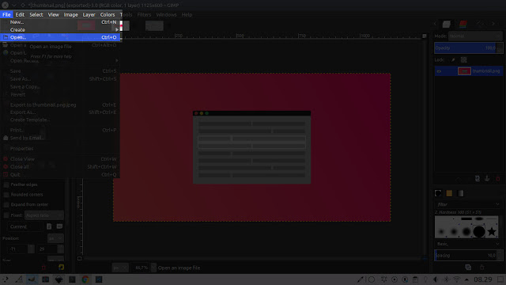

Bila sobat memiliki screenshoot yang sudah ada di clipboard sobat juga bisa menggunakan gambar tersebut sebagai gambar baru dengan cara mengakses menu Edit > Paste as > Paste as New Image bisa juga dengan shortcut **Ctrl**+**Shift**+**V**.

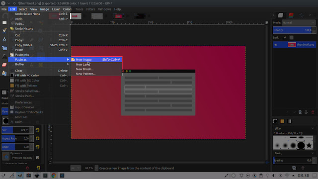

Lalu pilih tool rectangle bisa dengan shortcut R.

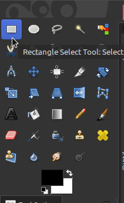

Sekarang sobat seleksi bagian yang ingin di beri tanda sorot atau highlight pada gambar.

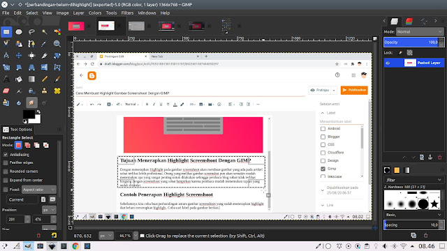

Sekarang invert seleksi dengan mengakses Select > Invert dan juga bisa diakses dengan Shortcut **Ctrl**+**I**.

Karena sudah menggunakan invert maka yang awalnya terseleksi menjadi tidak terseleksi begitupun sebaliknya. Sekarang silahkan sobat pilih tool Paint Brush bisa juga menggunakan shortcut P, tools ini akan kita gunakan untuk memberi warna gelap kebagian yang tidak diberi highlight.

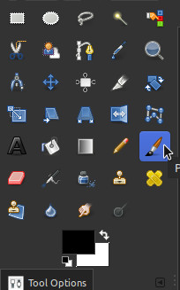

Setting tool pada bagian Tool Options dengan opacity 50%, untuk brush pilih yang tidak memiliki blur atau solid dan bagian size bisa disesuaikan dengan kebutuhan, fungsi opacity memungkinkan bagian gambar yang tidak diberi highlight masih bisa dibaca dan brush solid mempercepat kita untuk memberikan warna gelap pada gambar. Bisa lihat gambar berikut.

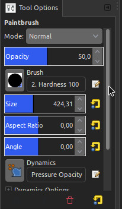

Silahkan terapkan brush seperti sobat mencorat-coret buku pada bagian semua gambar tapi ketika klik tahan dan jangan pernah dilepas kliknya sebelum semua bagian yang tidak diberi highlight terwarnai jika dilepas dan dilanjutkan maka warna tadi akan tertimpa dengan warna yang baru sehingga memiliki 2 layer warna dan warna pada bagian yang tidak diberi highlight tidak rapi.

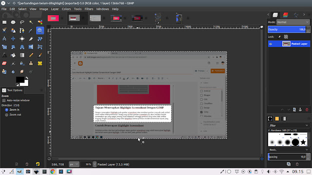

_Contoh paint brush highlight yang rapi_

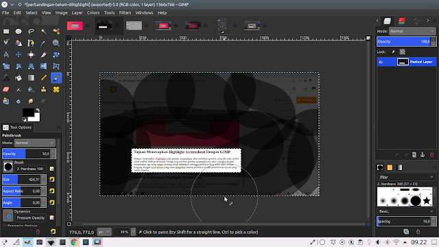

_Contoh paint brush highlight tidak rapi_

Sekarang tinggal export supaya hasil dari higlight gambar screenshoot tersebut bisa digunakan pada artikel di blog sobat. Caranya akses File > Export atau Export As bisa menggunakan shortcut **Ctrl**+**E** atau **Shift**+**Ctrl**+**E**.

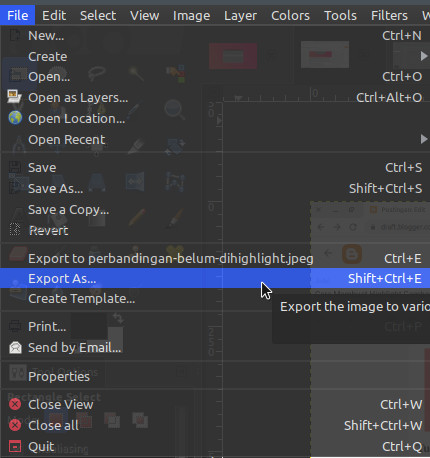

Gunakan format JPEG supaya lebih ramah untuk loading blog, karena jpeg ukuranya lebih kecil daripada png sehingga cepat terbuka ketika diterapkan di blog.

## Akhir Kata

Semoga tutorial membuat higlight gambar dengan gimp ini bisa bermanfaat bagi sobat yang membaca. Terimakasih..