Di postingan kali ini saya akan membagikan tutorial membuat json endpoint (API) dari sebuah data google spreadsheet yang mana data tersebut berasal dari google form. Jadi yang pertama harus dilakukan adalah membuat form atau formulir dari google form.

langsung saja, pertama buka [drive.google.com](http://drive.google.com) . lalu klik tombol baru.

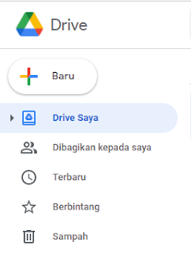

setelah itu klik tambah google formulir, lalu pilih formulir kosong.

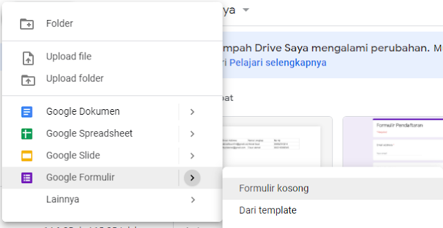

kemudian buat sebuah formulir misalkan, formulir Nama.

Tampilan awal :

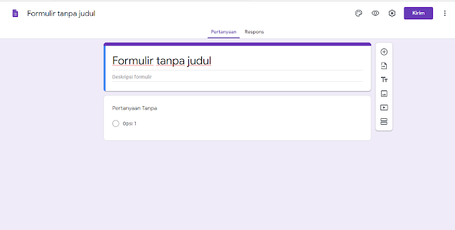

Misalnya menjadi seperti dibawah :

\* untuk menambahkan form input yang lain, bisa dengan mengklik tombol plus di sebelah kanan form.

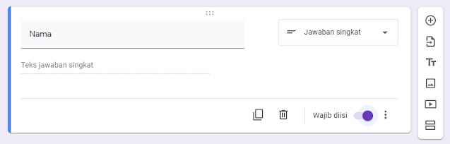

setelah selesai membuat form, lalu klik tombol kirim yang berada disebelah kanan atas. nanti akan muncul tampilan seperti dibawah ini :

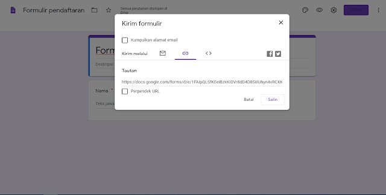

\* untuk link bisa langsung disalin atau dicopy, atau pun bisa diperpendek URL nya supaya lebih baik dan ringkas.

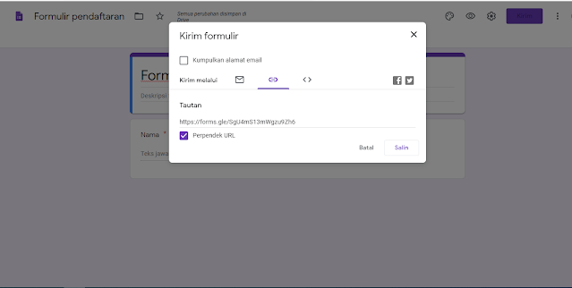

setelah mengcopy atau menyalin URL nya, lalu pastekan di browser anda. nanti akan muncul tampilannya seperti pada gambar dibawah ini:

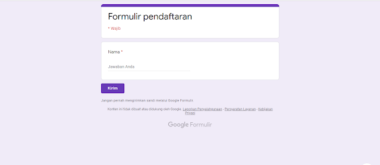

lalu isi misalkan Nama Akmal, setelah diisi kemudian klik kirim. setelah mengklik tombol kirim lalu kembali ke tampilan dimana menginputkan formulir atau soal.

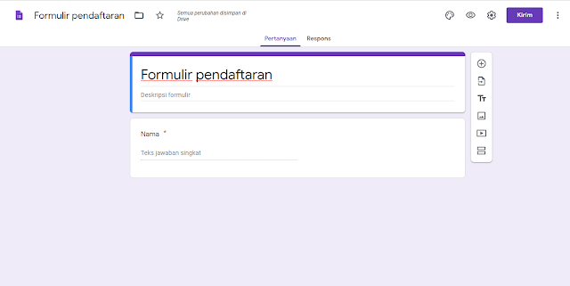

Klik tab respon disebelah tab pertanyaan. semua yang diinput sebelumnya akan muncul disini. Tampilannya akan seperti dibawah ini:

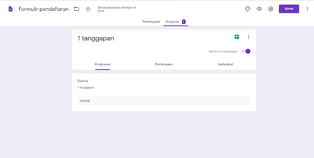

kemudian klik tombol spreadsheet (seperti tanda plus) yang berwarna hijau, maka akan muncul popup seperti dibawah ini:

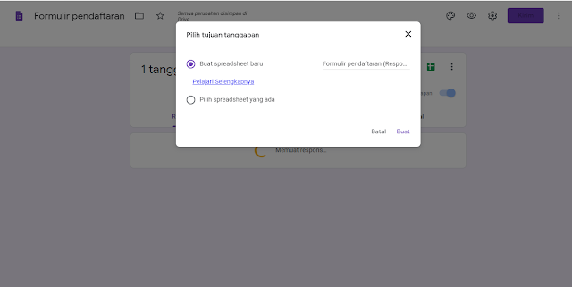

Klik buat, maka akan muncul tampilan spreadsheet :

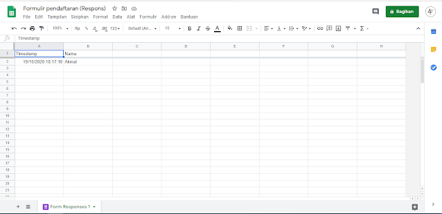

Klik file lalu pilih publishkan di web :

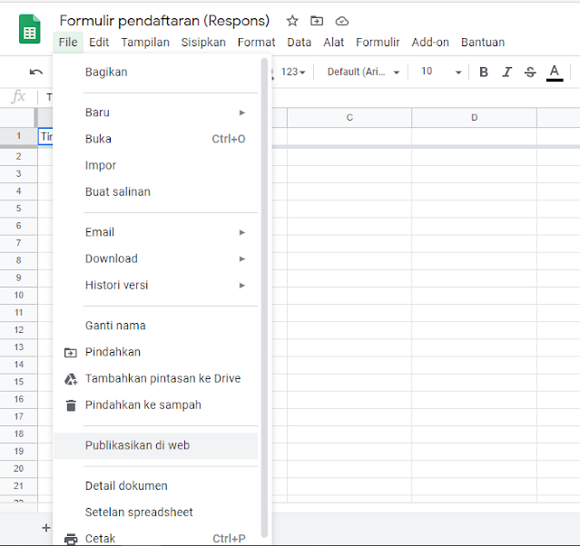

Lalu klik publikasikan.

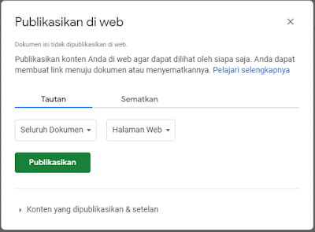

Klik ok.

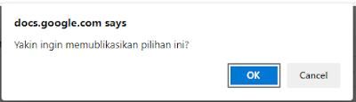

Kemudian buka lagi tampilan spreadsheet yang tadi.

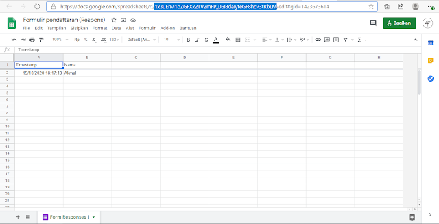

\* Salin Id yang ditandai warna biru tersebut. lalu masukkan id tersebut ke url seperti dibawah ini:

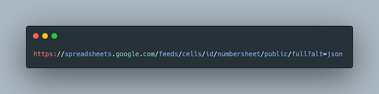

\* ubah id dan numbersheet. **id** berasal dari yang sebelumnya disalin dan untuk numbersheet bisa diisi dengan **1.**

[**Contoh Lengkap**](https://spreadsheets.google.com/feeds/cells/1x3uErM1oZGFXk2TV2mFP_06I8daIyteGF8hcP3tRbLM/1/public/full?alt=json)

Setelah selesai lalu buka url tersebut maka tampilannya akan muncul tampilan seperti dibawah ini:

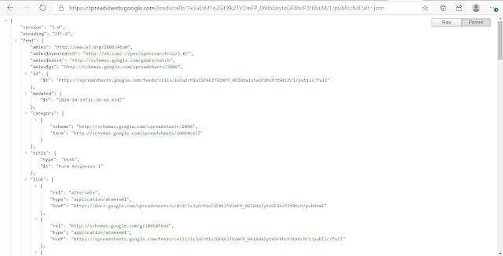

Selesai. sampai berjumpa di artikel berikutnya.