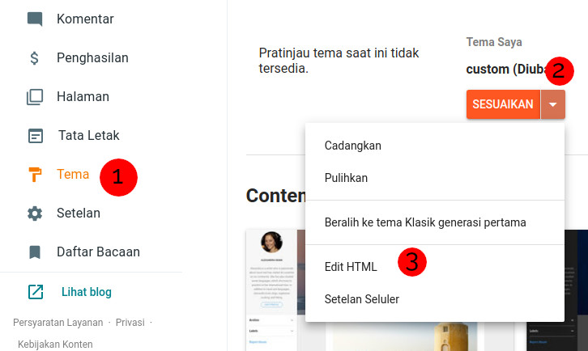
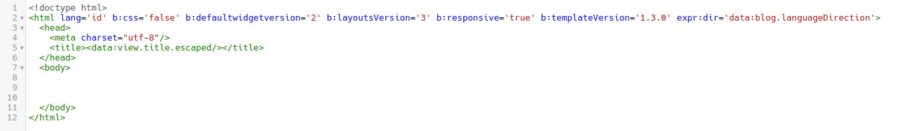
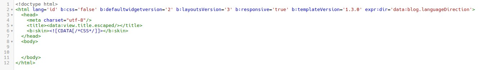
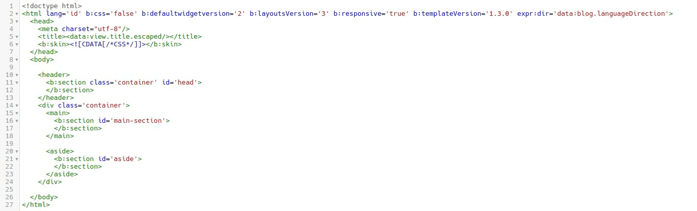
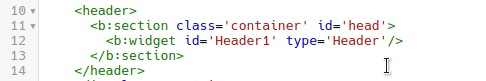
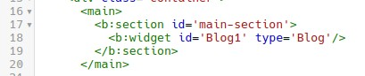

<iframe class="youtube" loading="lazy" width="640" height="360" allowfullscreen="false" src="https://www.youtube.com/embed/zTgkVvCnVyQ" start="0"></iframe>

Blogger adalah platform blogging gratis yang disediakan oleh Google. Di blogger terdapat yang namanya sebuah template atau bisa juga disebut tema. Template tersebut dijadikan sebagai tampilan blog kamu nantinya, template tersebut juga bisa mengatur tata letak supaya terlihat lebih rapi. Kamu bisa membuat template blogger atau menggunakan yang sudah jadi dan banyak bertebaran di internet.

## Persiapan

Sebelum membuat template blogger, kamu harus mempunyai pengetahuan berikut.

1.  HTML
    
2.  CSS (Dasar)
    
3.  Javascript (Opsional)
    

HTML sangat penting dan untuk css kamu bisa menggunakan css framework seperti Bootstrap. Untuk javascript hanyalah opsional, jika ingin tampilan kamu lebih interactive maka kamu juga harus bisa javascript.

## Pengenalan

Saya anggap kamu sudah mengetahui dasar HTML dan CSS, jika belum silahkan dipelajari terlebih dahulu. Untuk membuat template blogger dari nol kamu akan mengikuti beberapa tahap, sedangkan untuk yang saya bahas kali ini masih hanya dasar. Sebelum mengedit template, kamu harus mengetahui beberapa hal berikut.

### **Pengetahuan Dasar Tag Blogger**

Sebelum mengedit template kamu perlu mengetahui tag dasar terlebih dahulu, berikut yang akan kita pelajari.

Bagian style adalah bagian CSS yang nantinya akan kamu gunakan untuk mengubah tampilan dari halaman blog mu. Bagian style di tulis bukan dengan `<style> /* CSS */ </style>` tetapi dengan `<b:skin> /* CSS */ </b:skin>`.

#### **Bagian Section.**

Bagian Section ini adalah bagian yang nantinya akan ditempatkan bagian Widget. Berikut adalah contohnya.

```
<b:section id='main'></b:section>
```

Setiap section hanya diperbolehkan memiliki 1 id yang unik saja, artinya kamu tidak bisa menempatkan 2 section dengan id yang sama, contoh yang salah seperti berikut.

```
<b:section id='main'></b:section>
<b:section id='main'></b:section>
```

Contoh yang benar adalah seperti berikut.

```
<b:section id='head'></b:section>
<b:section id='main'></b:section>
```

Dalam bagian section kamu bisa menerapkan beberapa atribut dengan berbagai fungsi sebagai berikut.

<table><tbody><tr><td colspan="1" rowspan="1"><p>Attribut</p></td><td colspan="1" rowspan="1"><p>Jenis</p></td><td colspan="1" rowspan="1"><p>Fungsi</p></td></tr><tr><td colspan="1" rowspan="1"><p><code>id</code></p></td><td colspan="1" rowspan="1"><p>string</p></td><td colspan="1" rowspan="1"><p>ID dari section, harus unik (wajib)</p></td></tr><tr><td colspan="1" rowspan="1"><p><code>max-widgets</code></p></td><td colspan="1" rowspan="1"><p>boolean</p></td><td colspan="1" rowspan="1"><p>Jumlah maksimal widget yang akan tampil</p></td></tr><tr><td colspan="1" rowspan="1"><p><code>class</code></p></td><td colspan="1" rowspan="1"><p>string</p></td><td colspan="1" rowspan="1"><p>Class yang digunakan</p></td></tr><tr><td colspan="1" rowspan="1"><p><code>cond</code></p></td><td colspan="1" rowspan="1"><p>string</p></td><td colspan="1" rowspan="1"><p>Untuk menerapkan tag kondisional blogger</p></td></tr><tr><td colspan="1" rowspan="1"><p><code>locked</code></p></td><td colspan="1" rowspan="1"><p>boolean</p></td><td colspan="1" rowspan="1"><p>Mengatur apakah section bisa menambahkan widget atau tidak</p></td></tr><tr><td colspan="1" rowspan="1"><p><code>tag</code></p></td><td colspan="1" rowspan="1"><p>string</p></td><td colspan="1" rowspan="1"><p>Mengatur nama tag yang nantinya muncul saat render html</p></td></tr><tr><td colspan="1" rowspan="1"><p><code>name</code></p></td><td colspan="1" rowspan="1"><p>string</p></td><td colspan="1" rowspan="1"><p>Nama section yang akan muncul saat di tata letak</p></td></tr></tbody></table>

Contoh penerapan kode

```
<b:section id='id-main' class='main' name='Main Section' tag='main></b:section>
```

Akan menghasilkan sebagai berikut.

```
<main id="id-main" class="main" name="Main Section"></main>
```

#### **Bagian Widget**

Bagian ini nantinya akan merender bagian penting, tipe yang tersedia sama dengan yang bisa kamu temukan di tata letak > tambah widget. Tipe yang tersedia adalah Blog, AdSense, Attribution, BlogArchive, BloggerButton, BlogList, BlogSearch, ContactForm, FeaturedPost, Feed, FollowByEmail, Followers, Header, HTML, Image, Label, LinkList, Navbar, PageList, PopularPosts dll. Bisa membaca dokumentasi lengkap di [Blogger Code Gadget Introduction](https://bloggercode-blogconnexion.blogspot.com/2019/02/widget-intro.html)

Selain itu terdapat atribut juga seperti pada bagian Section.

<table><tbody><tr><td colspan="1" rowspan="1"><p>Attribut</p></td><td colspan="1" rowspan="1"><p>Jenis</p></td><td colspan="1" rowspan="1"><p>Fungsi</p></td></tr><tr><td colspan="1" rowspan="1"><p><code>id</code></p></td><td colspan="1" rowspan="1"><p>string</p></td><td colspan="1" rowspan="1"><p>Sebagai identitas , harus unik(wajib)</p></td></tr><tr><td colspan="1" rowspan="1"><p><code>type</code></p></td><td colspan="1" rowspan="1"><p>string</p></td><td colspan="1" rowspan="1"><p>Tipe yang akan ditampilkan (wajib)</p></td></tr><tr><td colspan="1" rowspan="1"><p><code>locked</code></p></td><td colspan="1" rowspan="1"><p>boolean</p></td><td colspan="1" rowspan="1"><p>Mengatur apakah widget dikunci atau tidak</p></td></tr><tr><td colspan="1" rowspan="1"><p><code>title</code></p></td><td colspan="1" rowspan="1"><p>string</p></td><td colspan="1" rowspan="1"><p>Judul widget</p></td></tr><tr><td colspan="1" rowspan="1"><p><code>visible</code></p></td><td colspan="1" rowspan="1"><p>boolean</p></td><td colspan="1" rowspan="1"><p>Mengatur apakah widget ditampilkan atau disembunyikan</p></td></tr></tbody></table>

Untuk menuliskanya sedikit berbeda dengan section pada atribut id, jika di bagian section kita bisa bebas menentukan id namun di bagian widget terbatas dengan tipe widget, contoh penerapan.

```
<b:widget id='Header1' type='Header'>...</b:widget>
<b:widget id='Header2' type='Header'>...</b:widget>
```

Dan bagian widget harus bersarang di dalam bagian section. Contoh

```
<b:section id='head'>
<b:widget id='Header1' type='Header'>...</b:widget>
</b:section>
```

## **Mengedit Template**

Sekarang kamu masuk Blogger dan pindah menuju bagian tema lalu klk tanda panah ke bawah dan pilih edit html.



Setelah masuk ke bagian edit html, sekarang kamu bisa menambahkan tag html mu sendiri. Sekarang tambahkan deklarasi html 5 beserta tag nya.

```
<!DOCTYPE html>
<html lang='id' b:css='false' b:defaultwidgetversion='2' b:layoutsVersion='3' b:responsive='true' b:templateVersion='1.3.0' expr:dir='data:blog.languageDirection'>
  <head>
    <meta charset="utf-8"/>
    <title><data:view.title.escaped/></title>
  </head>
  <body>

  </body>
</html>
```



Pada bagian tag `<data:view.title.escaped/>` adalah bagian dari kode blogger yang berfungsi menampilkan judul secara otomatis, jika kamu mengatur judul blog kamu dengan "Template Blogger" maka halaman rumah atau homepage kamu juga berjudul Template Blogger. Ketika berada di halaman postingan maka judul akan berubah sesuai dengan judul postingan.

Disini saya mengatur template widget dan layout ke versi terbaru revisi 1.3.0, jadi beberapa tutorial di internet mungkin akan ada yang tidak berfungsi.

Kamu belum bisa menyimpan template karena template belum menerapkan skin, section dan widget apapun.

Sekarang tambahkan skin pada bagian head

```
<b:skin version='1.3.0'><![CDATA[/* CSS */</b:skin>
```

Sehingga hasil akhir seperti berikut.



Sekarang tambahkan bagian header, main dan aside.

```
<header>
	<b:section class='container' id='head'>
	</b:section>
</header>
<div class='container'>
	<main>
		<b:section id='main-section'>
        </b:section>
    </main>

	<aside>
	  	<b:section id='aside'>
		</b:section>
	</aside>
</div>
```



Tambahkan widget didalam section seperti berikut.

```
<b:widget id='Header1' type='Header'/>
```



Tambahkan juga widget Blog pada bagian `main`.

```
<b:widget id='Blog1' type='Blog'/>
```



Kamu juga bisa menambahkan widget pada bagian aside, dan jika kamu mengakhiri tag widget dengan `/>` maka kode akan otomatis dilengkapi ketika kita menyimpan template. Kode akhir dari template sebagai berikut.

```
<!DOCTYPE html>
<html lang='id' b:css='false' b:defaultwidgetversion='2' b:layoutsVersion='3' b:responsive='true' b:templateVersion='1.3.0' expr:dir='data:blog.languageDirection'>
  <head>
    <meta charset="utf-8"/>
    <title><data:view.title.escaped/></title>
    <b:skin><![CDATA[/*CSS*/]]></b:skin>
  </head>
  <body>

    <header>
      <b:section class='container' id='head'>
        <b:widget id='Header1' type='Header'/>
      </b:section>
    </header>
    <div class='container'>
      <main>
        <b:section id='main-section'>
          <b:widget id='Blog1' type='Blog'/>
        </b:section>
      </main>

      <aside>
        <b:section id='aside'>
        </b:section>
      </aside>
    </div>
    
  </body>
</html>
```

Silahkan simpan template dan reload halaman untuk melihat kode yang sudah lengkap. Sekarang kamu bisa mengubahnya sesuka hati.

## Akhir Kata

Sekarang kamu siap untuk membuat template mu sendiri, silahkan lakukan percobaan yang banyak karena biasanya cukup pusing ketika memahami tag blogger. Sebagai referensi kamu bisa mengunjungi [Blogger Code](https://bloggercode-blogconnexion.blogspot.com/). Mohon maaf bila terdapat kesalahan, karena saya juga masih belajar.