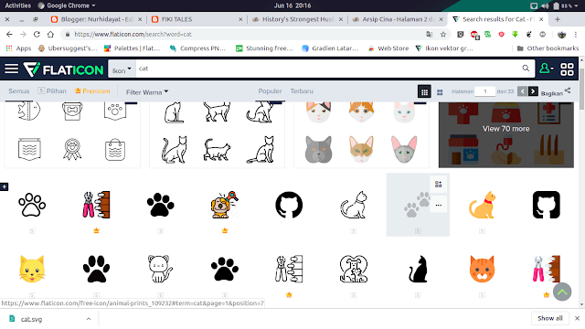
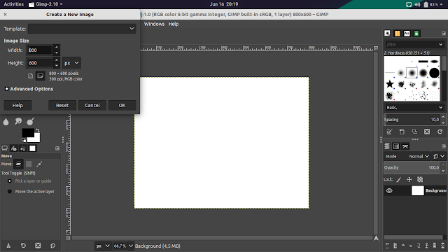
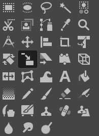
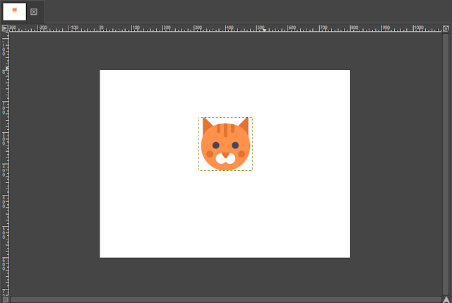
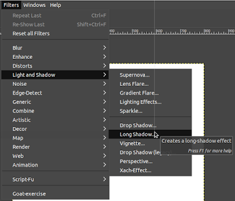
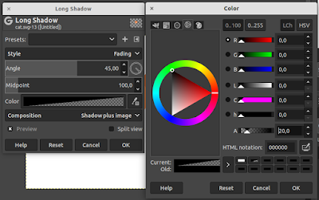
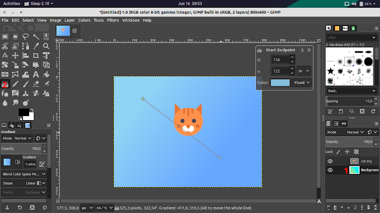

Untuk membuat postingan blog anda menarik maka biasanya selalu diselipkan thumbnail di awal postingan atau setelah kata pembuka, hal ini memungkinkan tampilan blog terlihat lebih rapi.

  
Untuk membuat Thumbnail Blog Sederhana Menggunakan Gimp bisa ikuti cara saya.  
  
\- Pastikan anda mempunyai ikon dengan background transparant sesuai dengan topik artikel, biasanya saya mengambil dari google atau [flaticon.com](http://flaticon.com)

\- Sekarang buka Gimp dan buat proyek baru dengan lebar 800 px dan tinggi 600 px.

  
  

  
\- Sekarang klik file>open as layer lalu pilih icon yang sudah disiapkan tadi dan sesuaikan ukurannya dengan menggunakan tool seperti berikut.  
  

  
Saat mengecilkan atau memperbesar tekan shift jika ingin perbandingan ukuran tetap.  
  

  
\- Jika ukuran dan posisi sudah tetap maka kita tinggal merubah ukuran layer dengan klik layer>layer to imagae size. Jika sudah kita terapkan _effect_ dari Long Shadow dengan cara klik effect>ligh and shadow>Long shadow  
  

Setting seperti berikut  
  

  
\- Sekarang ubah background menggunakan Gradient atau Bucket Fill. Jika tidak punya referensi warna bisa menggunakan [flatuicolors.com](http://flatuicolors.com) atau [webgradients.com](http://webgradients.com)  
  

  
Sekarang sudah jadi tinggal anda ekspor dan jadikan thumbnail di blog.  
  

Icons made by [Freepik](https://www.freepik.com/) from [www.flaticon.com](http://www.flaticon.com) is licensed by [CC 3.0 BY](https://creativecommons.org/licenses/by/3.0/)