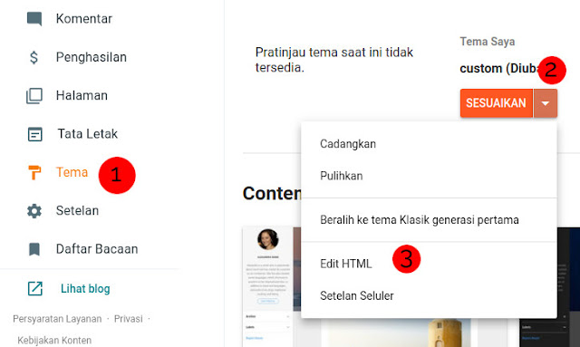
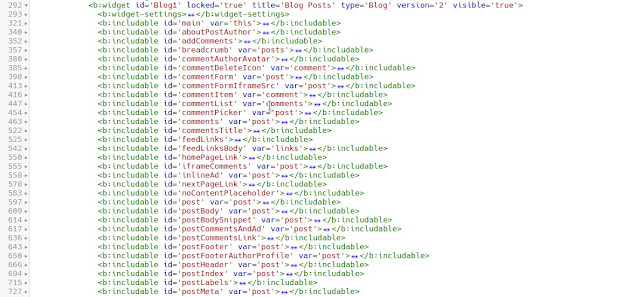
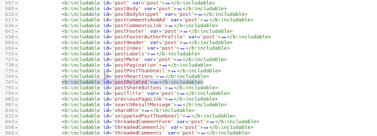
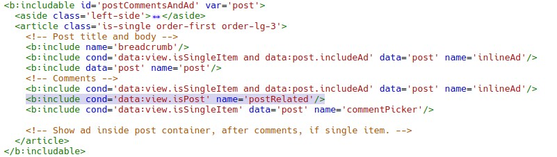

**Related Articles** pada blogger harus kamu buat secara manual dan tidak bisa melalui tata letak. Untuk membuatnya kamu memerlukan Blogger API Key karena kita akan menggunakan Blogger API, serta javascript supaya widget bekerja.

## Fungsi Widget Related Articles

Widget **Related Articles** berfungsi untuk mengarahkan pengunjung dengan artikel (_postingan_) yang terkait dengan artikel yang sedang dibaca, jika pengunjung merasa tertarik dengan artikel terkait yang kita berikan maka mereka akan membaca artikel kita yang lain. Dengan begitu durasi sesi (session duration) kita akan jadi naik, hal ini tentu berpengaruh pada SEO.

## Kenapa Menggunakan Blogger API

Kenapa tidak menggunakan url feeds saja? Alasanya adalah ukuran resource blogger API lebih kecil dibandingkan dengan url feeds, pada url feeds akan otomatis membawa isi dari artikel sehingga lebih besar dibandingkan dengan blogger api yang bisa kita rubah supaya tidak menampilkan isi artikel.

## Cara Membuat

Sebelum membuat kamu harus sudah memiliki Blogger API Key yang bisa kamu lihat caranya di [Cara Membuat Blogger API KEY](https://www.nurhidayat.web.id/2020/10/cara-membuat-blogger-api-key.html), karena blogger api tidak dapat digunakan tanpa api key. Disarankan untuk membackup template terlebih dahulu.

Sekarang masuk ke Blogger > Tema > Klik disebelah kanan sesuaikan > Edit HTML.



Copy dan pastekan kode berikut diatas kode `</b:skin>` atau `</style>`

```
/*Related Articles Widget by Nurhidayat.web.id*/.related{height:max-content;margin-bottom:1rem;position:relative}.scroll{background-color:transparent;overflow-x:auto;white-space:nowrap;padding-top:.3rem;padding-bottom:.3rem}.scroll .card{display:inline-block;margin-right:.5rem;border:1px solid rgba(0,0,0,.1);box-shadow:0 .1rem .5rem rgba(0,0,0,.1);border-radius:.25rem;width:240px;background-color:#fff}.scroll .card:last-child{margin-right:80px}.scroll .card-img-top{width:100%;display:block;border-top-left-radius:.25rem;border-top-right-radius:.25rem}.scroll .card-title{white-space:normal;font-size:16px;margin-top:0}.scroll .card-title a{color:#4a4a4a}.scroll .card-body{display:flex;flex-wrap:wrap;padding:.5rem 1rem}.scroll .small{color:#000;font-size:14px;opacity:.7}
```

Sekarang cari widget Blog seperti berikut.



Copy dan pastekan kode berikut diantara `<b:includable>` seperti pada gambar.

```
<b:includable id='postRelated'>
<div class='related'>
  <h3 class="title">Related Articles</h3>
  <div class="scroll" id="parse">
    <div class='card'>
      <div class='card-body'>
        <div style='padding: 5rem 0;'>
          <span class='card-title'>Loading..</span>
        </div>
      </div>
    </div>
    <div class='card'>
      <div class='card-body'>
        <div style='padding: 5rem 0;'>
          <span class='card-title'>Loading..</span>
        </div>
      </div>
    </div>
    <div class='card'>
      <div class='card-body'>
        <div style='padding: 5rem 0;'>
          <span class='card-title'>Loading..</span>
        </div>
      </div>
    </div>
  </div>
</div>
<script>
  let imgsize = "w280-h140-p-k-no-nu";
  api = "XXXXXXXXXXXXXXXXXX";
  label = [<b:if cond='data:post.labels'><b:loop index='l' values='data:post.labels' var='label'>&quot;<data:label.name/>&quot;,</b:loop></b:if>]
  maxres = 10;
  noimage = "https://fiik346.github.io/img/noimage2by1.svg";
  const api_url = 
  new URL("https://www.googleapis.com/blogger/v3/blogs/<data:blog.blogId/>/posts");
  /*Related Articles by Nurhidayat <![CDATA[*/async function getapi(e){const a=await fetch(e);show(await a.json())}function show(e){let a="";for(let t of e.items){let e="";if(void 0!=t.images){for(z of t.images)var s=z.url.split("/");z.url.includes("bp.blogspot.com")?e+="https://"+s[2]+"/"+s[3]+"/"+s[4]+"/"+s[5]+"/"+s[6]+"/"+imgsize+"/"+s[8]:e+=z.url}else e+=noimage;let l=t.title;t.title.length>35&&(l=t.title.slice(0,35)+"...");let i=t.published,r=i.substring(0,4),n=i.substring(5,7),c=i.substring(8,10),o=new Array;o[1]="Januari",o[2]="Februari",o[3]="Maret",o[4]="April",o[5]="Mei",o[6]="Juni",o[7]="Juli",o[8]="Agustus",o[9]="September",o[10]="Oktober",o[11]="November",o[12]="Desember",a+=`<div class="card">n    <a href="${t.url}" class="d-block"></a>n    <div class="card-body">n    <h3 class="card-title"><a href="${t.url}">${l}</a></h3>n    <span class="small">${c+" "+o[parseInt(n,10)]+" "+r}</span>n    </div>n    </div>`}document.getElementById("parse").innerHTML=a}api_url.search=new URLSearchParams({key:api,fetchBodies:!1,fetchImages:!0,maxResults:maxres,labels:label[Math.floor(Math.random()*label.length)]}),getapi(api_url);/*]]>*/
</script>
</b:includable>
```

Untuk bagian XXXXXXXX yang saya tandai silahkan ganti dengan API Key kamu, jika belum punya api key bisa membaca [Cara Membuat Blogger API KEY](https://www.nurhidayat.web.id/2020/10/cara-membuat-blogger-api-key.html).

Sekarang pastekan kode berikut

```
<b:include cond='data:view.isPost' name='postRelated'/>
```

pada bagian

```
<bincludable id='postCommentsAndAd' var='post'>
```

tepat di atas kode

```
<b:include cond='data:view.isSingleItem' data='post' name='commentPicker'/>
```

Lihat gambar berikut untuk lebih jelasnya



Sekarang klik simpan/save di tombol kanan atas, lihat artikel di blog kamu apakah widget related articles sudah tampil atau belum.

Selamat mencoba, jika terjadi kesalahan silahkan untuk berkomentar.