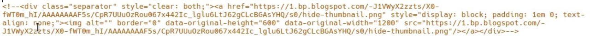

**Thumbnail** secara singkat bisa disebut sebagai gambar kecil atau gambar preview. Thumbnail pada blog maupun youtube bisa digunakan untuk menjelaskan konten apa yang akan disajikan dan dibahas. Jika kamu bingung tidak bisa membuat thumbnail sendiri coba [Cara Membuat Thumbnail Blog Sederhana dengan Gimp](https://www.nurhidayat.web.id/2019/06/cara-membuat-thumbnail-blog-sederhana.html)

## Cara Kerja Thumbnail Blogger

Thumbnail pada blogger diambil dari gambar yang kamu pasang dalam postingan. Jika gambar dalam postingan lebih dari satu maka gambar dengan urutan paling atas yang akan diambil sebagai Thumbnail. Jadi jika kamu ingin menampilkan thumbnail dengan gambar yang ditujukan maka taruh di urutan paling atas.  
Thumbnail blogger tampil dalam widget FeaturedPost, Blog dan Popular Post. Jika template yang kamu pakai mendukung related posts disertai thumbnail maka akan tampil juga disana, selain itu akan tampil juga di sosial media.

## Kelebihan Custom Thumbnail

Custom thumbnail yang dimaksud disini adalah menyembunyikan gambar thumbnail dari postingan, sehingga thumbnail pada halaman postingan blog tidak terlihat. **Dengan menyembunyikan gambar tersebut, postingan kamu akan lebih terlihat rapi.**

## Menyembunyikan Thumbnail dari Postingan

Berbagai cara bisa dilakukan untuk menyembunyikan thumbnail dari halaman postingan berikut cara cara yang saya ketahui. Tapi sebelum menggunakan salah satu cara dibawah pastikan kamu sudah mengupload gambar pada postingan kamu.

### **1\. Dengan Style**

Dengan menambahkan class `display:none` maka thumbnail tidak akan tampil, namun cara yang satu ini sangat tidak direkomendasikan karena akan berpengaruh pada score seo postingan kamu.  
Caranya ialah tambahkan kode berikut pada `img` gambar thumbnail yang ingin kamu sembunyikan dari postingan.

```
style="display:none"
```

Contoh penerapan kode.

```

```

Perlu di ingat cara ini sangat tidak direkomendasikan, silahkan baca bagian berikutnya.

### **2\. Dengan Javascript**

Cara yang kedua dengan menambahkan javascript pada template, cara yang satu ini masih bisa dipakai namun agak ribet alias kurang bersahabat bagi pembaca dan juga penulis. Namun Jika ingin tahu berikut caranya.

Terapkan kode javascript ini pada blog tepat diatas kode `</body>`.

```
<script>document.querySelector('.post-body').querySelector('.separator').firstElementChild.remove()</script>
```

Maka setiap postingan akan terhapus gambar dengan urutan pertama dengan kondisi setiap gambar terbungkus `<div class="separator">`. Namun kurang fleksibel jika kamu tidak ingin menyembunyikan thumbnail dari postingan, dan sering telat terhapus jika kecepatan internet lambat dan malah sering tampil terlebih dahulu baru terhapus.

### **3\. Tambahkan Kode Komentar**

Cara yang satu ini sangat saya rekomendasikan dan paling saya sukai, karena sangat fleksibel dan google pun membacanya sebagai komentar dari html sehingga tidak berpengaruh pada score seo. Jika kamu belum tahu tag komentar html berikut kodenya.

```
<!-- -->
```

Untuk menerapkan kode komentar pada gambar thumbnail supaya tidak tampil, kamu haru masuk ke tampilan html saat mengedit postingan. Jika belum tahu caranya silahkan lihat video dibawah.

<video src="https://rr2---sn-xmjxajvh-cqvs.googlevideo.com/videoplayback?expire=1659878530&amp;ei=AkzvYoWMLdKRsfIP95gl&amp;ip=140.213.22.45&amp;id=f67ef99c33ddc4c6&amp;itag=18&amp;source=blogger&amp;mh=9M&amp;mm=31&amp;mn=sn-xmjxajvh-cqvs&amp;ms=au&amp;mv=m&amp;mvi=2&amp;pl=24&amp;susc=bl&amp;eaua=kbVbIRkG24s&amp;mime=video/mp4&amp;vprv=1&amp;dur=3.320&amp;lmt=1599050297963372&amp;mt=1659849419&amp;txp=1311224&amp;sparams=expire,ei,ip,id,itag,source,susc,eaua,mime,vprv,dur,lmt&amp;sig=AOq0QJ8wRQIgBB7VYgD7Fjiunwek8pJv9Z-Ul9_W8sHnFN-P3mh0jC4CIQCAFGmXiuuOgOcG5ftqRWSfs4adff8HhjY5xEvvYJ1z3g%3D%3D&amp;lsparams=mh,mm,mn,ms,mv,mvi,pl&amp;lsig=AG3C_xAwRgIhAMNm6smNeLHXKd7Nb5MFYy9EdVejhrLcHiNYVyY89lSxAiEAtu5VIT4O8tlys5760oVW8Z8bs5Q51GN4NVdJmjSOVGY%3D&amp;cpn=ulYMspnjYHIQr9ND&amp;c=WEB_EMBEDDED_PLAYER&amp;cver=1.20220803.01.00" controls="true"></video>

Sekarang kamu tambahkan `<--` pada awal dari `<div class="separator">` jika tidak ada maka pada kode `` pada akhir dari kode `</div>`. Lihat gambar berikut.



Contoh dari kode lengkapnya berikut

```
<!--<div class="separator" style="clear: both;"><a href="https://1.bp.blogspot.com/-J1VWyX2zzts/X0-fWT0m_hI/AAAAAAAAF5s/CpR7UUuOzRou067x442Ic_lglu6LtJ62gCLcBGAsYHQ/s0/hide-thumbnail.png" style="display: block; padding: 1em 0; text-align: none;"></a></div>-->
```

## Akhir Kata

Bagaimana? Cara ke tiga adalah yang paling saya sukai, selain fleksibel juga mudah cara tersebut tidak mempengaruhi score seo. Jikalau masih belum paham bisa tanyakan di kolom komentar.