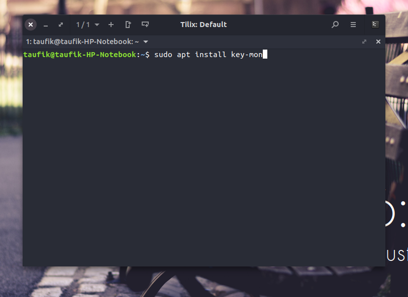
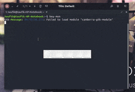
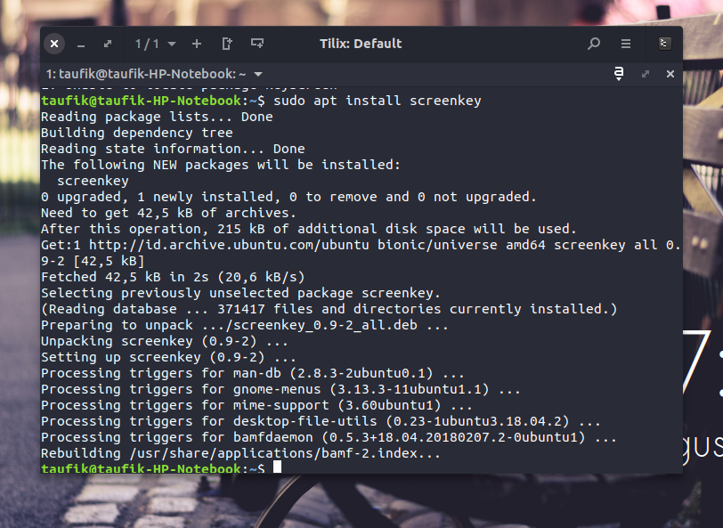
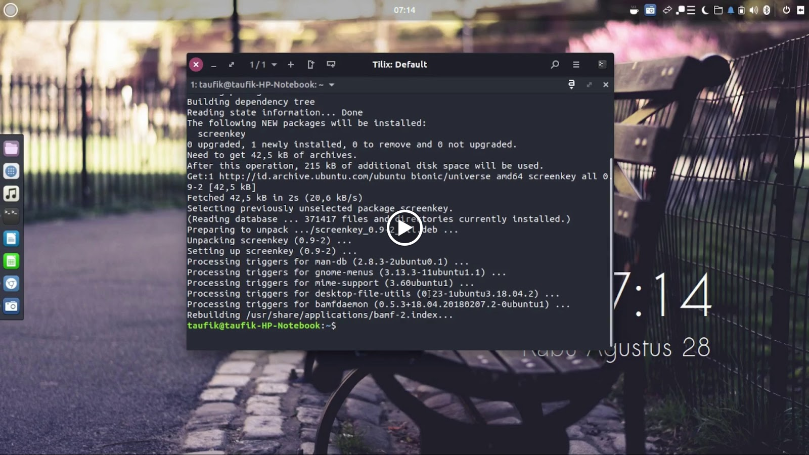

Jika anda pengguna Apple, mungkin anda akan mengenal dengan yang namanya Keystroke Pro. Software tersebut akan menampilkan input dari keyboard anda, sama halnya dengan Carnac pada Windows yang sama-sama bisa menampilkan input keyboard.

Lain cerita dengan Linux, saya cari-cari dengan keyword "bagaimana cara menampilkan input keyboard pada ubuntu / linux" dan hasilnyapun malah "cara menampilkan on screen keyboard" begitupun dengan keyword bahasa Inggris "how to display keyboard input ubuntu" entah bahasa inggris saya yang kurang bagus atau google tidak mengerti bahasa inggris saya, yang saya temukan hanyalah on screen keyboard. Hingga suatu hari saya iseng cari di youtube, eh nemu satu dan akhirnya saya coba seperti dibawah..  
  
Nah awalnya harus buka terminal dulu atau bisa menggunakan Ctrl+Alt+T  

```
sudo apt install key-mon
```



Nah selanjutnya kita tinggal cari key-mon dan buka atau bisa pada terminal dengan menggunakan perintah

```
key-mon
```

  
Maka akan muncul jendela seperti berikut



Bisa dipindah dengan menggesernya menggunakan cursor, untuk setting bisa dengan klik kanan pada jendela tadi. Untuk menutup KeyMon maka tinggal menggunakan perintah pkill

```
pkill key-mon
```

  
Fungsi dari KeyMon ini adalah akan menampilkan tombol apa saja yang ditekan pada keyboard, misal anda menekan Ctrl + Shift + Alt + O maka pada layar pun akan tampil tombol tersebut.  
  
Nah ternyata ada lagi yang lain yaitu Screenkey yang sama-sama bisa menampilkan input keyboard pada linux, cuman ini lebih mirip Carnac yaitu: semua yang anda tekan akan muncul namun tidak memiliki sebuah kotak seperti KeyMon melainkan langsung tampil seperti anda mengetik. Berikut perintahnya

```
sudo apt install screenkey
```



Sekarang tinggal buka dengan menggunakan perintah

```
screenkey
```



Untuk menutup screenkey cukup lakukan hal yang sama dengan key-mon yaitu

```
pkill screenkey
```

  
Jadi begitulah [Cara Menampilkan Input Keyboard Pada Linux](http://0.0.7.227/08/menampilkan-input-keyboard-pada-linux.html), jika kamu pengguna windows cukup menggunakan Carnac kalau Mac saya kurang tahu soalnya Keystroke Pro tidak gratis. Hati-hati saat anda merekam dan menggunakan kedua software diatas, karena saat input password maka tombol yang ditekanpun ikun tampil pada layar. Sekian postingan ini semoga bermanfa'at..