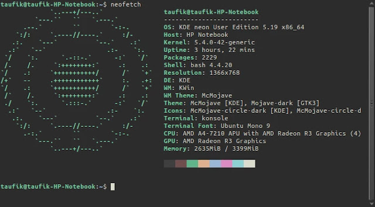
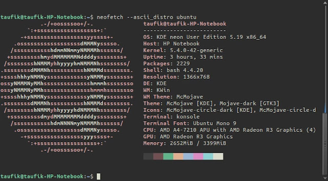
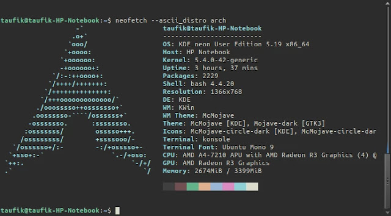
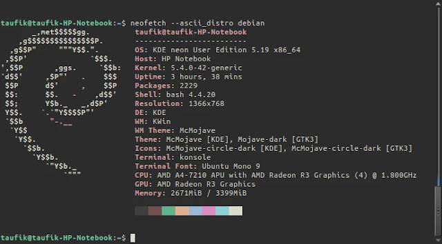

Distribusi atau Distro Linux sangatlah banyak dan begitu pun logo nya selalu berbeda. Pernah kamu melihat ASCII Art? Kalau jaman dulu di komentar Facebook sering ada spam summon naga, nah itu adalah salah satu ASCII Art. Jadi ASCII Art itu adalah gambar yang dibuat hanya dengan karakter yang sudah tercantum, menurut wikipedia terdapat 128 karakter yang dipakai untuk membuat ASCII Art. Logo Distribusi Linux juga bisa ditampilkan di terminal Linux dalam format ASCII loh. Berikut cara-cara untuk Menampilkan Logo Distribusi Linux Dalam Format ASCII di Terminal Linux.

Pastinya buka dulu Terminal Linux, bisa dengan menggunakan shortcut CTRL+Alt+T. 

Masukan command berikut untuk pengguna Debian.

```
apt-get install neofetch
```

Jika pengguna Ubuntu dan turunannya tambahkan sudo dan isi password

```
sudo apt-get install neofetch
```

Untuk distro Fedora silahkan gunakan command berikut.

```
sudo dnf install neofetch
```

Untuk distro Arch gunakan command berikut.

```
pacman -S neofetch
```

Untuk menampilkan logo dalam format ASCII di terminal silahkan gunakan command berikut.

```
neofetch
```

Hasil dari logo distro KDE Neon.



Selain logo itu sendiri, terdapat beberapa informasi sistem yang sedang anda gunakan mulai dari Operating System, Kernel, Lamanya Komputer Hidup, Resolusi hingga skema warna pun ada.

Selain menampilkan logo distro yang digunakan kita juga bisa menampilkan dengan logo distro Linux lainya. Untuk menampilkan logo distro Linux sesuai keinginan maka gunakan command berikut.

```
neofetch --ascii_distro nama distro
```

Contohnya logo distro Ubuntu dalam format ASCII.



Contoh distro Arch Linux dalam format ASCII.



Contoh distro Debian dalam format ASCII.

