Jika saya punya sebuah alamat email dengan domain yang bukan gmail misalkan [brianna@nurhidayat.web.id](mailto:brianna@nurhidayat.web.id) mengirimkan email ke [username@gmail.com](mailto:username@gmail.com) maka foto profil tidak akan tampil, hal tersebut karena alamat email [brianna@nurhidayat.web.id](mailto:brianna@nurhidayat.web.id) tidak terkait dengan google berbeda jika email tadi di hosting dengan GSuite.

Berikut contoh dari email custom domain yang tidak menampilkan foto profil.

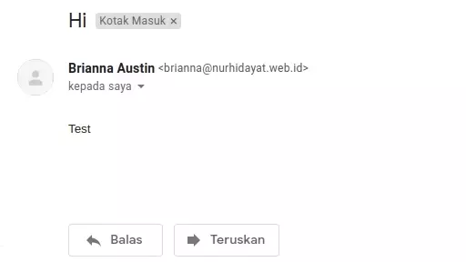

Untuk email yang di hosting pada Gmail sudah terkait dengan akun google sehingga terdapat foto profil jika mengirimkan email ke alamat email, katakanlah alamat email saya [brianna@gmail.com](mailto:brianna@gmail.com) lalu mengirimkan ke email [username@gmail.com](mailto:username@gmail.com) dan saya sudah menerapkan foto profil pada email tersebut maka email yang [username@gmail.com](mailto:username@gmail.com) terima memiliki foto profil.

## Keuntungan

Apa Keuntungan menggunakan foto profil pada email custom domain kita? Keuntungannya ialah mempengaruhi pada branding, mungkin kamu sering mendapatkan email yang dikirim perusahaan dengan foto profil berupa logo perusahaan atau bisa seseorang yang ternyata dia adalah brand ambassador perusahaan. Dengan menerapkan foto profil gmail pada custom domain kamu tentu akan bermanfaat bagi branding, karena sekarang ini kebanyakan orang mungkin menganggap Gmail dan E-mail adalah sama. Hal tersebut disebabkan pengguna E-mail kebanyakan menggunakan platform Gmail, karena Gmail sudah terhubung dengan Akun Google dan Akun Google itu adalah Gmail itu sendiri.

## Cara Menerapkan

Untuk menambahkan foto profil email custom domain yang kamu miliki, kamu harus membuat akun google baru. Jika browser-mu sudah terhubung dengan Akun Google maka keluarkan saja dulu atau bisa membuka jendela baru dengan Guest Account.

Sekarang kamu bisa membuka halaman [google.com](http://google.com) dan klik login.

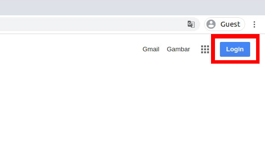

Lalu kamu buat akun baru dengan akun pribadi.

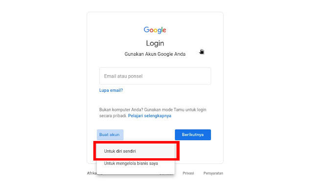

Sekarang pilih email dengan email yang sudah ada.

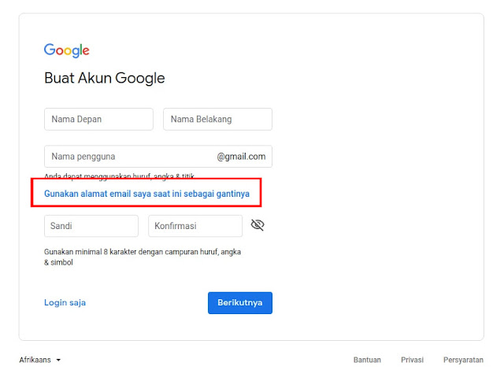

Lalu isi dengan nama kamu, alamat email custom domain kamu dan password juga, kalau sudah bisa di klik tombol berikutnya.

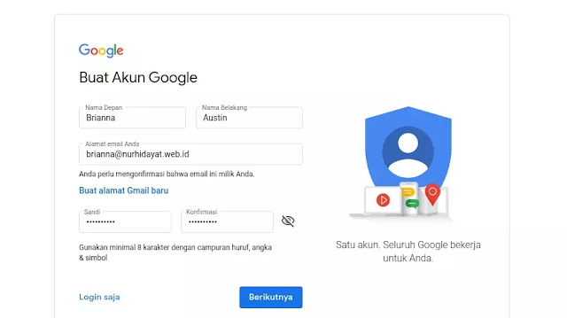

Kamu akan mendapatkan kode verifikasi dari google ke alamat email yang kamu daftarkan dan kamu harus mengisi form verifikasi dengan kode tersebut.

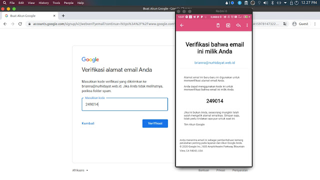

Sekarang tinggal mengisi nomor telepon yang berfungsi untuk mengidentifikasi kamu adalah seorang manusia dan bukan robot.

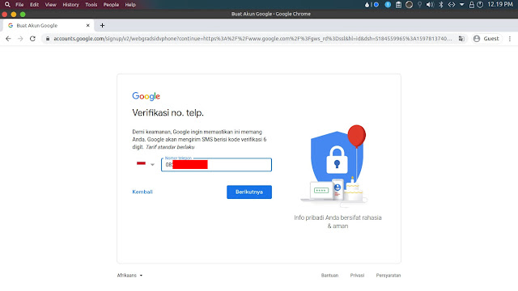

Verifikasi nomor telepon dengan kode yang dikirimkan ke nomor telepon tersebut.

  

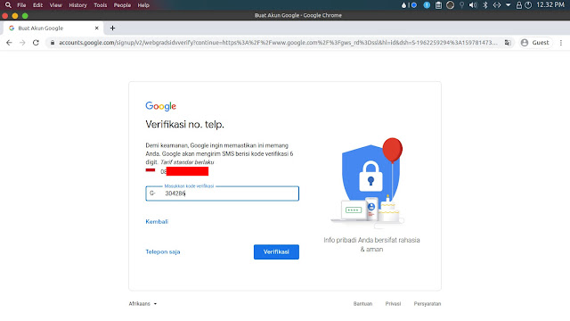

Sekarang isi data diri kamu.

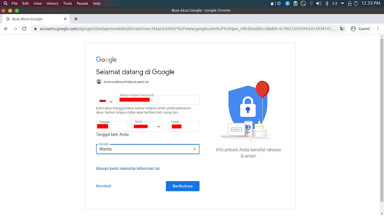

Setelah selesai akan muncul optimalkan nomor telepon, anda boleh ikut atau lewati.

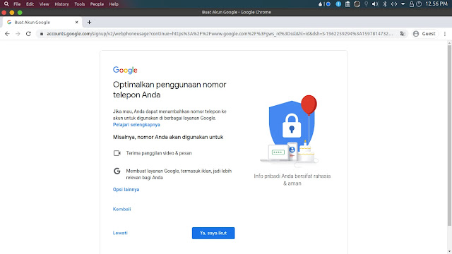

Sekarang kamu pilih setuju dengan syarat  dan ketentuan yang diberikan oleh Google.

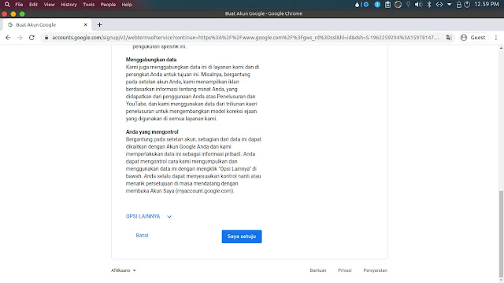

Selanjutnya kamu akan diarahkan ke halaman pencarian Google, maka kamu tinggal klik profil di sebelah kanan atas dan klik foto.

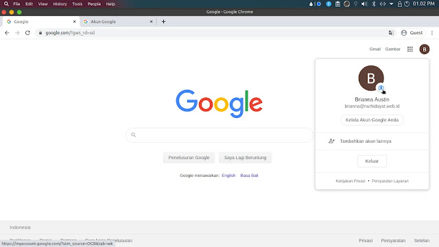

Sekarang kamu bisa mengunggah foto profil kamu di halaman ini dengan mengklik gambar.

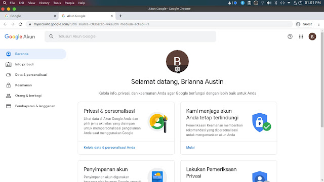

Silahkan upload foto profil kamu, berikut hasil dari upload.

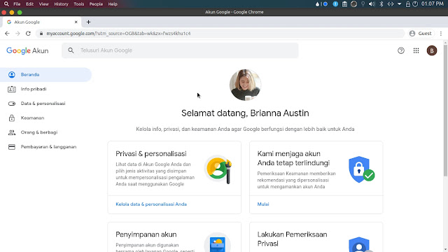

  
Sekarang test dengan email dan beginilah hasilnya.

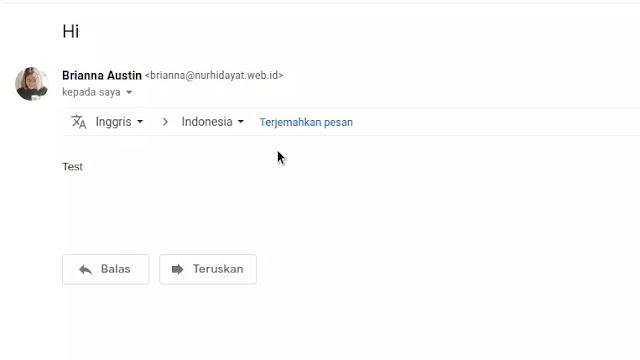

## Akhir Kata

Begitulah cara menambahkan foto profil gmail untuk email dengan domain custom, dan pastinya tidak memerlukan langganan GSuite. Sekarang ketika kamu mengirimkan email maka foto profil kamu akan muncul.