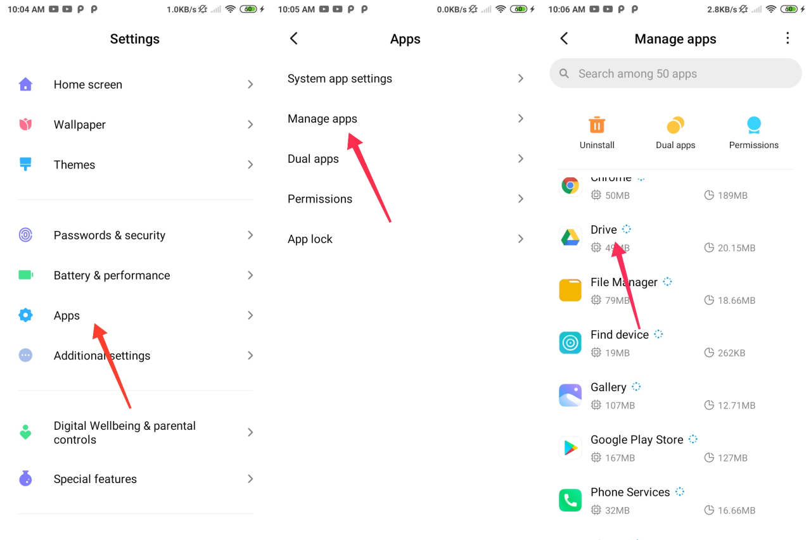
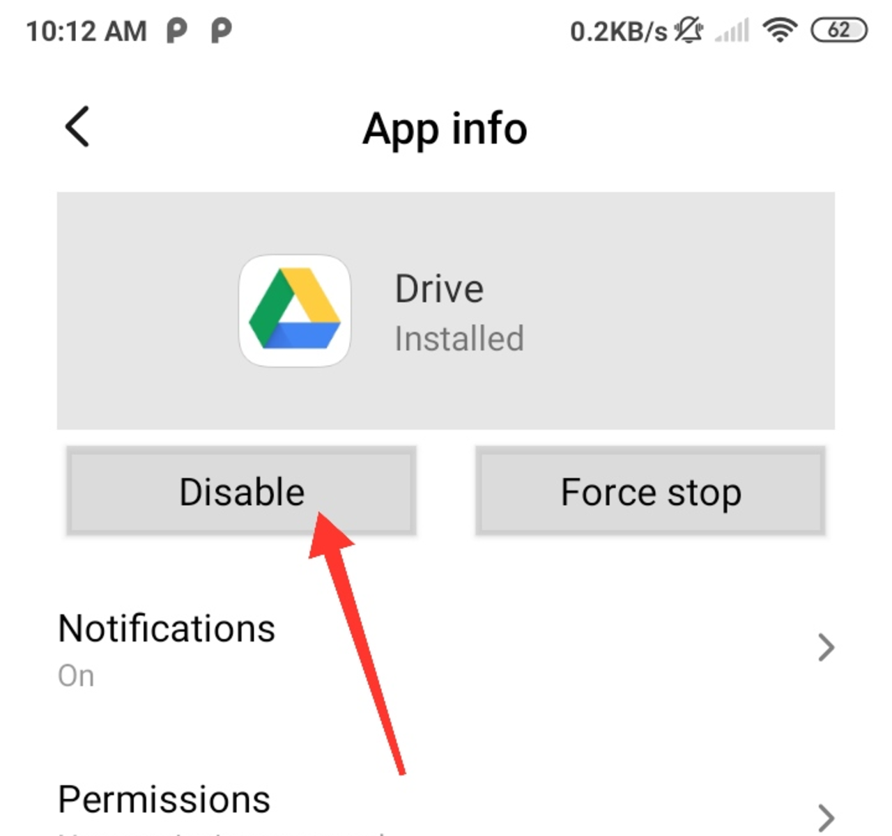
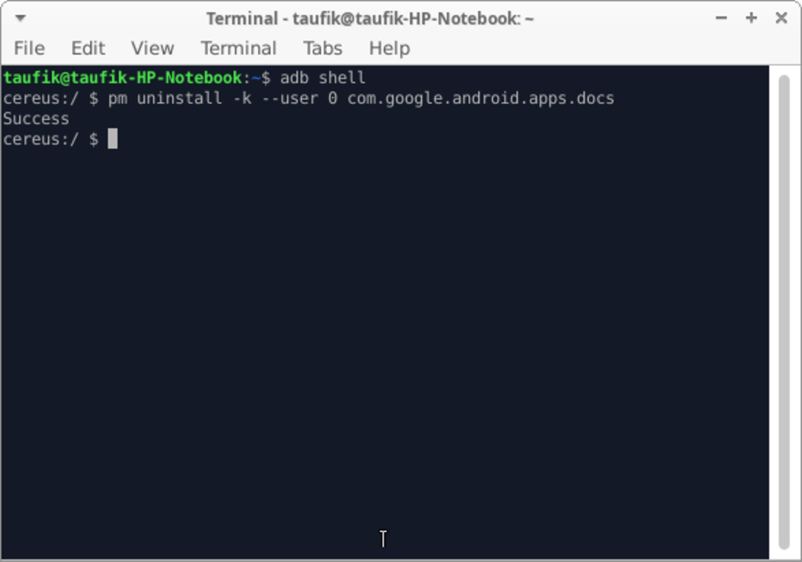

Aplikasi bawaan yang tidak kita inginkan atau disebut bloatware lebih baik dihapus saja. Selain bisa mengosongkan memori juga meringankan ram yang terpakai, karena biasanya bloatware sering berjalan di latar belakang dan selalu update otomatis.

Pada artikel ini kita dapat mengetahui bagaimana cara menghapus aplikasi bloatware, terutama aplikasi tersebut telah terpasang pada sistem sehingga kita tidak bisa melakukannya dengan cara yang biasa.

## Jadi Apa itu Bloatware?

Bloatware adalah aplikasi yang tidak kita butuhkan namun telah terpasang oleh _vendor_, setiap orang memiliki pendapat sendiri terkait aplikasi bloatware. Contohnya adalah aplikasi Google TV, karena saya tidak membutuhkan aplikasi tersebut maka aplikasi Google TV adalah bloatware. Tetapi bagi mereka yang membutuhkan aplikasi Google TV tidak bisa menyebutnya sebagai bloatware.

## Dampak dari Bloatware pada Smartphone

Mungkin kamu tidak menyadari dampak yang dihasilkan dari bloatware pada smartphone ketika masih baru, namun setelah lama menggunakan smartphone tersebut barulah kamu menyadari gangguan yang ditimbulkan aplikasi bloatware tersebut.

Selain membuat penyimpanan smartphone membengkak juga dapat menyebabkan performa smartphone menurun. Biasanya aplikasi bloatware sering berjalan di latar belakang dan selalu update secara otomatis, sehingga membebani ram juga mengurangi daya baterai dan pada akhirnya smartphone menjadi lambat.

## Cara Menghapus Aplikasi Bloatware

Kebanyakan aplikasi bloatware dapat dihapus dengan cara yang biasa, namun untuk aplikasi yang terpasang pada sistem hal tersebut tidak mungkin. Solusinya adalah dengan menonaktifkan aplikasi atau menghapusnya dengan ADB dari komputer, berikut kedua cara tersebut.

### Menonaktifkan Aplikasi Bloatware

-   Masuk ke settings → apps → manage apps, lalu pilih aplikasi yang akan dinonaktifkan. Disini saya mencontohkan dengan aplikasi Google Drive, kamu bisa memilih aplikasi lain seperti Google TV, Google Book dan yang lainya..
    

-   Tap tombol disable, sehingga aplikasi akan di nonaktifkan.
    

Untuk pengguna xiaomi kalian bisa menggunakan aplikasi Hidden Settings dari play store, karena di beberapa aplikasi tombol tersebut tidak bisa di tap.

### Menghapus Aplikasi Bloatware dengan ADB

Untuk cara yang satu ini kamu memerlukan komputer atau laptop.

-   Aktifkan mode pengembangan terlebih dahulu, dengan cara masuk settings → about phone klik secara terus menerus pada build number sebanyak 8-10 kali sampai muncul notifikasi mode developer telah aktif.
    
-   Download ADB dari [Link Download ADB](https://developer.android.com/studio/releases/platform-tools?hl=id). Extract file nya lalu buka terminal pada folder tersebut dengan cara klik kanan → open terminal here.
    
-   Ketik perintah `./adb shell`
    

-   Gunakan perintah berikut untuk menghapus aplikasi bloatware, `pm uninstall -k --user 0 NamaPackageAplikasi`
    

Untuk nama package dari aplikasi kalian bisa melihatnya di settings → apps →manage apps → pilih aplikasi → klik icon tanda seru di pojok kanan atas. Bisa juga dengan menggunakan aplikasi package name viewer.

## Tips Menghindari Bloatware

Biasanya bloatware sering muncul pada smartphone dengan harga murah, seperti dari merk Xiaomi dan Infinix. Untuk merk lain juga masih ada bloatware namun tidak sampai terlalu mengganggu dan mudah di hapus. Untuk smartphone yang minim bloatware biasanya menggunakan stock android seperti Google Pixel dan Nokia. Sebelum membeli pastikan untuk melihat ulasan apakah smartphone yang kamu inginkan sangat minim dengan bloatware atau tidak.