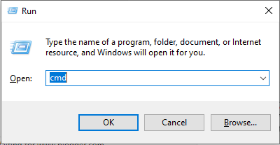
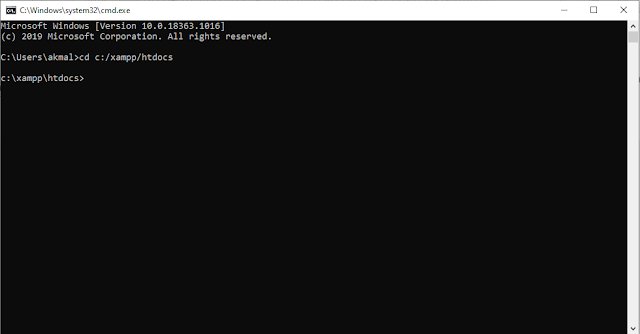
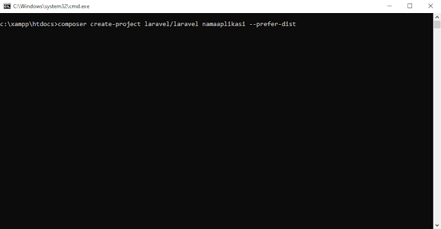
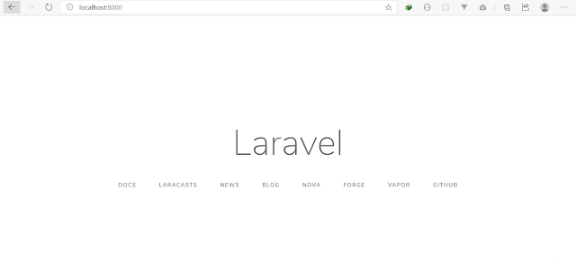

**Laravel** adalah Framework web PHP yang diciptakan oleh Taylor Otwell. Laravel ini bersifat open source jadi bebas untuk digunakan. Laravel ini memiliki banyak fitur yang sangat membantu dalam membangun sebuah website. 

## Persiapan

Untuk menginstal laravel ada beberapa Aplikasi yang harus diinstal terlebih dahulu. Apa saja ? 

### **1\. Web Server** 

Web server adalah software yang fungsinya digunakan untuk menerima dan melayani permintaan yang dikirimkan user melalui sebuah browser yang kemudian dimunculkan kepada user sesuai dengan permintaan yang dikirim ke server.

Untuk nama aplikasinya saya memakai Aplikasi XAMPP. cara mendownload nya sangat mudah sekali kalian bisa mengunjungi halaman website resminya di [XAMPP](https://www.apachefriends.org/download.html).

### **2\. Composer**

Composer adalah sebuah tool aplikasi yang digunakan sebagai penghubung php dengan library atau package lain.Misalnya kita butuh package atau library pdf, kita bisa mendownload atau menambahkan library tersebut ke projectan kita dengan composer. Saat kalian sedang menginstall composer pastikan terhubung ke internet karena ada data yang didownload. Cara mendownload tool composer bisa langsung ke halaman website resminya di  [Composer](https://getcomposer.org/download/).

### **3\. Text Editor**

Text editor adalah sebuah aplikasi yang digunakan untuk mengubah code dari framework laravel ini. Untuk text editor kalian bisa menggunakan sublime text, vscode, atom, notepad++, dan masih banyak lagi. Jika belum memiliki text editor silahkan baca [Text Editor Terbaik untuk Pemrograman](https://www.nurhidayat.web.id/blog/text-editor-terbaik-untuk-pemrograman)

## Cara Install

Setelah semua persiapan sudah selesai, kalian sekarang bisa menginstal laravel. Jadi pastikan tidak ada yang terlewat.

**Buka Folder**

Buka folder `c:/xampp/htdocs` menggunakan CMD(Command Prompt). Untuk pengguna window bisa menggunakan Tombol Window + R lalu ketik cmd. maka akan terbuka cmdnya.



 lalu ketikan perintah berikut

```
cd c:/xampp/htdocs
```

kemudian enter. 



Lalu ketikkan perintah berikut

```
composer create-project laravel/laravel namaaplikasi --prefer-dist
```

lalu klik tombol enter. Pastikan terhubung ke internet karena akan ada yang harus didownload. 



Tunggu Sampai proses download selesai. Kemudian ketikkan perintah berikut ini.

```
cd namaaplikasi
```

Untuk menjalankan nya kalian hanya perlu mengetikkan

```
php artisan serve
```

Kemudian cek di browser seperti google chrome, firefox atau browser lainnya. Lalu di address bar ketikkan seperti berikut.

```
localhost:8000
```



Maka akan muncul tampilan seperti diatas. Dan kalian sudah berhasil menginstall laravel.