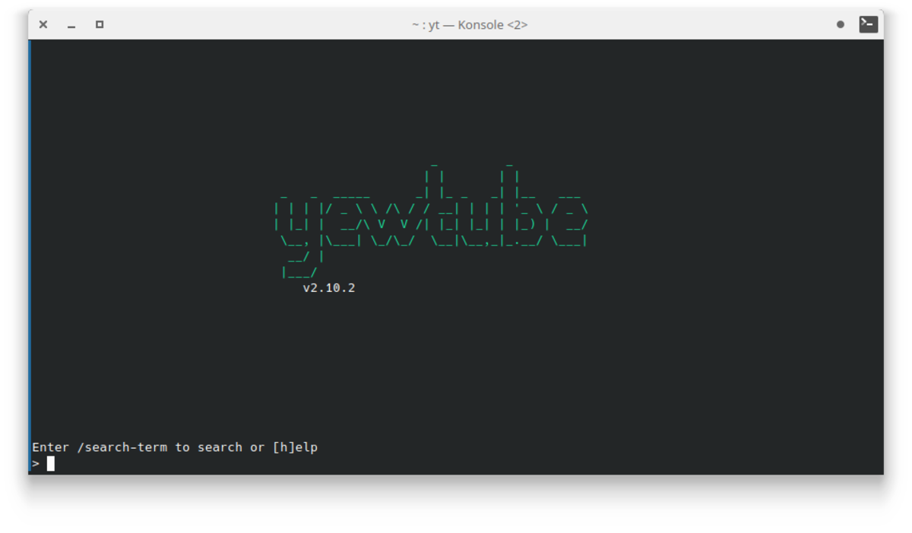
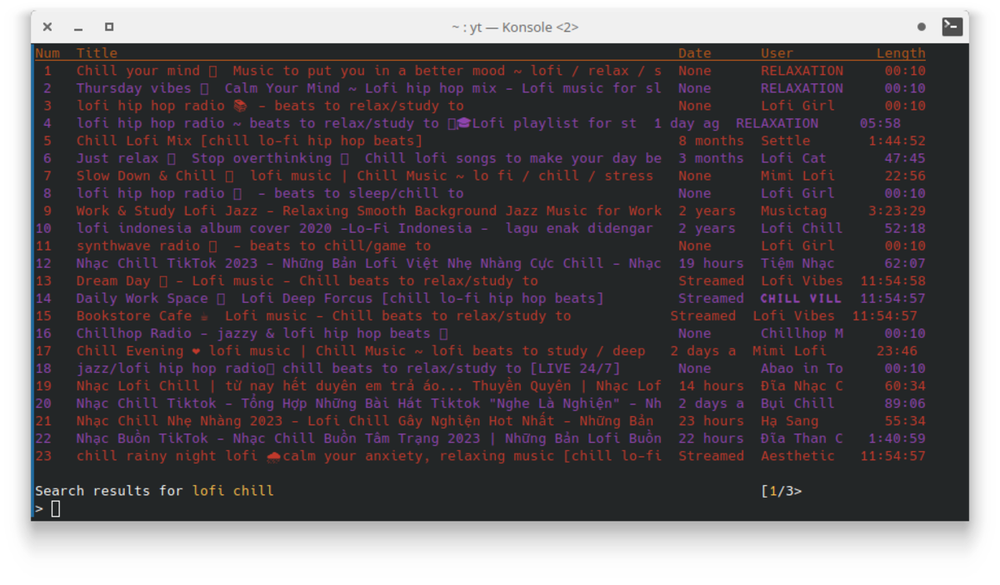

Mendengarkan musik merupakan hal yang sangat umum di jaman sekarang ini. Berawal dari radio dan kaset, trend mendengarkan musik beralih ke streaming secara online menggunakan platform-platform streaming musik. Pada artikel ini, kita akan mengetahui bagaimana melakukan streaming musik hanya menggunakan terminal atau konsole pada sistem operasi linux, windows, mac.

## Streaming Musik Menggunakan Yewtube

Untuk yang pertama kita bisa menggunakan `yewtube` yang merupakan _fork_ dari `mps-youtube`. Dengan alat ini kita bisa menonton video atau mendengarkan musik dari youtube lewat terminal.

### Memasang Yewtube

Pastikan sistem operasi telah terpasang `python`, `python-pip` atau `python-pipx` serta media player seperti VLC maupun MPV. Untuk melakukan instalasi ikuti salah satu perintah berikut pada terminal.

```
# pip
pip install yewtube

# pipx (direkomendasikan)
pipx install yewtube
```

### Menjalankan dan Melakukan Pencarian

Jika proses pemasangan telah berhasil maka langkah selanjutnya menjalankan `yewtube` itu sendiri dengan perintah `yt` dan akan muncul tampilan seperti berikut.



Untuk melakukan pencarian gunakan perintah `/` (_slash_) diikuti dengan _query_ yang akan dicari, seperti berikut.

```
/lofi chill
```

### Memutar Media

Jika hasil pencarian telah muncul, ketik dan enter nomor yang tertera pada daftar hasil pencarian untuk memutar media tersebut. Perlu kamu ketahui, daftar hasil pencarian dengan bagian _date_ berisi _None_ biasanya merupakan list yang sedang live streaming dan tidak dapat diputar.



### Memutar Audio Saja

Secara default `yewtube` akan memutar media berupa video, agar hanya memutar audio saja maka lakukan konfigurasi dengan perintah berikut.

```
set show_video false
```

### Mengganti Pemutar Media

Jika pada sistem operasi kamu terdapat VLC dan MPV, maka secara bawaan `yewtube` akan menggunakan VLC untuk memutar media. Meski tidak disarankan mengubah ke pemutar media lain, namun kamu bisa beralih dengan perintah berikut.

```
# mpv dapat diganti dengan player lain
set player mpv
```

## Streaming Youtube Menggunakan Ytfzf

Sama seperti yewtube ytfzf juga merupakan alat lain yang mampu melakukan streaming youtube melalui terminal, namun bedanya ytfzf menggunakan fzf sebagai interface mereka.

### Melakukan Pemasangan Ytfzf

Saat ini ytfzf hanya tersedia pada sistem operasi linux saja, dan untuk melakukan pemasangan bisa melalui package manager masing-masing distro atau

```
# Debian dan Ubuntu
sudo apt-get install ytfzf

# Arch Linux
sudo pacman -S ytfzf
```

Jika tidak berhasil bisa langsung _clone_ repository dari ytfzf dan build manual menggunakan `make`, berikut perintahnya.

```
git clone https://github.com/pystardust/ytfzf
cd ytfzf
sudo make install doc
```

### Melakukan Pencarian dan Memutar Media

Untuk melakukan pencarian kita bisa melakukannya dengan perintah berikut.

```
ytfzf kueri yang ingin dicari
```

Atau hanya memutar media musik saja dengan perintah berikut.

```
ytfzf -m kueri yang ingin dicari
```

Berikut tampilan dari `ytfzf`, untuk memilih daftar kamu bisa menggunakan tanda panah pada keyboard. Tekan tombol enter untuk memutar media.

## Kenapa Streaming Menggunakan Terminal

Jika kamu bukan pengguna linux, mungkin kamu tidak akan menyukai sesuatu yang berhubungan dengan terminal dan lebih menyukai streaming lewat platform yang lebih mudah digunakan.

Selain tidak adanya GUI proses yang dilakukan juga cukup ribet khususnya bagi yang tidak terbiasa dengan cli. Namun terdapat beberapa kelebihan dari streaming musik menggunakan terminal diantaranya:

1.  Gratis
    
2.  Tanpa iklan
    
3.  Tidak bisa memutar media yang sedang live streaming.
    
4.  Tidak memakan banyak memori.
    

## Akhir Kata

Mungkin streaming musik melalui terminal bukanlah pilihan utama, namun bisa menjadi alternatif bagi mereka yang terbiasa dan menyukai interface cli/terminal. Dengan beberapa kelebihan seperti tanpa adanya iklan dan gratis, streaming musik menggunakan terminal patut dipertimbangkan.