Sebagian besar pengguna distro Linux mungkin sudah mengetahui beberapa jenis Desktop Environment. Namun, karena setiap pengguna memiliki preferensi dan kebutuhan yang berbeda, memilih Desktop Environment yang terbaik bisa menjadi sedikit sulit. Oleh karena itu, dalam artikel ini, kamu akan mengetahui beberapa Desktop Environment Linux terbaik yang tersedia saat ini, sehingga kamu dapat memilih yang sesuai dengan keinginan dan kebutuhanmu.

## Desktop Environment Secara Singkat

Desktop Environment (DE), atau dalam bahasa Indonesia disebut Lingkungan Desktop, merupakan kumpulan komponen yang menyediakan elemen untuk antarmuka grafis (GUI), seperti icon, toolbar, window, menu, widget, dan sebagainya.

Desktop Environment mengatur tampilan dan interaksi pengguna dengan komputer secara grafis. Jika komputer tidak memiliki Desktop Environment, pengguna hanya dapat mengakses komputer dengan menggunakan perintah terminal saja.

## Desktop Environment Linux Terbaik

### 1\. KDE Plasma

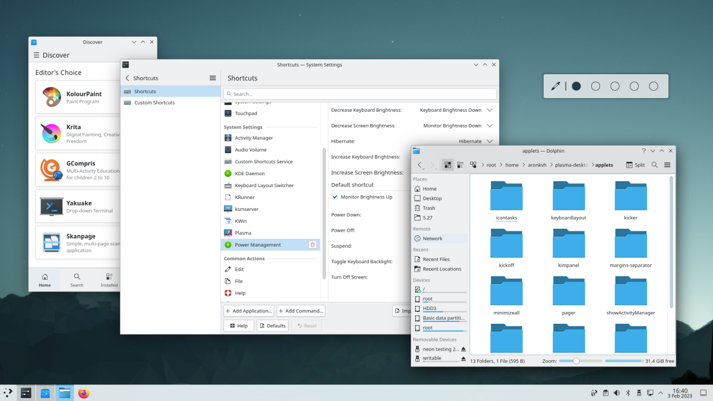

KDE Plasma Desktop Environment adalah salah satu DE paling populer di antara pengguna Linux. DE ini menawarkan tampilan yang elegan dan modern, serta fitur-fitur yang kaya dan dapat disesuaikan.

#### Kelebihan KDE Plasma

Salah satu kelebihan utama KDE Plasma adalah kemampuan kustomisasinya yang sangat luas. Pengguna dapat dengan mudah mengubah tampilan dan nuansa antarmuka pengguna sesuai dengan preferensi mereka. Selain itu, KDE Plasma juga menawarkan beberapa kelebihan lainnya, seperti:

1.  Fitur yang kaya: KDE Plasma menawarkan banyak fitur yang berguna, seperti efek visual yang menarik, manajemen jendela yang lebih baik, dan integrasi dengan aplikasi KDE.
    
2.  Fleksibilitas: Pengguna dapat dengan mudah menyesuaikan setiap aspek antarmuka pengguna, termasuk panel tugas, tema, wallpaper, dan banyak lagi.
    
3.  Ketersediaan Aplikasi: KDE Plasma didukung oleh banyak aplikasi yang dikembangkan oleh komunitas KDE, termasuk aplikasi produktivitas, multimedia, dan utilitas sistem.
    

#### Kekurangan KDE Plasma

Namun, KDE Plasma juga memiliki beberapa kekurangan, seperti:

1.  Memerlukan Sumber Daya (memori) yang Lebih Tinggi: Karena fitur yang kaya, KDE Plasma memerlukan sumber daya yang lebih tinggi dibandingkan dengan DE lainnya.
    
2.  Kompleksitas: Karena kemampuan kustomisasinya yang luas, KDE Plasma mungkin terasa agak rumit untuk pengguna pemula atau yang tidak terbiasa dengan antarmuka pengguna yang sangat dapat disesuaikan.
    
3.  Kebutuhan Keterampilan Penggunaan yang Lebih Tinggi: Beberapa fitur KDE Plasma mungkin memerlukan keterampilan penggunaan yang lebih tinggi, seperti konfigurasi jaringan atau manajemen printer.
    

Meskipun memiliki beberapa kekurangan, KDE Plasma tetap menjadi salah satu DE paling populer di antara pengguna Linux. Dengan kemampuan kustomisasinya yang luas, fitur-fitur yang kaya, dan dukungan aplikasi yang luas, KDE Plasma dapat menjadi pilihan yang baik bagi pengguna Linux yang mencari DE yang fleksibel dan kaya fitur. Namun, bagi pengguna yang memerlukan DE yang lebih ringan atau kurang kompleks, KDE Plasma mungkin bukan pilihan yang tepat.

### 2\. Gnome

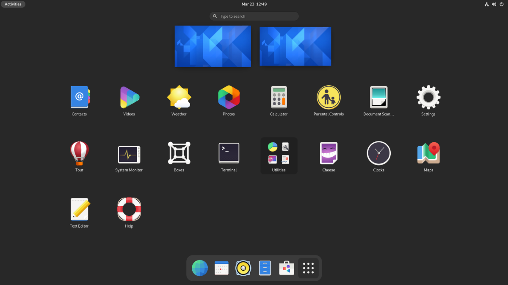

Gnome adalah salah satu desktop environment paling populer untuk sistem operasi Linux. Desktop environment ini dikembangkan oleh Gnome Project dan menawarkan pengalaman desktop yang modern dan intuitif.

#### Kelebihan Gnome

1.  User interface yang modern dan intuitif: Gnome menawarkan pengalaman desktop yang modern dan mudah digunakan. Antarmuka pengguna Gnome sangat mudah dipahami bahkan oleh pengguna baru.
    
2.  Kontrol yang kuat: Gnome menawarkan kontrol yang kuat atas sistem. Pengguna dapat mengatur berbagai opsi seperti gaya desktop, tema, dan jendela dengan mudah.
    
3.  Integrasi dengan aplikasi Gnome: Gnome desktop environment memiliki banyak aplikasi yang dikembangkan oleh Gnome Project seperti Nautilus, GNOME Terminal, dan GNOME Calculator. Semua aplikasi ini terintegrasi dengan baik dengan desktop environment.
    
4.  Dukungan multibahasa: Gnome mendukung banyak bahasa dan skrip, membuatnya mudah digunakan oleh pengguna dari berbagai negara dan budaya.
    

#### Kekurangan Gnome

1.  Konsumsi sumber daya yang tinggi: Gnome membutuhkan memori yang cukup besar untuk berjalan dengan lacar. Hal tersebut bisa menjadi kendala pada sistem dengan spesifikasi rendah atau komputer dengan RAM yan sedikit.
    
2.  Tidak fleksibel: Beberapa pengguna mungkin merasa bahwa Gnome kurang fleksibel dibandingkan dengan desktop environment lainnya. Beberapa opsi mungkin tidak tersedia atau sulit diakses.
    
3.  Integrasi aplikasi pihak ketiga: Integrasi aplikasi pihak ketiga dengan Gnome mungkin tidak selalu mulus. Beberapa aplikasi mungkin tidak terintegrasi dengan baik atau tidak memiliki dukungan untuk Gnome.
    

Meskipun memiliki beberapa kekurangan, Gnome tetap menjadi salah satu desktop environment terbaik untuk Linux, terutama untuk pengguna yang mencari pengalaman desktop modern dan intuitif.

### 3\. XFCE

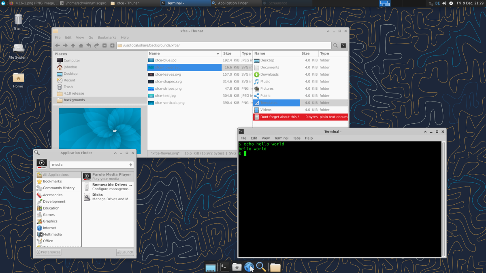

Xfce adalah desktop environment yang populer di Linux. Ini adalah lingkungan desktop yang ringan dan mudah digunakan, terutama cocok untuk sistem dengan spesifikasi rendah atau keterbatasan sumber daya.

#### Kelebihan Xfce

1.  Ringan: Xfce membutuhkan sedikit sumber daya untuk berjalan dengan baik, sehingga cocok untuk sistem dengan spesifikasi rendah atau keterbatasan sumber daya.
    
2.  Mudah digunakan: Xfce memiliki antarmuka pengguna yang sederhana dan mudah digunakan, membuatnya ideal untuk pengguna baru atau pengguna yang mencari pengalaman desktop yang langsung dan tidak rumit.
    
3.  Customizable: Xfce dapat dengan mudah disesuaikan dengan preferensi pengguna. Pengguna dapat mengubah tema, gaya desktop, dan opsi lainnya untuk membuat lingkungan desktop yang sesuai dengan keinginan mereka.
    
4.  Stabil dan handal: Xfce telah terbukti stabil dan handal dalam penggunaan sehari-hari. Sehingga jarang mengalami masalah atau kerusakan pada sistem.
    

#### Kekurangan Xfce

1.  Kurang modern: Beberapa pengguna mungkin merasa bahwa Xfce kurang modern dibandingkan dengan desktop environment lainnya. Sehingga, mungkin tidak memiliki fitur-fitur terbaru atau antarmuka pengguna yang canggih.
    
2.  Kurangnya integrasi aplikasi pihak ketiga: Beberapa aplikasi pihak ketiga mungkin tidak terintegrasi dengan baik dengan Xfce. Hal ini dapat mengakibatkan masalah dalam penggunaan aplikasi di lingkungan desktop.
    

Meskipun memiliki beberapa kekurangan, Xfce tetap menjadi salah satu desktop environment terbaik untuk Linux, terutama untuk pengguna yang mencari lingkungan desktop yang ringan dan mudah digunakan.

### 4\. Mate

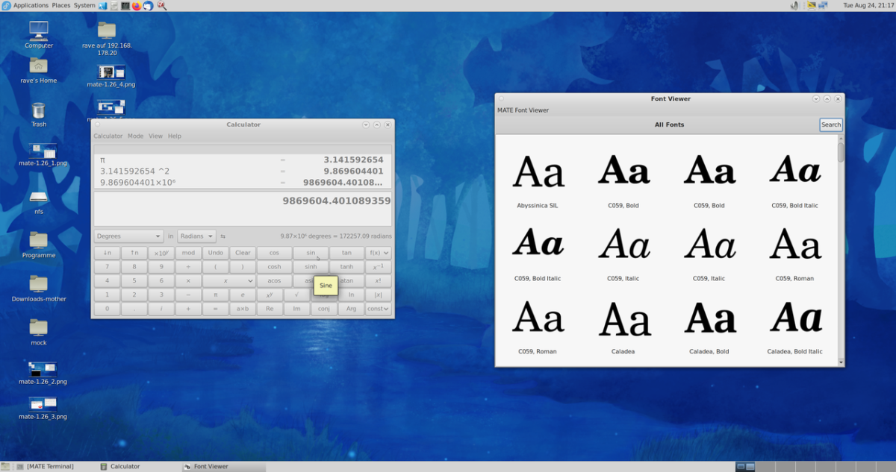

Mate Desktop Environment adalah salah satu lingkungan desktop open-source yang populer untuk distribusi Linux. Mate dirancang untuk menjadi ringan, cepat, dan mudah digunakan, dan didasarkan pada Gnome 2 yang populer di masa lalu. Berikut adalah beberapa kelebihan dan kekurangan dari Mate Desktop Environment:

#### Kelebihan

1.  Ringan dan cepat: Mate Desktop Environment sangat ringan dan tidak memakan banyak sumber daya sistem. Ini membuatnya ideal untuk digunakan pada sistem yang lebih tua atau perangkat dengan spesifikasi yang lebih rendah.
    
2.  Antarmuka Pengguna yang Mudah Digunakan: Mate memiliki antarmuka pengguna yang mudah digunakan dan familiar bagi pengguna yang terbiasa dengan lingkungan desktop tradisional.
    
3.  Konfigurasi yang Fleksibel: Mate menyediakan pengaturan yang fleksibel dan dapat disesuaikan untuk pengaturan tampilan dan fungsionalitas. Pengguna dapat mengubah tampilan desktop, ikon, tema, dan banyak lagi.
    
4.  Dukungan untuk banyak fitur: Mate memiliki dukungan untuk banyak fitur, termasuk dukungan untuk keyboard pintas, desktop virtual, dan pengaturan energi.
    

#### Kekurangan

1.  Tampilan kuno: Antarmuka pengguna Mate terlihat sedikit kuno dan ketinggalan zaman dibandingkan dengan beberapa lingkungan desktop modern.
    
2.  Kurangnya inovasi: Meskipun Mate dirancang ulang dari Gnome 2 yang populer, tidak banyak fitur baru yang ditambahkan selain beberapa fitur penyesuaian.
    
3.  Keterbatasan aplikasi bawaan: Meskipun Mate memiliki beberapa aplikasi bawaan yang berguna, namun aplikasi bawaannya terbatas dibandingkan dengan beberapa lingkungan desktop modern.
    

Meskipun memiliki beberapa kekurangan, Mate Desktop Environment tetap menjadi pilihan yang populer untuk pengguna Linux yang mengingingkan lingkungan desktop yang ringan, cepat, dan mudah digunakan. Namun, Mate mungkin bukan pilihan yang tepat bagi mereka yang menginginkan lingkungan desktop dengan tampilan yang lebih modern.

### 5\. Cinnamon

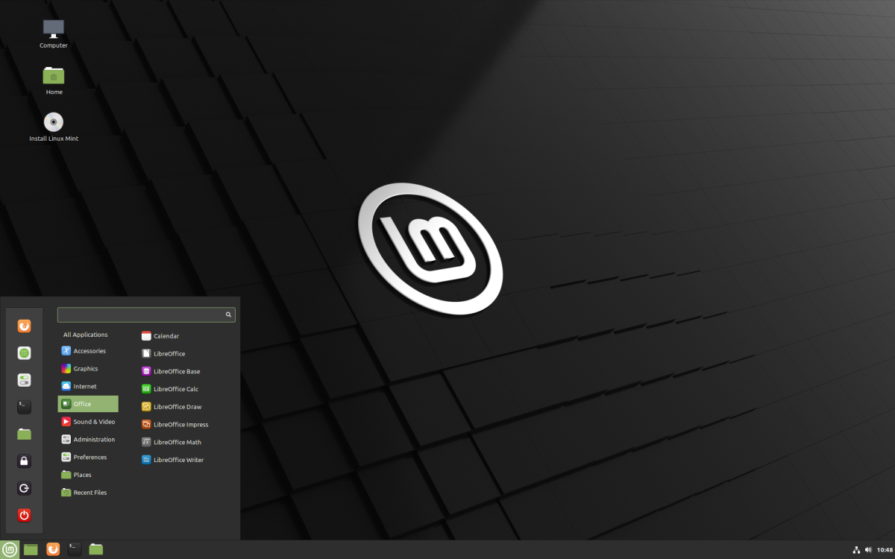

Cinnamon adalah desktop environment yang dikembangkan oleh tim Linux Mint. Dibangun di atas teknologi GNOME, Cinnamon menawarkan tampilan klasik yang mudah digunakan, dengan elemen-elemen modern yang memudahkan penggunaan. Desktop environment ini mendapatkan popularitas karena tampilannya yang menarik dan kemudahan penggunaannya.

#### Kelebihan Cinnamon

1.  Tampilan yang elegan dan menarik
    
2.  Mudah digunakan dan dipelajari
    
3.  Integrasi dengan sistem Linux Mint yang baik
    
4.  Banyak pilihan tema dan pengaturan personalisasi
    
5.  Dukungan untuk panel dan menu klasik
    

#### Kekurangan Cinnamon

1.  Membutuhkan spesifikasi hardware yang cukup tinggi
    
2.  Beberapa fitur mungkin memakan sumber daya yang lebih banyak
    
3.  Tidak banyak dukungan pihak ketiga untuk Cinnamon
    

Kesimpulannya, Cinnamon Desktop Environment adalah pilihan yang baik untuk pengguna yang mencari desktop environment dengan tampilan klasik yang mudah digunakan dan personalisasi yang luas. Meskipun membutuhkan spesifikasi hardware yang lebih tinggi, Cinnamon menawarkan tampilan yang menarik dan fitur yang memudahkan penggunaan. Namun, pengguna harus siap mengalami keterbatasan dukungan pihak ketiga dalam hal pengembangan aplikasi dan dukungan teknis.

### 6\. Budgie

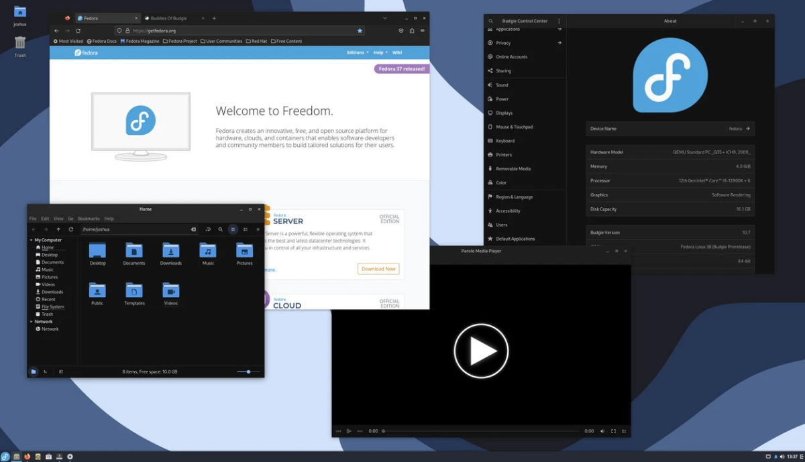

Budgie Desktop Environment adalah salah satu lingkungan desktop yang dibangun di atas teknologi GNOME 3 dan dirancang oleh tim Solus Project. Desktop environment ini sangat ringan dan mudah digunakan, serta menawarkan desktop environment yang minimalis namun elegan dengan tema material design yang membuatnya terlihat modern dan juga up-to-date.

#### Kelebihan

1.  Desain modern dan minimalis yang membuat Budgie terlihat elegan dan menarik
    
2.  Dibangun di atas teknologi GNOME 3, sehingga memiliki kemampuan yang sama dengan GNOME
    
3.  Sangat ringan dan efisien dalam penggunaan sumber daya, sehingga cocok untuk digunakan pada komputer dengan spesifikasi rendah
    
4.  Mudah dikustomisasi dengan fitur-fitur seperti panel, aplikasi menu, dan tema desktop
    

#### Kekurangan

1.  Tidak memiliki banyak aplikasi bawaan, sehingga pengguna harus mengunduh dan menginstal aplikasi sendiri
    
2.  Fitur-fitur tambahan seperti plug-in dan ekstensi sangat terbatas, sehingga pengguna mungkin harus bergantung pada pihak ketiga untuk menambahkan fungsionalitas
    
3.  Budgie masih terbilang baru dan belum memiliki komunitas pengguna yang besar seperti desktop environment lainnya, sehingga sulit untuk mencari dukungan dan tutorial online
    

Meskipun memiliki kekurangan, Budgie Desktop Environment masih menjadi pilihan yang menarik bagi pengguna Linux yang mencari lingkungan desktop yang modern, ringan, dan mudah digunakan.

### 7\. LXDE

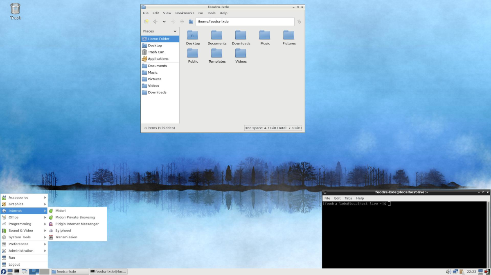

LXDE (Lightweight X11 Desktop Environment) adalah salah satu pilihan desktop environment (DE) yang bisa dijadikan alternatif untuk pengguna Linux. DE ini dirancang untuk memberikan pengalaman pengguna yang ringan, cepat, dan mudah digunakan. LXDE terkenal karena tampilannya yang minimalis, sederhana, dan tidak memakan banyak sumber daya sistem. LXDE sering digunakan pada sistem operasi yang membutuhkan performa ringan seperti Raspberry Pi, netbook, atau laptop dengan spesifikasi rendah.

#### Kelebihan LXDE

Salah satu kelebihan LXDE adalah kecepatannya. LXDE dirancang untuk bekerja dengan sistem operasi yang memiliki sumber daya terbatas, sehingga membutuhkan sedikit memori dan CPU. Selain itu, LXDE juga memiliki fitur-fitur yang sederhana dan mudah digunakan. Beberapa fitur menarik LXDE antara lain:

1.  PCManFM: File manager yang cepat, sederhana, dan mudah digunakan.
    
2.  Openbox: Window manager yang fleksibel dan mudah dikonfigurasi.
    
3.  LXPanel: Panel yang sederhana dan mudah dikustomisasi.
    
4.  LXSession: Manajer sesi yang memungkinkan pengguna untuk mengatur pengaturan otomatis pada saat booting.
    

#### Kekurangan LXDE

Meskipun memiliki kecepatan yang tinggi dan sederhana, LXDE memiliki beberapa kekurangan. Beberapa kekurangan LXDE antara lain:

1.  Tampilan kurang menarik: Tampilan LXDE terlihat sederhana dan kurang menarik dibandingkan dengan desktop environment yang lebih canggih.
    
2.  Kurangnya fitur: LXDE tidak memiliki fitur seperti efek animasi atau visualisasi desktop yang memukau.
    
3.  Keterbatasan pengaturan: LXDE memiliki pengaturan yang cukup terbatas dibandingkan dengan desktop environment yang lebih canggih.
    

Meskipun memiliki beberapa kekurangan, LXDE tetap menjadi pilihan yang menarik bagi pengguna Linux yang membutuhkan performa tinggi dan sederhana. Jika kamu mencari DE yang cepat, ringan, dan mudah digunakan, maka LXDE bisa menjadi pilihan yang tepat.

### 8\. LXQT

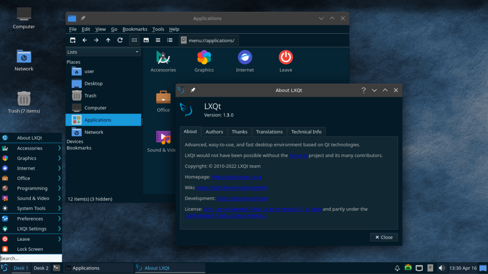

LXQt (Lightweight Qt Desktop Environment) adalah salah satu desktop environment (DE) yang populer di kalangan pengguna Linux. DE ini dirancang untuk memberikan pengalaman pengguna yang ringan, cepat, dan menawan. LXQt pertama kali dirilis pada tahun 2013 dan merupakan pengganti dari LXDE yang lebih lama. LXQt dirancang menggunakan toolkit Qt 5, sehingga tampilannya lebih menawan dibandingkan dengan LXDE.

#### Kelebihan LXQt

Salah satu kelebihan LXQt adalah kecepatannya. LXQt dirancang untuk bekerja dengan sistem operasi yang memiliki sumber daya terbatas, sehingga membutuhkan sedikit memori dan CPU. Selain itu, LXQt juga memiliki fitur-fitur yang lebih canggih dibandingkan dengan LXDE. Beberapa fitur menarik LXQt antara lain:

1.  Panel yang fleksibel: Panel LXQt dapat dikustomisasi dengan mudah dan memungkinkan pengguna untuk menambahkan atau menghapus widget sesuai dengan kebutuhan.
    
2.  Tampilan menawan: LXQt memiliki tampilan yang menawan dan modern dibandingkan dengan LXDE.
    
3.  Banyak pilihan konfigurasi: LXQt memiliki banyak opsi konfigurasi yang memungkinkan pengguna untuk menyesuaikan desktop environment sesuai dengan kebutuhan.
    

#### Kekurangan LXQt

Meskipun memiliki banyak kelebihan, LXQt juga memiliki beberapa kekurangan. Beberapa kekurangan LXQt antara lain:

1.  Tidak secepat LXDE: Meskipun lebih cepat dari beberapa desktop environment lain, LXQt tidak secepat LXDE dalam hal kecepatan.
    
2.  Kurangnya dokumentasi: LXQt masih kurang didukung oleh dokumentasi yang lengkap, sehingga pengguna harus mencari informasi sendiri melalui sumber-sumber online.
    
3.  Masih dalam pengembangan: LXQt masih dalam tahap pengembangan dan terkadang masih memiliki bug atau kesalahan yang perlu diperbaiki.
    

Meskipun memiliki beberapa kekurangan, LXQt tetap menjadi pilihan yang menarik bagi pengguna Linux yang membutuhkan DE yang cepat, ringan, dan menawan. Jika kamu mencari DE yang modern dan lebih canggih dibandingkan dengan LXDE, maka LXQt bisa kamu pertimbangkan.

### 9\. Deepin DE

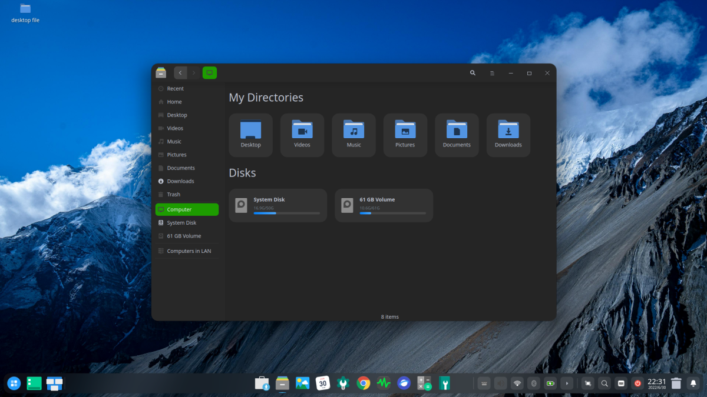

Deepin Desktop Environment (DDE) adalah salah satu desktop environment terbaik terutama dari segi tampilan yang sangat indah. DDE dikembangkan oleh perusahaan teknologi yang berbasis di China yaitu Deepin Technology.

Jika kamu menginginkan desktop yang memiliki tampilan modern dan elegan, maka deepin bisa dipertimbangkan. Namun untuk menggunakan DDE sebaiknya kamu menggunakan distro Deepin OS sehingga kestabilan desktop bisa terjamin. Jika kamu menginstall DDE pada distro yang tidak didukung, kemungkinan masalah pada sistem sangat besar.

#### Kelebihan

Salah satu kelebihan Deepin adalah tampilannya yang sangat elegan dan modern. DDE memiliki desain yang minimalis dan memperhatikan detail, sehingga membuatnya terlihat sangat menarik.

#### Kekurangan

Meskipun memiliki banyak kelebihan, Deepin juga memiliki beberapa kekurangan. Beberapa kekurangan Deepin antara lain:

1.  Masalah privasi: Deepin memiliki beberapa masalah privasi yang memicu kekhawatiran di antara pengguna. Beberapa pengguna khawatir dengan pengumpulan data oleh Deepin.
    
2.  Kurangnya dukungan komunitas: Deepin tidak memiliki dukungan komunitas yang besar, dan masalah atau kesalahan sering kali memerlukan bantuan dari tim Deepin sendiri.
    

Meskipun memiliki beberapa kekurangan, Deepin tetap menjadi pilihan menarik bagi pengguna Linux yang mencari DE yang elegan dan mudah digunakan. Jika kamu mencari DE dengan desain minimalis yang elegan dan memperhatikan detail, maka Deepin bisa menjadi pilihan yang tepat.

### 10\. Phanteon

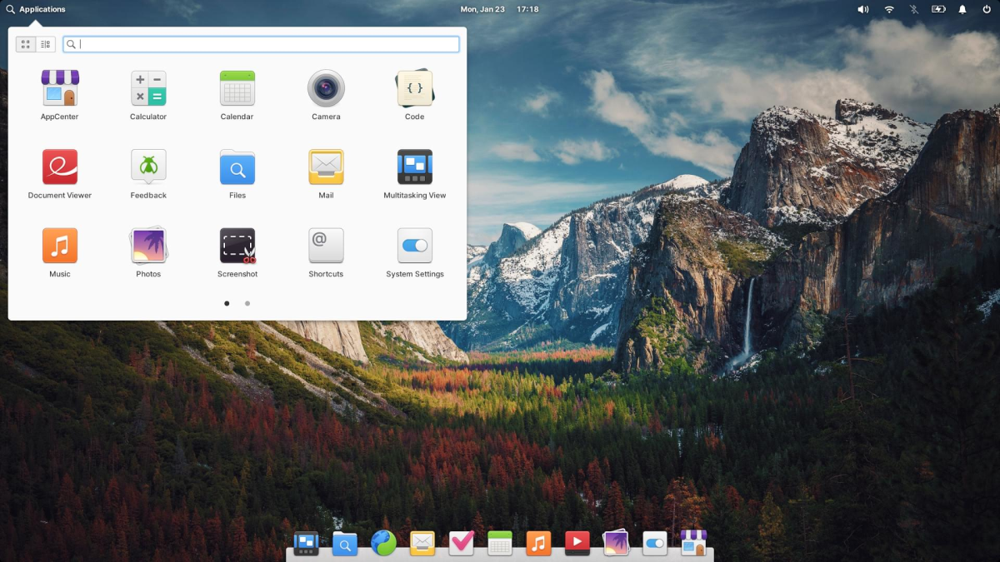

Pantheon Desktop Environment (DE) adalah DE bawaan dari distribusi Linux elementaryOS. Dikembangkan oleh tim elementary, Pantheon dikenal karena tampilan yang elegan dan modern, serta integrasi yang baik dengan aplikasi bawaan.

#### Kelebihan Pantheon

Salah satu kelebihan utama Pantheon adalah tampilannya yang elegan dan modern. DE ini dirancang dengan desain yang minimalis dan memperhatikan detail, sehingga tampilannya sangat menarik dan membuatnya sangat populer di kalangan pengguna Linux. Beberapa kelebihan Pantheon lainnya adalah:

1.  Integrasi dengan aplikasi bawaan: Pantheon terintegrasi dengan baik dengan aplikasi bawaan dari elementaryOS, sehingga pengguna dapat dengan mudah mengakses aplikasi seperti terminal, editor teks, pengelola berkas, dan lain-lain.
    
2.  User-friendly: Pantheon sangat mudah digunakan dan ramah pengguna, dengan antarmuka pengguna yang intuitif dan mudah dipahami.
    
3.  Dukungan komunitas yang baik: elementaryOS dan Pantheon memiliki dukungan komunitas yang baik, yang memungkinkan pengguna untuk dengan mudah menemukan solusi untuk masalah yang mungkin mereka hadapi.
    

#### Kekurangan Pantheon

Meskipun memiliki banyak kelebihan, Pantheon juga memiliki beberapa kekurangan, seperti:

1.  Terbatas pada elementaryOS: Pantheon hanya tersedia di elementaryOS, yang membuatnya kurang fleksibel dibandingkan dengan DE lainnya yang dapat diinstal di banyak distribusi Linux.
    
2.  Kurangnya fitur kustomisasi: Pantheon memiliki keterbatasan dalam hal fitur kustomisasi, yang membuatnya kurang cocok bagi pengguna yang suka memodifikasi antarmuka pengguna.
    
3.  Masalah performa: Beberapa pengguna melaporkan masalah performa pada Pantheon, terutama ketika digunakan pada perangkat dengan spesifikasi rendah.
    

Meskipun memiliki beberapa kekurangan, Pantheon tetap menjadi pilihan menarik bagi pengguna Linux yang mencari DE yang elegan, modern, dan mudah digunakan. Jika kamu menggunakan elementaryOS atau mencari DE dengan tampilan yang menarik, maka Pantheon bisa menjadi pilihan yang tepat.

### 11\. UKUI

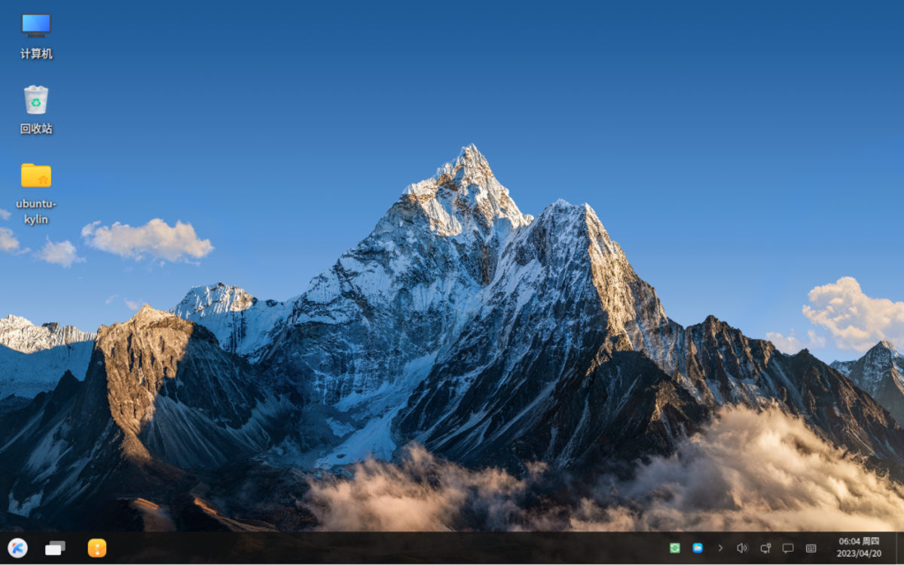

UKUI Desktop Environment (DE) adalah DE resmi dari distribusi Linux Ubuntu Kylin, yang dikembangkan oleh China National Electronics Import & Export Corporation (CEIEC). UKUI dikembangkan untuk memberikan pengalaman pengguna yang mirip dengan Windows, namun tetap memiliki ciri khas Linux.

#### Kelebihan UKUI

Salah satu kelebihan utama UKUI adalah tampilannya yang mirip dengan Windows, yang membuatnya sangat mudah digunakan oleh pengguna Windows yang baru beralih ke Linux. Beberapa kelebihan lain dari UKUI adalah:

1.  User-friendly: UKUI sangat mudah digunakan dan ramah pengguna, dengan antarmuka pengguna yang intuitif dan mirip dengan Windows.
    
2.  Dukungan Bahasa Cina: UKUI menyediakan dukungan bahasa Cina yang sangat baik, membuatnya sangat populer di kalangan pengguna di China.
    
3.  Lebih ringan daripada DE lainnya: UKUI lebih ringan daripada DE lainnya seperti GNOME dan KDE, yang membuatnya cocok untuk digunakan pada perangkat dengan spesifikasi rendah.
    

#### Kekurangan UKUI

Meskipun memiliki banyak kelebihan, UKUI juga memiliki beberapa kekurangan, seperti:

1.  Keterbatasan fitur: UKUI memiliki keterbatasan dalam hal fitur dan kustomisasi, yang membuatnya kurang cocok bagi pengguna yang suka memodifikasi antarmuka pengguna.
    
2.  Kurangnya dukungan komunitas: UKUI kurang memiliki dukungan komunitas dibandingkan dengan DE lainnya seperti GNOME dan KDE, yang membuatnya kurang populer di luar China.
    
3.  Masalah kompatibilitas: Beberapa aplikasi mungkin tidak dapat berjalan dengan baik di UKUI karena perbedaan dalam infrastruktur dan dukungan aplikasi.
    

Meskipun memiliki beberapa kekurangan, UKUI tetap menjadi pilihan menarik bagi pengguna Linux yang baru beralih dari Windows dan mencari DE yang mudah digunakan. Jika kamu mencari DE dengan tampilan mirip dengan Windows dan ringan, maka UKUI bisa menjadi pilihan yang tepat.

### 12\. CutefishDE

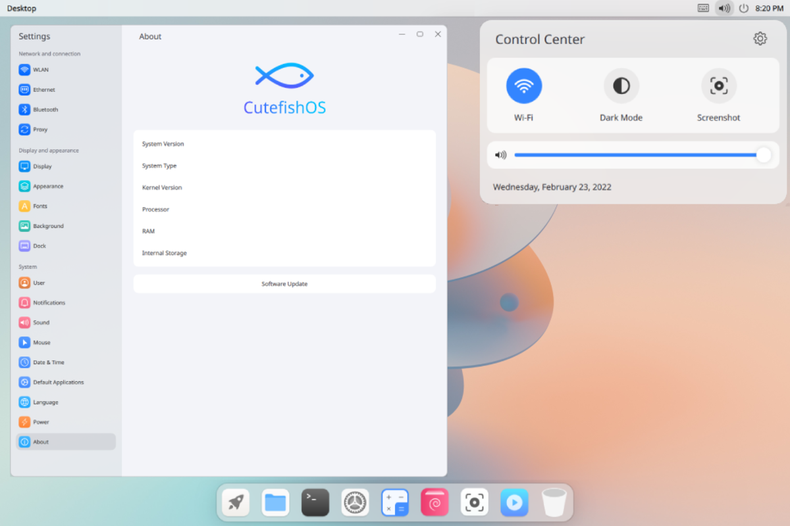

CuteFish Desktop Environment (DE) adalah DE yang baru dan sedang dikembangkan untuk sistem operasi Linux. DE ini menawarkan tampilan yang modern dan menyenangkan, dengan fitur-fitur yang lebih sederhana dan mudah digunakan.

#### Kelebihan CuteFish

Salah satu kelebihan utama CuteFish adalah antarmuka pengguna yang user-friendly dan mudah digunakan. Dibandingkan dengan DE lainnya, CuteFish menawarkan pengalaman pengguna yang lebih intuitif dan sederhana.

Selain itu, CuteFish juga menawarkan beberapa kelebihan lainnya, seperti:

1.  Tampilan Modern: CuteFish menawarkan tampilan modern dan menyenangkan, dengan ikon dan tema yang menarik.
    
2.  Kustomisasi Mudah: CuteFish memiliki fitur kustomisasi yang mudah digunakan, memungkinkan pengguna untuk menyesuaikan antarmuka pengguna sesuai dengan preferensi mereka.
    
3.  Ringan: CuteFish tergolong ringan dan dapat digunakan pada perangkat dengan spesifikasi rendah.
    

Kekurangan CuteFish

Namun, seperti halnya DE lainnya, CuteFish juga memiliki beberapa kekurangan, seperti:

1.  Masih dalam tahap pengembangan: CuteFish masih dalam tahap pengembangan dan belum sepenuhnya stabil, sehingga beberapa fitur mungkin tidak berfungsi dengan baik atau terdapat bug.
    
2.  Kurangnya dukungan aplikasi: Karena CuteFish masih baru, masih terdapat kurangnya dukungan aplikasi, sehingga beberapa aplikasi mungkin tidak dapat berjalan dengan baik.
    
3.  Kurangnya dukungan komunitas: Karena masih baru, CuteFish kurang memiliki dukungan komunitas dibandingkan dengan DE lainnya seperti GNOME dan KDE.
    

Meskipun memiliki beberapa kekurangan, CuteFish tetap menjadi pilihan menarik bagi pengguna Linux yang mencari DE yang user-friendly dan modern. Dengan tampilan yang menyenangkan dan fitur-fitur yang sederhana, CuteFish dapat menjadi pilihan bagi pengguna yang ingin mencoba sesuatu yang baru dan berbeda. Namun, bagi pengguna yang memerlukan fitur-fitur khusus atau dukungan aplikasi yang lebih luas, CuteFish mungkin belum menjadi pilihan yang tepat.

## Akhir Kata

Demikianlah ulasan mengenai desktop environment Linux terbaik yang bisa kamu coba. Setiap desktop environment memiliki kelebihan dan kekurangannya masing-masing, sehingga kamu bisa memilih yang paling sesuai dengan kebutuhan dan keinginan kamu. Ingatlah bahwa Linux adalah sistem operasi yang sangat fleksibel dan dapat disesuaikan dengan kebutuhan pengguna, sehingga memilih desktop environment yang tepat sangat penting untuk memaksimalkan pengalaman penggunaan Linux kamu. Semoga artikel ini bermanfaat bagi kamu dalam memilih desktop environment Linux yang sesuai dengan kebutuhan kamu.