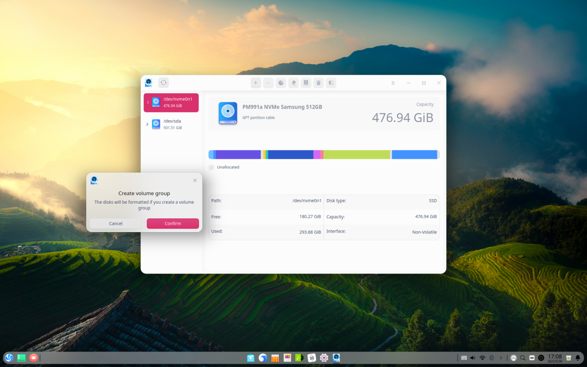
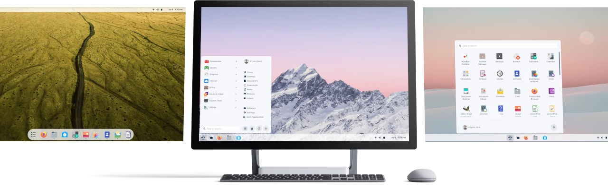
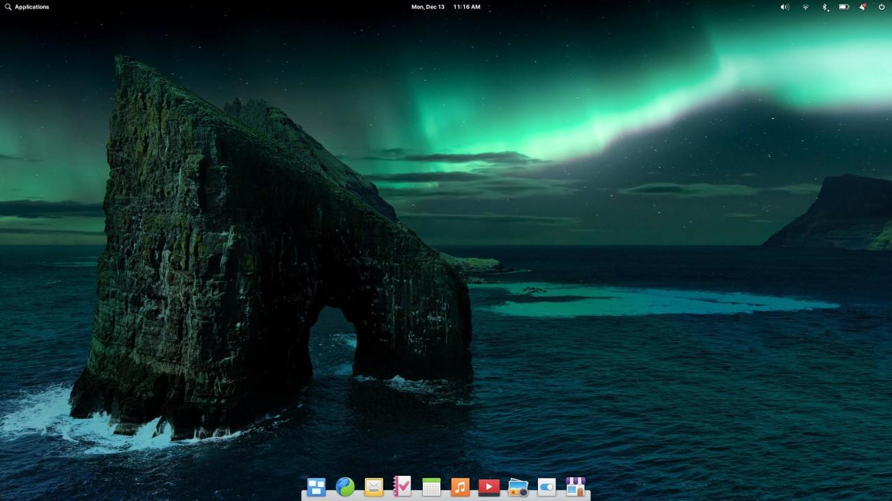
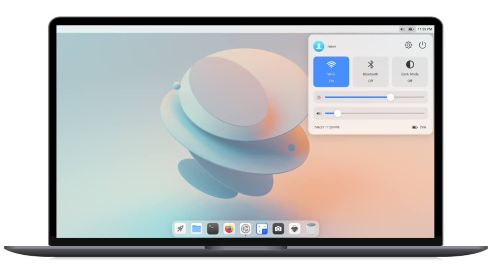
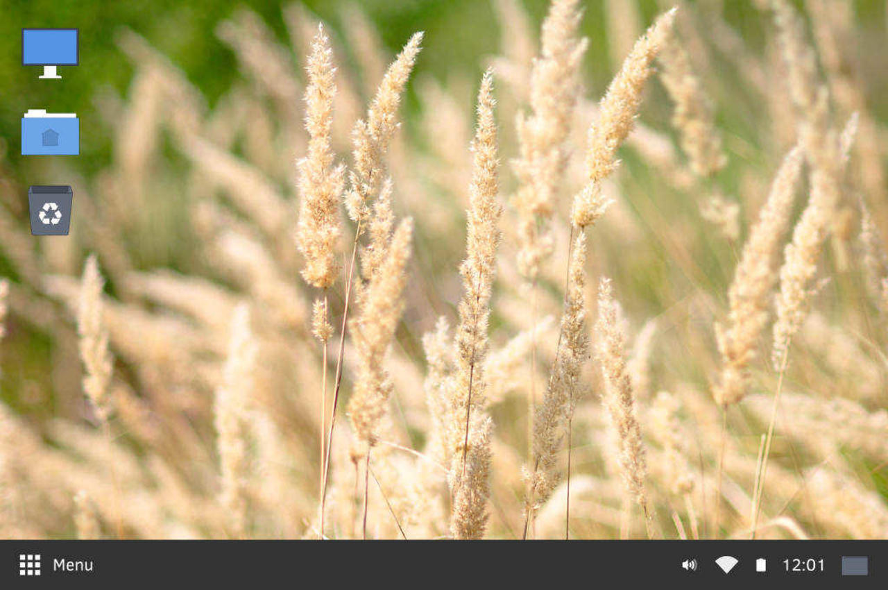
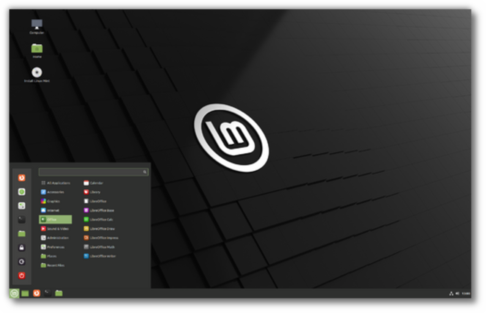

**Distro Linux** memiliki banyak variasi. Tak tanggung-tanggung ratusan distro linux bertebaran diluar sana, mulai dari yang sudah ditinggalkan, baru dibuat dan bahkan yang sudah lama bertahan dan tetap exist seperti Ubuntu dan Linux Mint.

## Apa itu Distro Linux

Apakah kamu sudah tahu dengan yang namanya **Distro Linux**? Atau baru mendengarnya? Apa sih sebenarnya distro linux itu?

Linux dan Distro Linux tidak sama, Linux sebenarnya merupakan kernel atau inti dari Distro Linux. Sistem operasi yang paling banyak digunakan Android, menggunakan Linux sebagai kernel atau inti nya.

Sedangkan Distro Linux merupakan sebuah sistem operasi layaknya Windows maupun Mac OS X. Tidak seperti Windows maupun Mac OS X yang memiliki paket siap digunakan, Linux memiliki berbagai paket yang berbeda dan juga dihasilkan oleh organisasi berbeda.

Maka disinilah **Distro Linux** mengambil semua paket yang dibutuhkan sehingga siap digunakan oleh penggunanya.

## UI/UX Distro Linux

User Interface dan User Experience pada distro linux berbeda tergantung dari desktop environment yang digunakan. Distro Linux juga ada yang menggunakan desktop environment seperti Gnome, XFCE dan KDE dengan berbagai kostumisas untuk membuat tampilan atau UI/UX lebih bagus.

Ada juga yang menggunakan desktop environment sendiri seperti KDE Neon dengan desktop environment KDE dan juga Ubuntu versi lama dengan desktop environment Unity. Sayangnya Unity sudah berhenti dikembangkan sejak Ubuntu 16.0, namun kamu bisa menikmati versi Ubuntu Unity yang dikembangkan bukan oleh Canonical (pengembang asli dari distro Ubuntu).

## List Distro Linux Terbaik

Sekarang kami akan merekomendasikan distro linux terbaik dari segi tampilan atau UI/UX.

### Deepin OS

Deepin OS merupakan distro yang dikembangkan oleh Deepin Technology yang berasal dari China. Distro Linux Deepin di dasarkan pada Debian, dan sempat juga berdasarkan pada Ubuntu saat versi 9.12 hingga pihak pengembang memutuskan tidak menggunakan lagi ubuntu sebagai dasar sistem operasi mereka pada deepin versi 2014.3.

Deepin OS pernah menggunakan desktop environmnet xfce, lxde dan gnome hingga Deepin mengembangkan desktop environment sendiri yang dinamai Deepin Desktop Environment.

Saat terakhir kali artikel ini diperbarui deepin sudah rilis versi 20.6. Namun berdasarkan penglihatan dan pengalaman kami terhadap Deepin OS ini bisa dibilang distro linux terbaik dari segi tampilan atau UI dan UX untuk saat ini. Kamu bisa mendownload distro tersebut secara gratis dari [deepin.org](http://deepin.org).

### Zorin OS

Distro Zorin menggunakan Gnome 3 dengan beberapa kostumisasi pada tampilan sebagai desktop environmentnya. Ada juga Zorin OS Lite dimana menggunakan Xfce sebagai desktop environmentnya. Zorin OS dan Zorin OS Lite tidak jauh berbeda dari segi tampilan, namun dari segi fungsi mungkin akan berbeda dikarenakan aplikasi yang digunakan juga berbeda.

Namun dari segi tampilan distro linux Zorin adalah salah satu distro dengan tampilan terbaik yang pernah kami lihat.

### Elementary OS

Mau yang simpel tapi elegan? Elementary OS mungkin adalah salah satu pilihannya. Dengan gaya yang dibuat seperti Mac OS serta menggunakan desktop environment GNOME kostumisasi maka jadilah tampilan UI/UX yang simpel tapi sangat bagus dan mudah digunakan. Selain itu Elementary mempunyai Store aplikasi tersendiri yang belum tentu bisa diinstal di distro linux lainya.

### Ubuntu Kylin

<iframe class="youtube" loading="lazy" width="640" height="360" allowfullscreen="false" src="https://www.youtube.com/embed/RANEwmRE_ms" start="0"></iframe>

Ubuntu juga mengeluarkan distro Ubuntu versi China nya sendiri, Ubuntu Kylin menggunakan desktop environment UKUI perpaduan antara QT dan GTK yang membuatnya lebih baik dalam tampilan UI ataupun UX.

### Cutefish OS

Distro Cutefish OS dibuat berdasarkan Ubuntu, sehingga sangat mudah digunakan bahkan untuk pemula. Yang menarik adalah UI nya yang sangat keren dan digadang-gadang akan menjadi pengganti distro linux elementary.

Cutefish OS menggunakan desktop environment mereka sendiri yakni Cutefish Desktop, yang dibuat menggunakan QT dan beberapa framework dari KDE. Bahkan aplikasi mereka dirancang untuk pengalaman UI/UX pengguna yang terbaik.

### Solus Linux

Solus Linux dirancang untuk semua pengguna, namun dari berbagai komunitas distro satu ini sangat cocok dengan pengguna dengan profesi di bidang pengembangan perangkat lunax.

Meskipun terbilang pendatang baru tapi Solus Linux telah terbukti sebagai ditro yang cepat dan stabil. Solus juga tersedia beberapa opsi desktop environment populer yakni Budgie, GNOME, Mate dan Plasma.

### Linux Mint

Untuk distro linux yang satu ini sangat terkenal di Indonesia, banyak pengguna memilih Linux Mint karena kemudahan pengoperasiannya yang mirip dengan Windows. Untuk pemula maka distro Linux Mint ini sangat cocok, karena tampilannya yang sangat bersahabat.

Pengguna dengan komputer lama atau komputer dengan teknologi baru bisa menggunakan Linux Mint dengan lancar. Selain itu desktop environment Linux Mint juga bervariasi, ada Cinnamon, XFCE dan Mate. Sedangkan Cinnamon EDGE dibuat untuk pengguna komputer dengan teknologi lebih baru.

## Akhir Kata

Apakah kamu pengguna Linux? Atau sedang mencari Distro Linux dan masih bingung. Menurut pengalaman kami lebih baik kamu mencobanya sendiri supaya bisa merasakan distro mana yang terbaik dari segi tampilan atau ui/ux.

Atau mungkin kamu masih betah untuk menggunakan Windows maupun Mac, sehingga kamu bisa mencobanya dengan sistem dual booting atau booting langsung dari flash drive.