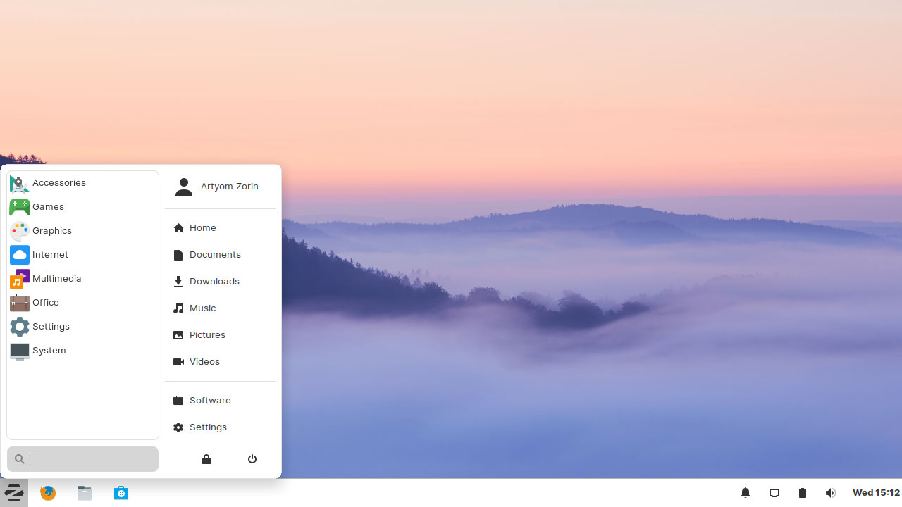
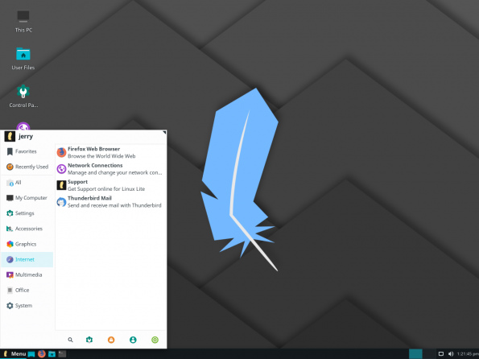
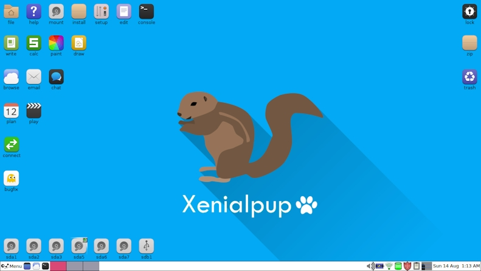

Distro Linux adalah sebuah pilihan jika anda mempunyai sebuah komputer lama namun masih ingin menggunakan OS versi terbaru atau khawatir akan keamanan dari OS anda yang sudah tidak di Update lagi. Distro Linux terbilang cukup ringan digunakan untuk penggunaan sehari-hari, namun jika spesifikasi komputer anda terbilang jadul maka anda harus bisa memilih Distro yang cukup ringan digunakan di komputer Anda.

## List Distro Linux Paling Ringan

Untuk hal ini saya memberikan referensi kepada Anda "Apa Distro Linux Paling Ringan yang Cocok untuk Komputer Anda?"

### **Zorin OS Lite**

Zorin OS terkenal dengan tampilannya dan juga ringan ketika digunakan. Sekarang terdapat Zorin OS Lite dengan menggunakan desktop environtmen Xfce yang membuatnya sangat ringan. Tampilan tetap memukau dan memanjakan mata spesifikasi yang dibutuhkan pun tak perlu tinggi untuk bisa menjalankanya. Antarmuka dibuat mirip dengan windows sehingga yang asalnya pengguna windows dapat beradaptasi.

Dukungan 32 Bit: Ya

Processor: 700 MHz Single Core

Ram: 512 MB

Display: Min 640 × 480

### **Linux Lite**

Linux Lite juga tak kalah ringan dengan distro lainya. Tampilan dari linux lite terlihat modern dan simple. Antarmuka pun mirip dengan windows. Linux Lite adalah turunan dari Ubuntu LTS.

  
Dukungan 32 Bit: Ya  
Processor: 1 Ghz processor  
Ram: 768 MB  
Penyimpanan: 8 GB

### Puppy Os

Puppy Linux adalah distro yang ringan digunakan pada komputer anda. Distro ini cukup unik, karena anda bisa memilih variant yang berbeda dari distro lainya. Anda bisa memilih binari Debian, Ubuntu, Arch, dan binari lainya dari distro ini.  
  
Dukungan 32 Bit : Ya  
RAM :  256 MB  
Processor : 600 Hz Processor

### Xubuntu

  
Xubuntu adalah variant dari ubuntu, perbedaanya dari ubuntu yaitu dekstop environment yang digunakan adalah Xfce dan beberapa software bawaan yang berbeda.  
  
Dukungan 32 Bit: Ya  
Ram: 512 MB

### MX Linux

<iframe class="youtube" width="640" height="360" allowfullscreen="false" src="https://www.youtube.com/embed/tZJ0EesBd6Y" start="0"></iframe>

Distro MX Linux adalah distro terbaik dan juga ringan digunakan. Distro MX Linux adalah distro paling stabil di tahun 2022. MX Linux dibuat dengan dasar Debian stabil dan antiX sehinggga tercipta distro yan stabil.

## Akhir Kata

Itulah beberapa distro linux yang ringan untuk digunakan bahkan di komputer lama sekalipun. Pelu diketahui bahwa desktop environment yang digunakan mempengaruhi terhadap pemakaian Ram. Xfce adalah salah satu desktop environment yang ringan, selain Xfce ada juga Lxde yang tak kalah ringan pula.

Distro Linux yang saya buat daftarnya bukanlah distro paling ringan, tetapi distro yang ringan namun tampilan kekinian alias modern. Untuk distro paling ringan munkin jatuh pada TinyCore yang hanya membutuhkan 64 MB Ram supaya bisa berjalan. Semoga artikel [Distro Linux Paling Ringan Terbaik 2020](https://www.nurhidayat.web.id/2020/04/distro-linux-paling-ringan-terbaik.html) bisa membantu anda dan bermanfaat bagi anda.