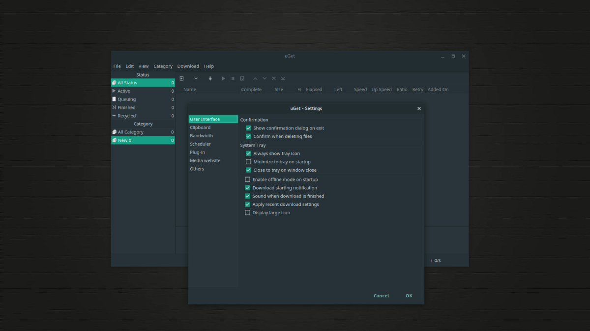
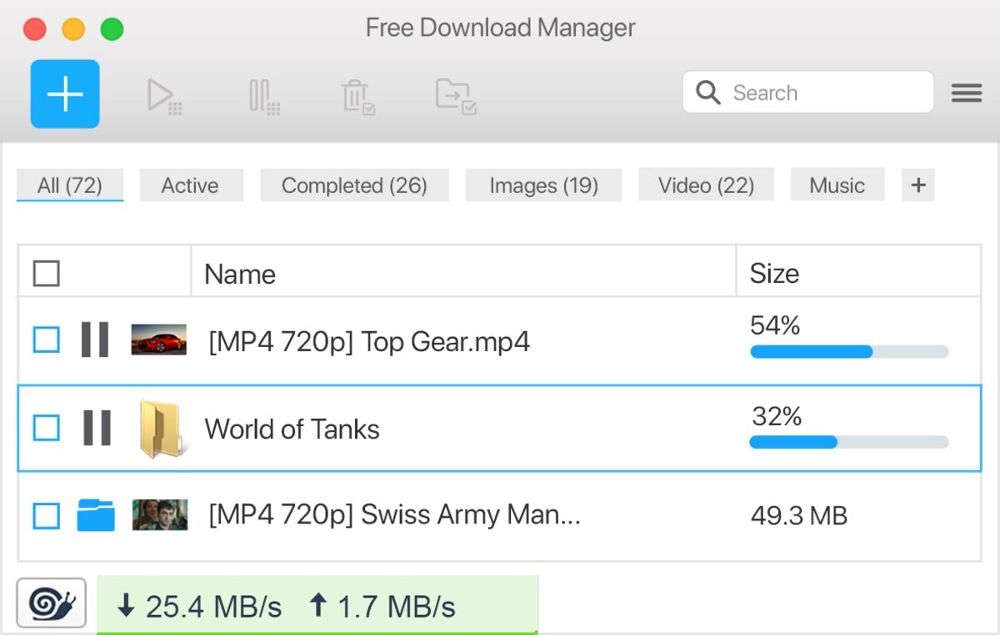
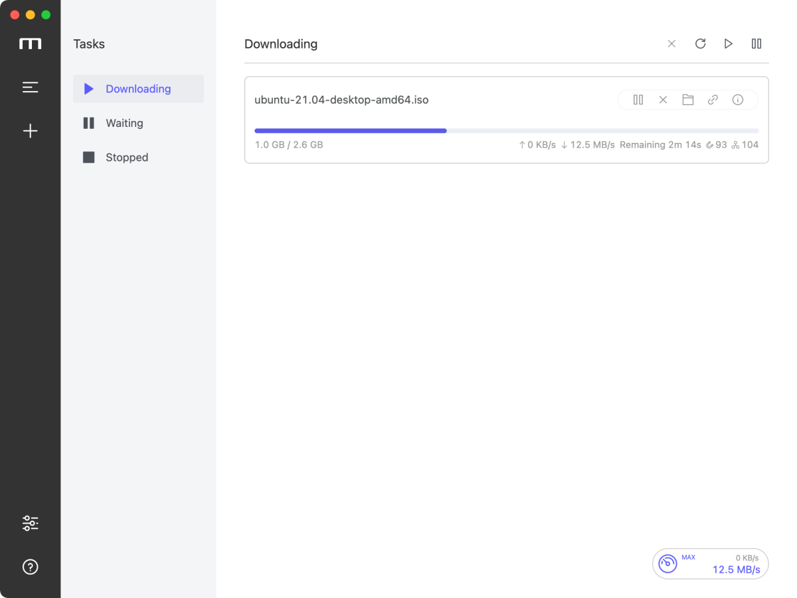
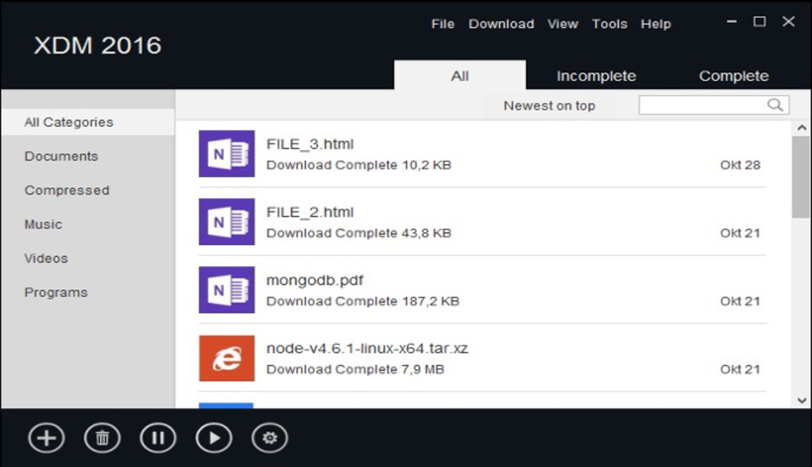
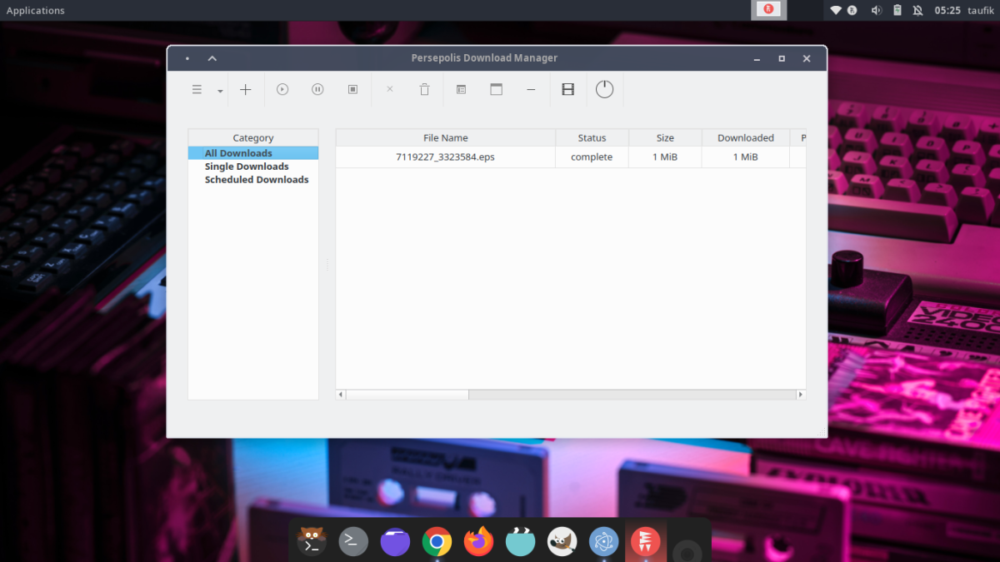

Baik pengguna linux maupun windows, pasti sesekali akan mengunduh file dari internet. Oleh karena itu, diperlukan _software download manager_ terutama ketika file yang di unduh lumayan besar.

Sebab, ketika mengunduh file tanpa download manager, sering terjadi hal-hal yang tidak di inginkan. Contohnya, ketika sedang dalam proses mengunduh namun koneksi internet tidak stabil, besar kemungkinan file yang di unduh tersebut _corrupt_.

Contoh lainnya, ketika proses mengunduh berlangsung tetapi komputer tiba-tiba mati. Maka, proses mengunduh akan terhenti dan tanpa _software download manager_, proses tersebut harus dilakukan lagi dari awal. Sehingga, membuang waktu dan juga bandwidth.

## Kenapa Menggunakan Software Download Manager?

Seperti yang saya sebutkan di awal, bahwa tanpa menggunakan _download manager_, proses mengunduh file sering terjadi hal-hal yang tidak di inginkan. Contohnya, file _corrupt_, proses terhenti dan mengulang dari awal, link download yang tiba-tiba mati dan masalah-masalah lainnya.

Menggunakan _software download manager_, akan mengatasi masalah-masalah tersebut. Sehingga download manager sangat diperlukan bagi mereka yang sering mengunduh file dari internet.

## Download Manager Gratis untuk Linux dan Windows

Terdapat banyak pilihan _software download manager_ baik untuk Linux dan Windows, yang tentunya gratis untuk digunakan. Berikut adalah beberapa di antara software-software tersebut.

### 1\. uGet Download Manager

Salah satu download manager terbaik saat ini ialah uGet. Karena, uGet dapat di install pada sistem operasi Linux, Windows, dan Android. Selain itu, uGet juga memiliki banyak fitur unggulan yang pastinya sangat penting.

Berikut adalah beberapa fitur unggulan dari uGet Download Manager:

1.  Multi platform: dapat berjalan di linux, windows dan android.
    
2.  Multi Connections: download file dengan beberapa segment, sehingga kecepatan download meningkat. Maksimal sampai 16 koneksi serentak pada satu file.
    
3.  Integrasi: Ekstensi dan Plugin untuk browser Firefox, Chrome dan Chromium yang memudahkan proses download.
    
4.  Youtube: download file langsung dari url youtube.
    
5.  Clipboard Monitor: Ketika menyalin url file, maka secara otomatis uGet menawarkan untuk mendownload file tersebut atau tidak.
    
6.  Batch Downloads: download file tanpa batas, tambahkan pada daftar antrean untuk mendownload secara otomatis.
    
7.  Download Queue: Dapat mengatur jumlah maksimal file yang dapat didownload secara serentak.
    
8.  Pause & Resume: jeda download yang berjalan, dan dapat dilanjutkan kembali tanpa mengulang dari awal.
    
9.  Multi Languages: uGet mendukung lebih dari 30 bahasa, yang diterjemahkan oleh komunitas.
    
10.  After Completion Action: Ketika download telah selesai, lakukan aksi seperti Shutdown, Reboot, Sleep, Hibernate maupun script.
    

Selain dari fitur tersebut, banyak fitur lain yang belum disebutkan seperti Scheduler, Multiple Mirror, Multiple Protocols dan fitur-fitur lainnya.

### 2\. Free Download Manager

FDM adalah salah satu download manager open source yang juga cross platform, mulai dari linux, windows, macOs dan Android. Dengan tampilan yang modern namun sederhana sehingga mudah ketika digunakan oleh pengguna menjadi salah satu alasan untuk menggunakan FDM.

Berikut beberapa fitur unggulan dari Free Download Manager:

1.  Multi Platform: FDM dapat di gunakan pada sistem operasi Linux, Windows, Mac dan Android.
    
2.  Remote Control: Buat tugas download dari jarak jauh menggunakan smartphone Android.
    
3.  Add-ons Support: Download files/video dari website lebih mudah dengan memasang add-ons.
    
4.  BitTorent Support: FDM dapat mendownload file melalui protokol bittorent.
    
5.  Download Acceleration: Pada FDM setiap file yang didownload akan dipisah ke beberapa bagian, sehingga dapat mengunduh dengan kecepatan maximal.
    
6.  Resuming Broken downloads: Ketika download mengalami kegagalan, FDM dapat melanjutkan proses download tanpa mengulang dari nol.
    
7.  Adjusting Traffic Usage: Setel kecepatan download sehingga dapat melakukan browsing di internet dengan lancar.
    

Selain itu, FDM juga bisa digunakan dengan berbagai bahasa termasuk bahasa Indonesia. FDM adalah download manager dengan fitur yang lengkap, cocok bagi pengguna Linux, Windows, Mac maupun Android.

### 3\. Motrix

Motrix adalah download manager dengan user interface yang modern, dibangun diatas electron dan juga vue sehingga menghasilkan tampilan yang baik. Tidak hanya untuk linux saja motrix juga tersedia bagi pengguna Windows dan Mac. Karena bersifat open source maka Motrix dapat digunakan secara gratis.

Selain itu Motrix memiliki fitur unggulan yaitu:

1.  Support Bittorent & Magnet
    
2.  Bittorent Selective Download
    
3.  Otomatis update list tracker (every day)
    
4.  UPnP & NAT-PMP Port Mapping
    
5.  Up to 10 tasks concurrently download
    
6.  Single task maximum support 64 thread download
    
7.  Download progress graphic dynamic display
    
8.  Multi Language Support
    

Motrix tersedia dalam berbagai format, mulai dari exe, dmg, deb, appimage juga dari software installer seperti snap, flatpak dan aur.

### 4\. Xtreme Download Manager

XDM merupakan salah satu pilihan download manager yang populer juga powerful untuk pengguna linux. Selain bisa dipasang di linux, XDM juga dapat dipasang di Windows dan Mac.

Berikut adalah beberapa fitur unggulan dari Xtreme Download Manager.

1.  Download Streaming Video: XDM dapat mendownload hampir dari setiap web streaming.
    
2.  Download 5X Faster: Dengan menggunakan teknologi _intelligent dynamic file segmentation_, XDM dapat mendownload sampai 5X lebih cepat.
    
3.  Support All Browser: XDM dapat berjalan di semua browser seperti Firefox, Chrome, Vivaldi, Opera dan browser lainnya.
    
4.  Download Resume: Ketika download dijeda, maka bisa melanjutkan proses download tanpa mengulang dari awal. Juga setiap proses yang mengalami kesalahan seperti koneksi tidak stabil, komputer mati, atau _interrupt_ lainnya dapat diatasi.
    
5.  Smart Scheduler: XDM dapat terkoneksi dengan internet sesuai waktu yang ditentukan, ketika download selesai dapat melakukan aksi seperti shutdown.
    
6.  Speed Limiter: XDM dapat membatasi kecepatan download, sehingga dapat melakukan aktivitas di internet tanpa terganggu.
    
7.  Queued Downloads: XDM juga mendukung antrean file, sehingga proses download dapat dilakukan secara otomatis satu persatu.
    

XDM sangat cocok bagi mereka yang membutuhkan download manager yang powerfull. Selain itu, XDM juga dapat di install pada sistem operasi selain linux, seperti windows dan mac.

Untuk pengguna Windows, XDM juga tersedia pada Microsoft Store.

### 5\. Persepolis Download Manager

Persepolis merupakan software download manager sederhana dan GUI dari Aria2. Sama halnya dengan Motrix, software yang satu ini juga Open Source dan support multi platform yaitu Linux, Mac dan Windows.

Persepolis sudah cukup dalam keperluan mendownload berkas dari internet. Meski tidak mendukung file torrent, hal tersebut bisa diabaikan jika kamu tidak pernah mendownload file torrent seperti saya.

Berikut adalah beberapa fitur unggulan dari Persepolis Download Manager.

1.  Multi Segment Download
    
2.  Scheduling Download
    
3.  Download Queuing
    
4.  Download from YouTube, Vimeo or Dailymotion
    

Meskipun tidak banyak fitur seperti halnya uGet atau FDM. Namun, persepolis sangat cocok bagi mereka yang menginginkan download manager untuk linux yang sederhana.

## Alternatif Download Manager Lain

Jika merasa daftar yang telah kami sebutkan kurang, mungkin alternatif download manager linux berikut bisa menjadi pilihan untuk digunakan.

1.  FireDM
    
2.  Aria2
    
3.  FlareGet
    
4.  MultiGet
    
5.  DownThemAll
    
6.  JDownloader 2
    
7.  Kget (linux only)
    

## Akhir Kata

Nah, itulah rekomendasi download manager gratis untuk linux dan windows terbaik versi Nurhidayat. Dengan menggunakan download manager, proses download bisa jauh lebih cepat, mencegah file _corrupt_ dan berbagai keuntungan lainnya.