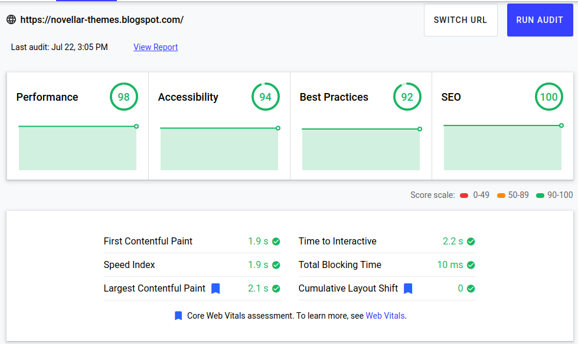

Pada kesempatan kali ini saya mau membagikan sebuah template blogger yang dikhususkan untuk web novel atau web baca novel online.

## Template Blogger Novellar

Template Novellar adalah template Blogger yang saya buat khusus untuk blog atau web novel, template ini sangat cocok untuk yang sedang menerjemahkan novel dan dipublish di blogger.

## Fitur Template Novellar

Untuk saat ini template Novellar masih versi 0.1, dan mungkin terdapat bug. Berikut fitur yang tersedia saat ini:

-   Fast Loading
    
-   Mobile Responsive
    
-   Seo Friendly (Need Customization)
    
-   Pass [Schema.org](http://Schema.org)
    
-   Load More Button in Index
    
-   Custom 404 page
    
-   Recent Post Novel in Index Only
    
-   Automatic Chapter List
    
-   Automatic Next and Prev by Label
    
-   Bootstrap 4.5
    
-   Material Icons
    
-   Automatic Novel Page
    

Hasil dari google light house:



## Dokumentasi Template

### **Navbar**

Untuk mengubah link navbar silahkan buka blogger>tab tema>edit html cari kode berikut dan ubah atau tambah dengan link yang anda inginkan, maksimal 4 link yang saya sarankan jika menggunakan ikon material. Jika lebih maka bisa membuat navbar terlihat tidak simetris, silahkan dicoba.

```
<li class='nav-item'><a class='header-link' href='/p/daftar-novel.html'><i class='material-icons'>collections_bookmark</i>Daftar Novel</a></li>
<li class='nav-item'><a class='header-link' href='#'><i class='material-icons'>view_list</i>Proyek</a></li>
<li class='nav-item'><a class='header-link' href='#'><i class='material-icons'>sms</i>Ruang Ngobrol</a></li>
```

  
Untuk warna merah adalah link tujuan, warna orange adalah icon material yang bisa anda buka referensinya di [materials.io](http://materials.io), untuk warna biru adalah text yang tampil dari link itu sendiri.

### **Halaman Daftar Novel**

Silahkan buat halaman baru dan ubah ke tampilan HTML dan tempel kode berikut  

```
<style>
@media (max-width:575){.card-columns{-webkit-column-count:2;-moz-column-count:2;column-count:2}}@media (min-width:576){.card-columns{-webkit-column-count:2;-moz-column-count:2;column-count:2}}@media (min-width:720px){.card-columns{-webkit-column-count:3;-moz-column-count:3;column-count:3}}@media (min-width:1000px){.card-columns{-webkit-column-count:5;-moz-column-count:5;column-count:5}}h3.rcnt-title{font-size:unset}
</style>
<script type="text/javascript">
var numposts = 99;
var showpostthumbnails = true;
var showpostdate = true;
</script>

<script src="/feeds/posts/default/-/Novel?alt=json-in-script&amp;callback=rcentbytag"></script>
```

Kode  `var numposts = 99;` adalah jumlah maksimal postingan yang akan tampil  
Kode `var showpostthumbnails = true;`adalah variabel apakah tuhmbnail akan ditampilkan, jika true maka thumbnail akan muncul dan jika false thumbnail tidak akan muncul  
Kode `var showpostdate = true;` adalah variabel apakah tanggal publikasi akan ditampilkan atau tidak  

### Widget Recent Post Pada Halaman Index

Sidebar dalam template ini hanya akan muncul di halaman index yaitu halaman depan dan pencarian. Silahkan edit di tata letak dan pada sidebar terdapat widget berupa html/javascript. Kode tidak berbeda dengan yang ada pada halaman Daftar Novel.

```
<script type="text/javascript">
var numposts = 3;
var showpostthumbnails = true;
var showpostdate = false;
</script>

<script src="/feeds/posts/default/-/Novel?alt=json-in-script&amp;callback=rcentbytag"></script>
```

### Link Footer

Untuk link footer sendiri sudah terdapat dalam tata letak jadi mengeditnya akan mudah.

### **Cara Membuat Postingan**

Untuk membuat postingan index dari novel atau daftar isi beserta info novel silahkan isi dengan label Novel dan judul novel, sedangkan untuk postingan chapter 1,2,3 dst, hanya diisi dengan label judul novelnya saja dan jangan pernah memberi label lebih dari 1 untuk postingan halaman chapter karena akan membuat script next prev per label error. Untuk isi postingan buat seperti berikut dalam mode html

```
<div class="row">
<div class="col-sm-4"></div>
<div class="col-sm-8">
<p><b>Genre</b><br />
Sci-fi, Fiction,
</p>
<p><b>Info 2<br/>
terserah
</p>
<p><b>Sinopsis</b><br />
Isi sinopsis
</p></div>
</div>
<script>var autlist = true;</script>
```

Jika ingin membuat link secara manual hapus kode `<script>var autlist = true;</script>` dan ganti dengan kode berikut:

```
<div class='auto-listchap'>
<ul>
  <li><a href='http://url-post'>Chapter Title</a></li>
  <li><a href='http://url-post'>Chapter Title</a><li>
  <li><a href='http://url-post'>Chapter Title</a><li>
  <li><a href='http://url-post'>Chapter Title</a><li>
</ul>
</div>
```

## Download Template

Untuk demo anda bisa kunjungi [Novellar Themes](https://novellar-themes.blogspot.com/) dan link  [Download Template Novellar](https://fiksafe.blogspot.com/2019/08/blog-post.html#?o=b2c5e6cb43ffa7f35eedc6d15e2f00ac60c7bc54fd539e60edffe72d09ef1b510a65740a3f102c16ed2f3dac224a2c91152caad166f62170c67eb1ef332b25fad178836681d3556e2288e31540da6828ba45f7338a7ba7cd0ee35560de6c9bfae190cb1646e7d8d0)

## Changelog

v 0.1 29 Juli 2020 realeased

## Syarat dan Ketentuan

Tidak digunakan konten mengandung sara, pornografi.

Tidak menghapus credit footer

> Kemungkinan besar template ini tidak akan ada update lagi