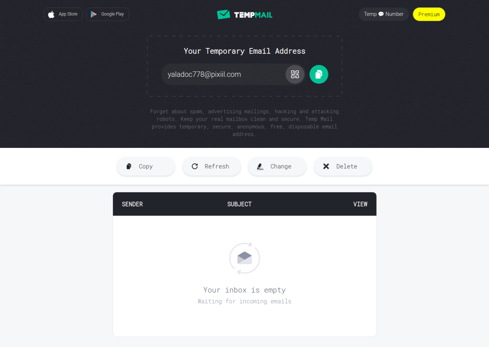

Email Sementara adalah layanan Elektronik Mail yang digunakan sekali pakai atau hanya sementara. Biasanya email sementara digunakan untuk keperluan mendaftar pada forum-forum online atau situs web yang mengharuskan penggunanya untuk mendaftar terlebih dahulu agar dapat membaca atau mendownload konten yang mereka sediakan.

## Pengertian Email Sementara

Email Sementara atau Temporary Mail bisa disebut 10minutes mail, trash mail dan sebutan lainnya adalah sebuah layanan Email yang tidak jauh berbeda dengan layanan Email lainya. Namun perbedaan dari Email Sementara dengan Email pada umumnya ialah kegunaan dari layanan tersebut.

Email umum akan bisa anda akses semau anda atau bahkan selamanya dan digunakan untuk hal-hal penting seperti bisnis, sedangkan Email Sementara biasanya hanya bisa diakses ketika kita membutuhkannya saja dan otomatis terhapus setelah selesai kita pakai.

## Manfaat Email Sementara

Apa gunanya dari Email Sementara ini? Gunanya adalah untuk menghindari spam atau bahkan virus yang disebarkan melalui email atau bisa digunakan untuk membuat banyak akun dalam sebuah situs web dan forum. Misalkan di sebuah situs web anda diperlukan mengisi form email untuk bisa mendownload ebook yang anda ingingkan dan ebook tersebut akan dikirim via email maka email sementara sangat bermanfaat untuk terhindar dari spam dan promosi di waktu yang akan datang, karena biasanya pemilik situs akan mencatat email yang anda isi dan mereka mengirim email berisi promosi atau spam.

Atau anda sering melihat forum-forum dimana konten dalam forum tersebut mengharuskan kamu untuk mendaftar terlebih dahulu supaya bisa mengaksesnya, maka Email Sementara solusinya, jika anda tidak berniat untuk berlama-lama di forum tersebut.

## Cara Membuat Email Sementara

Untuk membuat email sementara sangatlah mudah, kamu bisa mengetik di pencarian google dengan kata kunci temporary mail, maka akan ada barisan situs penyedia email sementara yang bisa kamu gunakan secara gratis.

Sebagai contoh saya akan menggunakan temp-mail.org, salah satu penyedia email sementara gratis terbaik yang saya temukan. Pertama kamu buka terlebih dahulu [temp-mail.org](http://temp-mail.org) maka anda siap menggunakan email sementara, namun biasanya akan berisi email yang acak seperti pada gambar berikut.

Jika kamu perlu alamat email tersebut untuk digunakan lagi di lain hari, maka kamu bisa mengganti alamat email tersebut dengan yang kamu inginkan misalnya [bakso@netmail9.net](mailto:bakso@netmail9.net) degan cara klik pada bagian change.

Sayangnya untuk temp-mail.org mengharuskan kamu membayar terlebih dahulu untuk membuat email dengan alamat email yang di inginkan. Mungkin kamu bisa memilih platform lain supaya tidak dikenakan biaya tambahan untuk mengubah alamat email sementara.

## List Pembuat Email Sementara Gratis

1.  [https://temp-mail.org/](https://temp-mail.org/)
    
2.  [https://www.guerrillamail.com/](https://www.guerrillamail.com/)
    
3.  [https://moakt.com](https://moakt.com)
    
4.  [https://www.emailondeck.com/](https://www.emailondeck.com/)
    
5.  [https://www.fakemail.net/](https://www.fakemail.net/)
    
6.  [https://tempail.com/en/](https://tempail.com/en/)
    
7.  [https://www.throwawaymail.com/en](https://www.throwawaymail.com/en)
    
8.  [https://tempmailgen.com/](https://tempmailgen.com/)
    
9.  [https://tempmailo.com/](https://tempmailo.com/)
    
10.  [https://smailpro.com/](https://smailpro.com/)