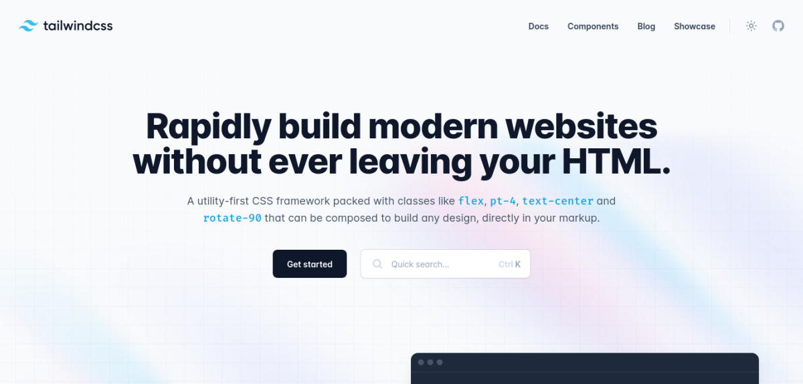
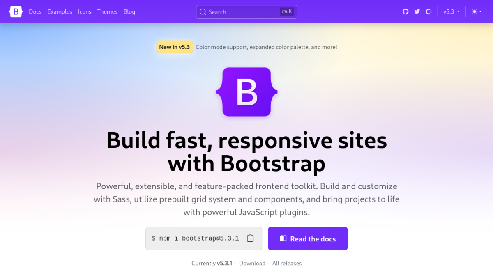
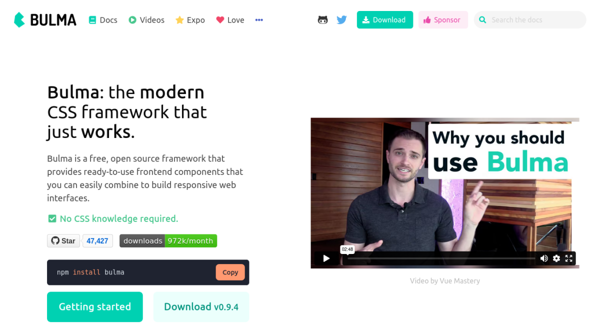
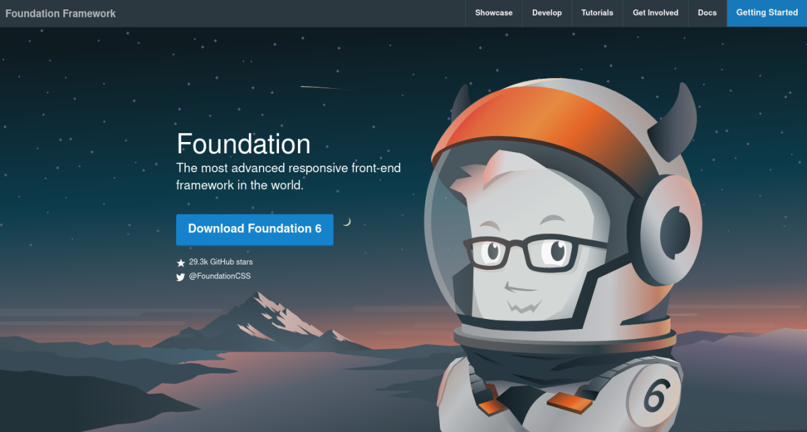
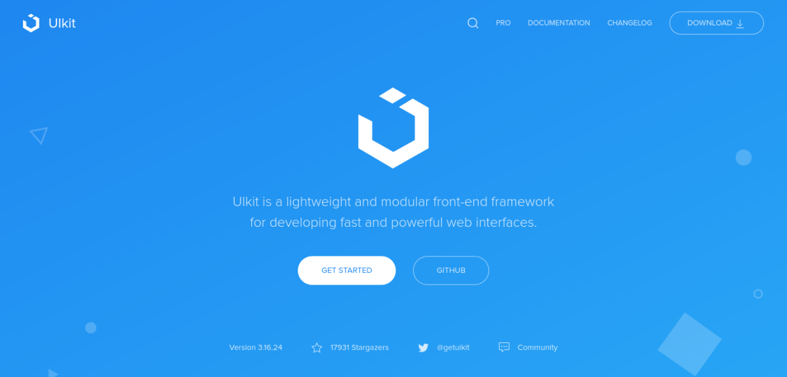
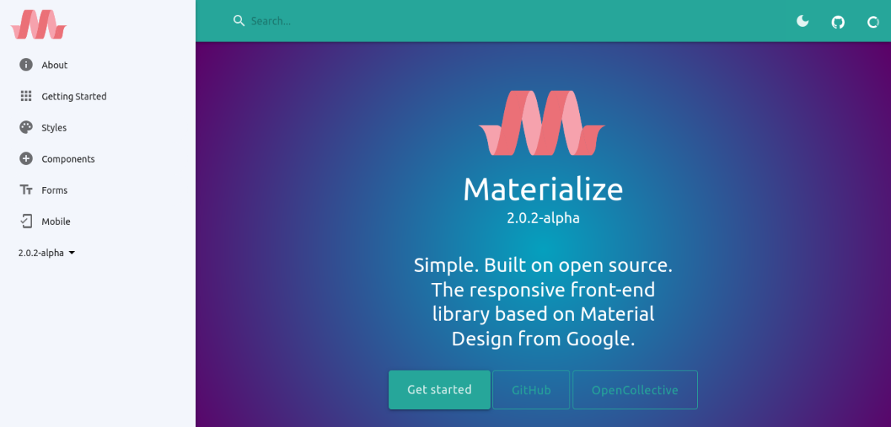

Untuk membuat sebuah tampilan website yang lebih menarik, diperlukan CSS untuk mengatur gaya dan tata letaknya. Namun, ada kalanya penulisan gaya CSS memerlukan waktu yang tidak sedikit. Beruntung ada framework css, yang sangat berguna untuk mempermudah dan mempercepat proses pembuatan gaya CSS.

Meskipun banyak framework css yang bertebaran diluar sana, apakah yang kamu pilih merupakan yang terbaik?

## **Apa itu Framework CSS?**

Framework CSS adalah pustaka CSS yang dibuat dan siap digunakan oleh pengembang. Dengan menggunakan framework css, kita bisa menggunakan langsung gaya-gaya yang disediakan tanpa harus membuatnya dari awal. Bahkan, kita dapat menyesuaikan gaya tersebut ketika proses pembuatan UI berjalan.

## **Framework CSS Terbaik**

### **1\. Tailwind CSS**

Tailwind merupakan salah satu framework css terbaik untuk saat ini. Dengan menggunakan Tailwind, kamu akan tetap fokus mengerjakan di bagian HTML dan JavaScript saja. Biasanya, tailwind banyak digunakan untuk project yang menggunakan library seperti React, Vue dan Svelte.

Namun, penting untuk menguasai fundamental css terlebih dahulu sebelum kamu menggunakan framework yang satu ini. Karena bagi sebagian pemula, terdapat tantangan dalam menggunakannya.

#### **Kelebihan Tailwind**

-   **Fokus pada HTML.** Dengan Tailwind, pembuatan kustom element dilakukan secara langsung pada html, sehingga terasa menulis kode css namun pada kelas html.
    
-   **Penamaan kelas yang lebih mudah diingat.** Jika terbiasa menggunakan css dan beralih ke Tailwind, kita tidak perlu mengingat nama gaya yang rumit.
    
-   **File CSS yang kecil.** Sebagian besar gaya pada tailwind dapat digunakan kembali, contohnya padding dan margin. Selain itu, pada tahap produksi semua gaya yang tidak akan digunakan akan dikecualikan. Sehingga, file css lebih kecil dibanding framework css lainnya.
    
-   **Ekstensi tambahan.** Adanya fitur extensi untuk _autocomplete_, _linting_ dan _syntax highligting_ pada Editor VS Code.
    

### **2\. Bootstrap**

Bootstrap adalah framework css yang pernah menjadi framework paling populer sebelum tailwind muncul, pada github sendiri tercatat lebih dari 4.8 juta orang menggunakan Bootstrap. Artinya, pengguna Bootstrap meningkat lebih dari 2x lipat dibanding tahun 2022 yang hanya 2 juta pengguna saja.

Bootstrap sangat cocok digunakan untuk pemula atau framework css pertama dalam projek kalian. Karena, lebih mudah digunakan dan terdapat JavaScript yang sudah sepaket ketika digunakan.

#### **Kelebihan Bootstrap**

-   **Komponen yang siap pakai.** Dengan bootstrap, kamu disediakan komponen yang siap pakai lengkap dengan fungsi JavaScript.
    
-   **Mudah digunakan.** Kamu hanya perlu salin dan tempel kode yang tersedia, lalu sedikit memodifikasi dan selesai. Sehingga sangat mudah digunakan, meski untuk kebutuhan yang lebih kompleks terdapat sedikit tantangan.
    
-   **Mendukung SASS.** Bootstrap ditulis menggunakan sass, sehingga bagi yang terbiasa menggunakannya akan mempermudah dalam pengerjaan gaya yang baru.
    

### **3\. Bulma**

Bulma adalah framework css yang ditulis dengan Sass, sama halnya dengan Bootstrap bahkan keduanya sangat mirip. Bedanya, terdapat pada penulisan gaya yang lebih mudah dimengerti, sehingga cenderung lebih mudah dipelajari.

Perbedaan lainnya ialah, Bulma tidak menyertakan javascript yang siap digunakan. Namun, tanpa javascript pun framework css ini sudah bisa digunakan.

#### **Kelebihan Bulma**

-   **Penamaan gaya yang mudah diingat.** Penamaan gaya pada framework bulma mudah diingat, contohnya `is-centered`, `block`, `is-small` dst.
    
-   **Ringan digunakan.** Untuk framework css yang lengkap, bulma lebih ringan dibandingkan dengan Bootstrap. Mungkin karena Bulma tidak memerlukan javascript untuk digunakan.
    

Perlu diperhatikan, pada repository github bulma tidak ada perubahan yang signifikan sejak tahun 2022.

### **4\. Foundation CSS**

Framework css terbaik selanjutnya adalah Foundation, yang mengklaim memudahkan untuk mendesain responsive dengan tampilan cantik. Menariknya, Foundation juga menawarkan framework yang dapat digunakan pada email.

Sama seperti Bootstrap dan Bulma, Foundation juga menerapkan metode mobile first. Artinya gaya css dimulai berurutan dari layar paling kecil hingga layar paling besar.

#### **Kelebihan Foundation**

-   **Support Email.** Fitur menarik ini ditawarkan bagi mereka yang membutuhkan gaya css untuk email.
    
-   **Kustomisasi yang mudah.** Framework foundation membebaskan kamu untuk mengubah, menghapus dan menambah gaya-gaya yang tersedia atau baru tanpa batasan.
    

Penting untuk diketahui, repository github foundation terakhir diperbarui pada 13 Juli 2022.

### **5\. UIKit**

Framework css terbaik berikutnya adalah UIKit, yang juga ditulis dengan sass. Menariknya, selain fungsi JavaScript terdapat kumpulan icon yang sepaket dengan css ketika digunakan.

UIKit mengklaim sebagai framework frontend yang ringan dan modular untuk membuat website yang powerful dengan cepat.

#### **Kelebihan UIKit**

-   **Komponen yang lengkap namun ringan.** Dengan komponen yang lengkap, namun UIKit mampu dijalankan dengan ringan.
    

### **6\. Materialize CSS**

Berbeda dengan yang sebelumnya, framework css Materialize menawarkan gaya yang didasarkan pada Google Material. Framework css satu ini juga sudah responsive dan mengikuti metode mobile first.

Materialize CSS sudah tidak diperbarui sejak 2018 yang lalu. Tetapi komunitas tidak meninggalkannya begitu saja, dan mengambil alih pengembangan saat ini.

#### **Kelebihan Materialize**

-   **Tampilan yang didasarkan Google Material.** Keuntungan dari mengikuti gaya Google Material ialah desain yang modern.
    

## **Akhir Kata**

Untuk saat ini, Tailwind adalah framework css yang biasa digunakan diikuti oleh Bootstrap. Kami sendiri, menyarankan untuk menggunakan salah satu dari kedua framework tersebut.

Apabila masih ada framework css terbaik lainnya yang belum kami sebutkan, silahkan sampaikan pada kolom komentar.