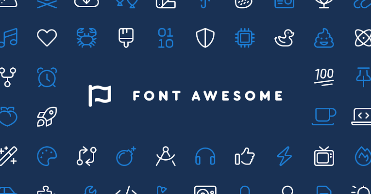
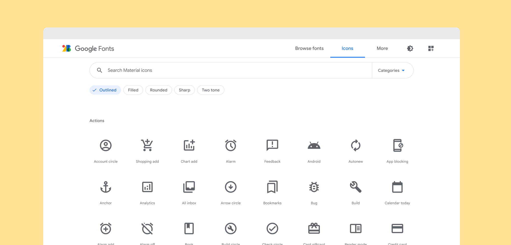
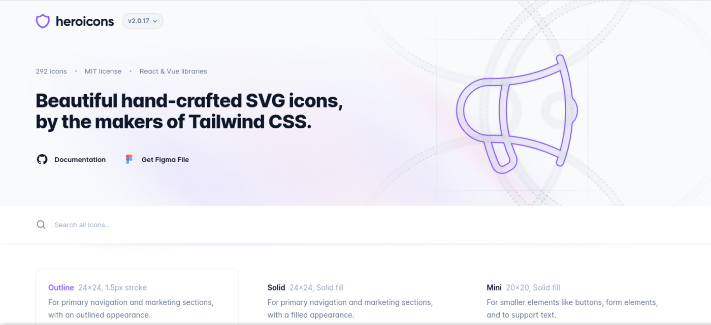
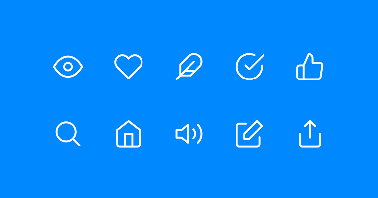
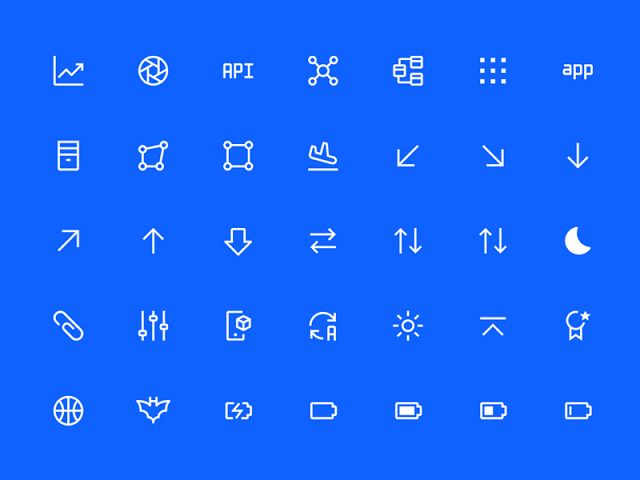
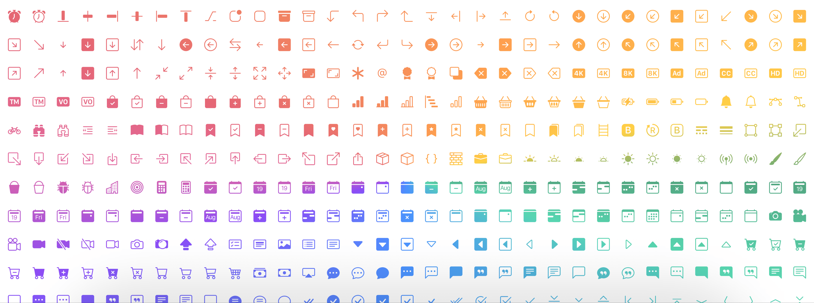
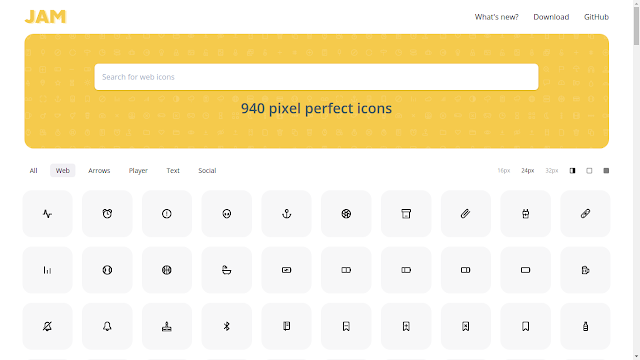
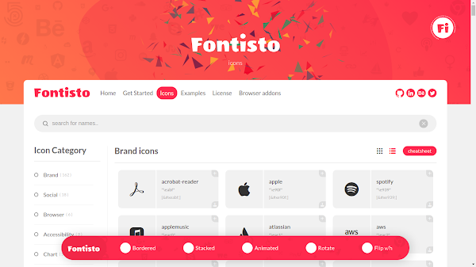
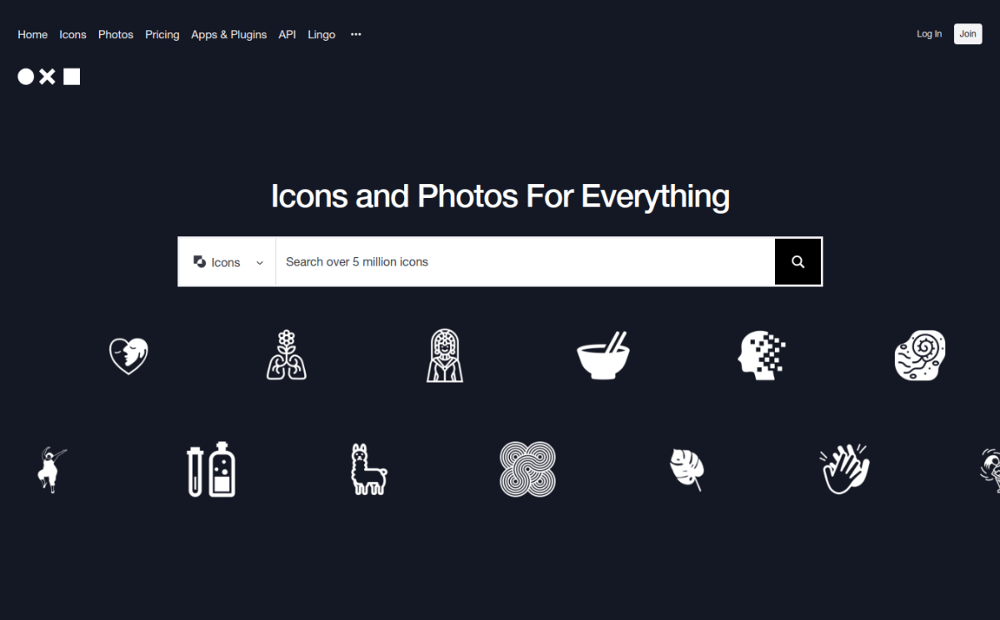

Untuk membuat sebuah icon diperlukan keahlian agar icon terlihat konsisten satu dengan yang lainnya. Tidak hanya itu, icon yang baik juga harus memiliki ukuran yang tidak asal sehingga ketika digunakan pas dengan kerapatan pixel dari layar pengguna khususnya _screen_ dengan kerapatan pixel yang kurang baik.

Jika membuat satu icon mungkin tidak lama, namun jika membuat kumpulan icon maka diperlukan waktu yang tidak sedikit. Maka dalam artikel kali ini saya merangkum **Icon Gratis Terbaik** yang bisa kamu gunakan secara personal maupun commercial.

## Icon Gratis Terbaik 2023

### 1\. Fontawesome

Font Awesome adalah kumpulan icon yang menurutku sangat konsisten, selain itu Font Awesome juga merupakan kumpulan icon gratis terlengkap yang pernah saya coba. Untuk akses icon yang lebih lengkap lagi, kamu perlu menggunakan versi pro.

Terdapat beberapa style dan jenis dari icon Font Awesome. Font Awesome juga tersedia Webfont+CSS, SVG+Javascript, Sketch, Figma, Vue, React, Angular dan Ember.

[Ke Font Awesome](https://fontawesome.com/)

### 2\. Google Material Icons

Jika kamu sering menggunakan produk dari Google, kamu pasti tidak asing dengan Icon yang satu ini. Google Material Icons hampir digunakan pada semua desain produk Google. Hal ini tentu saja wajar karena Material Icon adalah bagian dari proyek Google, yaitu Material UI.

Menurut saya, Material Icon sangat konsisten bahkan lebih konsisten daripada Font Awesome meskipun jumlah ikon yang tersedia tidak sebanyak Font Awesome. Terdapat 5 gaya dari Material Icon, yaitu Filled, Outlined, Rounded, Two-Tone, dan Sharp. Ikon-ikon tersebut dikelompokkan ke dalam berbagai kategori, sehingga kamu dapat dengan mudah menemukan ikon yang sesuai.

Kamu dapat menggunakan Material Icons dalam format SVG atau Webfonts+CSS.

[Google Material Icons](https://material.io/resources/icons/?style=outline)

### 3\. Heroicons

Heroicons merupakan set ikon yang dibuat oleh pengembang Tailwind CSS dengan tiga gaya yaitu outline, solid, dan mini. Ikon-ikon pada Heroicons memiliki konsistensi yang sangat baik dan mudah digunakan, karena kamu hanya perlu menyalin dan menempelkan kode SVG dari situs web mereka. Jika kamu ingin menggunakannya pada framework React atau Vue, kamu juga bisa menginstalnya dengan mudah.

Heroicons akan sangat tepat bila digunakan bersamaan dengan framework TailwindCSS, karena dikembangkan oleh pengembang yang sama.

[heroicons.com](http://heroicons.com)

### 4\. Feather Icons

Feather Icons juga merupakan ikon yang sangat konsisten. Ikon ini dapat mengubah ukuran stroke-nya karena berbentuk SVG. Feather Icons memiliki gaya UI modern, sehingga sangat cocok untuk digunakan pada aplikasi Mobile maupun Website dengan tampilan UI kekinian.

Untuk menggunakannya, kamu perlu menggunakan SVG atau SVG+Javascript.

### 5\. IBM UI Icons

UI Icons dari IBM sangat bagus dan konsisten. Setiap ikon memiliki sudut 45 dan 15 derajat yang konsisten di setiap sisi. Selain itu, setiap ikon juga telah tersedia dalam jumlah yang lengkap dengan berbagai kategori, sehingga memudahkan dalam mencari ikon berdasarkan kategori yang diinginkan.

[IBM UI Icons](https://www.ibm.com/design/language/iconography/ui-icons/library)

### 6\. Bootstrap Icon

Bootstrap Icon merupakan salah satu koleksi icon gratis terbaik yang dapat digunakan oleh para web developer. Bootstrap Icon sendiri merupakan bagian dari framework CSS populer, Bootstrap.

Koleksi icon Bootstrap Icon mencakup berbagai kategori, seperti arrow, navigation, dan social media icons. Icon-nya juga dapat digunakan dalam berbagai format, mulai dari SVG hingga font.

Walaupun Bootstrap Icon masih terbilang baru, namun telah banyak digunakan dan memiliki popularitas yang tinggi di kalangan web developer. Dengan sifatnya yang gratis dan mudah digunakan, Bootstrap Icon menjadi salah satu pilihan terbaik untuk mempercantik tampilan website atau aplikasi.

### 7\. CSS Icons

CSS Icon dibuat oleh seorang desainer UI bernama Astrit Malsia, dengan bantuan beberapa desainer lain sehingga tercipta lebih dari 700 ikon yang siap digunakan secara gratis di bawah lisensi MIT.

Yang menarik dari CSS Icon adalah bahwa ia kompatibel dengan berbagai format, mulai dari Figma dan Adobe XD, CSS, SVG, TSX, JSON, bahkan XML. Hal ini tentu saja akan memudahkan para penggunanya.

[Website CSS Icons](https://css.gg)

### 8\. Jam Icons

Jam Icons merupakan salah satu koleksi icon gratis terbaik dengan jumlah icon yang cukup banyak dan berbagai variasi. Selain itu, Jam Icons juga dikenal dengan kualitasnya yang tinggi, dengan ketelitian pada setiap detailnya sehingga disebut sebagai "pixel perfect icon". Kemampuan untuk menggunakan baik dengan format SVG atau Font juga memberikan fleksibilitas bagi pengguna dalam menggunakannya di berbagai proyek.

[Jam Icons](https://jam-icons.com/)

### 9\. Fontisto Icon Pack

Fontinsto berisi kumpulan icons berupa Vektor, sehingga sangat bagus digunakan dengan layar beresolusi tinggi. Kamu dapat menggunakanya dengan Webfont + CSS. Sebagai tambahan, Fontisto juga menyediakan fitur custom icon dimana pengguna dapat meng-customize icon dengan warna, ukuran, dan animasi yang berbeda sesuai dengan kebutuhan. Selain itu, Fontisto juga menyediakan dokumentasi lengkap dan mudah dipahami untuk memudahkan pengguna dalam menggunakan dan mengintegrasikan icon tersebut ke dalam proyek web mereka.

[Fontisto](https://fontisto.com/)

### 10\. Flaticon

FlatIcon adalah situs web yang menyediakan berbagai macam ikon vektor dalam berbagai format seperti SVG, EPS, PNG, PSD, dan AI. Dengan lebih dari 3 juta ikon, FlatIcon menawarkan koleksi ikon terbesar di dunia dan terus bertambah setiap hari.

Selain koleksi ikon yang besar, FlatIcon juga memiliki fitur pencarian yang canggih dan kategori yang terorganisir dengan baik sehingga memudahkan pengguna dalam mencari dan memilih ikon yang sesuai dengan kebutuhan mereka.

Selain itu, FlatIcon juga menyediakan fitur pengeditan ikon online, yang memungkinkan pengguna untuk mengubah warna, ukuran, dan bentuk ikon langsung di dalam browser tanpa harus menggunakan aplikasi desain terpisah.

FlatIcon menawarkan opsi gratis dan berbayar, dengan opsi gratis memungkinkan pengguna untuk menggunakan ikon tanpa biaya, asalkan memberikan kredit ke pembuat ikon. Opsi berbayar memungkinkan pengguna untuk mengunduh ikon tanpa harus memberikan kredit dan menyediakan akses ke fitur premium seperti pengeditan dan unduhan lebih banyak ikon.

Dengan koleksi ikon yang besar dan fitur-fiturnya yang canggih, FlatIcon adalah pilihan yang bagus untuk para desainer dan pengembang yang membutuhkan ikon-ikon berkualitas tinggi untuk proyek mereka.

### 11\. Noun Project

The Noun Project adalah sebuah website yang menyediakan kumpulan besar ikon yang bisa diunduh secara gratis. Dengan lebih dari 2 juta ikon yang dibuat oleh komunitas desainer dari seluruh dunia, The Noun Project menjadi salah satu sumber daya ikon gratis terbaik yang ada saat ini.

Tersedia berbagai kategori ikon seperti teknologi, alam, makanan, dan masih banyak lagi. Selain itu, pengguna juga dapat melakukan pencarian ikon berdasarkan kata kunci tertentu.

Dalam hal penggunaan, The Noun Project menyediakan opsi untuk mengunduh ikon dalam berbagai format seperti SVG, PNG, EPS, dan AI. Pengguna juga dapat memilih opsi untuk mengunduh ikon dengan lisensi Creative Commons atau lisensi komersial.

Secara keseluruhan, The Noun Project adalah salah satu situs terbaik untuk menemukan dan mengunduh ikon gratis yang berkualitas tinggi dan sangat direkomendasikan bagi para desainer grafis dan web developer.

### 12\. Icons8

Icons8 adalah sebuah situs yang menyediakan berbagai jenis ikon yang dapat diunduh secara gratis maupun berbayar. Situs ini memiliki koleksi ikon terbesar dengan lebih dari 140.000 ikon yang tersedia dalam berbagai format seperti PNG, SVG, EPS, PDF, dan lain-lain.

Tidak hanya itu, Icons8 juga menyediakan fitur kustomisasi ikon, sehingga pengguna dapat menyesuaikan ukuran, warna, dan bentuk ikon sesuai dengan kebutuhan mereka. Selain itu, Icons8 juga menyediakan plugin untuk aplikasi seperti Sketch, Adobe Illustrator, dan Photoshop, sehingga memudahkan pengguna untuk mengakses dan menggunakan ikon-ikon tersebut langsung dari aplikasi yang mereka gunakan.

Dengan koleksi ikon terbesarnya dan fitur kustomisasi yang mudah digunakan, Icons8 dapat dianggap sebagai salah satu situs yang menyediakan "icon gratis terbaik" untuk para desainer dan pengembang web.

## Kumpulan Icon Gratis Lainnya

Masih kurang? Berikut adalah kumpulan icon lain yang bisa kamu gunakan secara gratis.

1.  [Good Stuff No Nonsense](https://goodstuffnononsense.com/)
    
2.  [Iconshock](https://www.iconshock.com/)
    
3.  [Pixeden](https://www.pixeden.com/)
    
4.  [IconsFlow](https://iconsflow.com/)
    
5.  [Streamline](https://streamlinehq.com/)
    
6.  [Iconfinder](https://www.iconfinder.com/)
    
7.  [GraphicBurger](https://graphicburger.com/)
    
8.  [CSS Author](https://cssauthor.com/)
    
9.  [Fontello](https://fontello.com/)
    
10.  [iconmonstr](https://iconmonstr.com/)
    

## Apa Itu Icon?

Icon dalam dunia komputer adalah sebuah gambar kecil yang digunakan untuk mewakili file, aplikasi atau perintah tertentu pada antarmuka perangkat grafis (GUI). Biasanya icon sering berbentuk _symbol_ atau gambar yang mudah dikenali sehingga ketika digunakan mempermudah pengguna dalam mengidentifikasi dan mengakses object maupun perintah dalam sistem komputer. Guna dari icon adalah untuk mengganti teks yang panjang dan kompleks, sehingga bisa membuat antarmuka pengguna lebih intuitif dan efisien.

## Akhir Kata

Nah itulah kumpulan icon gratis terbaik yang bisa kamu gunakan baik secara personal maupun commercial. Untuk mendapatkan hasil terbaik kamu bisa menggunakan icon versi berbayar, selain itu menggunakan versi berbayar juga dapat mendukung para creator icon.

Selain menggunakan versi berbayar, kamu juga bisa melakukan donasi sebagai salah satu bentuk dukungan kepada creator icon untuk terus membuat icon gratis yang berkualitas.