Android adalah sistem operasi dengan linux sebagai inti atau kernel-nya. Meski Android adalah linux namun beberapa fungsi dibatasi, seperti mengakses direktori root untuk melakukan perubahan pada sistem.

Hal ini karena keamanan android adalah prioritas utama, dimana ponsel dengan os android dipakai sehari-hari dan dibawa kemana-mana. Akan sangat berbahaya bila seseorang yang bukan ahli teknologi secara tidak sengaja merubah sistem pada ponsel mereka.

## Penjelasan Singkat Linux

Linux adalah sistem operasi berbasis open source sama seperti sistem operasi Windows dan Mac OS. Sistem operasi itu sendiri memiliki kemampuan untuk berkomunikasi antara perangkat lunak dan perangkat keras. Contohnya prosesor mengeluarkan input yang akan diterima untuk ditampilkan pada perangkat keras monitor.

[Linux](https://www.nurhidayat.web.id/category/linux) sudah ada sejak tahun 90-an dan sekarang telah tersebar dimana-mana disekitar manusia. Mulai dari komputer, smartphone, smartwatch, mobil bahkan mungkin pada lemari es.

## Kenapa Menginstal Distro Linux di Android?

Seperti yang kami sebutkan di awal artikel, meski android merupakan sistem operasi linux namun memiliki berbagai batasan dalam fungsinya. Untuk bisa melewati batasan tersebut kita harus melakukan rooting terlebih dahulu, namun hal tersebut sangat beresiko pada keamanan dari ponsel android itu sendiri.

Tetapi berkat perkembangan teknologi yang pesat, sekarang kita bisa menginstal distro linux di android tanpa root sekalipun. Dengan cara ini ponsel android tetap aman namun fungsi linux bisa digunakan.

Dengan distro linux yang terpasang di android kita bisa melakukan banyak hal seperti:

1.  **Hacking**: tidak semua aktifitas hacking buruk, salah satunya menganalisa kerentanan sebuah server.
    
2.  **Pemrograman**: dengan linux kamu bisa melakukan pengembangan front-end maupun backend pada smartphone android yang kamu miliki.
    
3.  **Menjalankan Software Linux**: banyak software linux luar biasa yang bisa kamu gunakan seperti Inkscape, GIMP dan software lainya.
    

## Cara Install Distro Linux di Android

### Aplikasi yang diperlukan

Sebelum kita melakukan pemasangan distro linux, kita memerlukan beberapa aplikasi yang diperlukan. Berikut daftarnya.

#### 1\. Termux versi terbaru

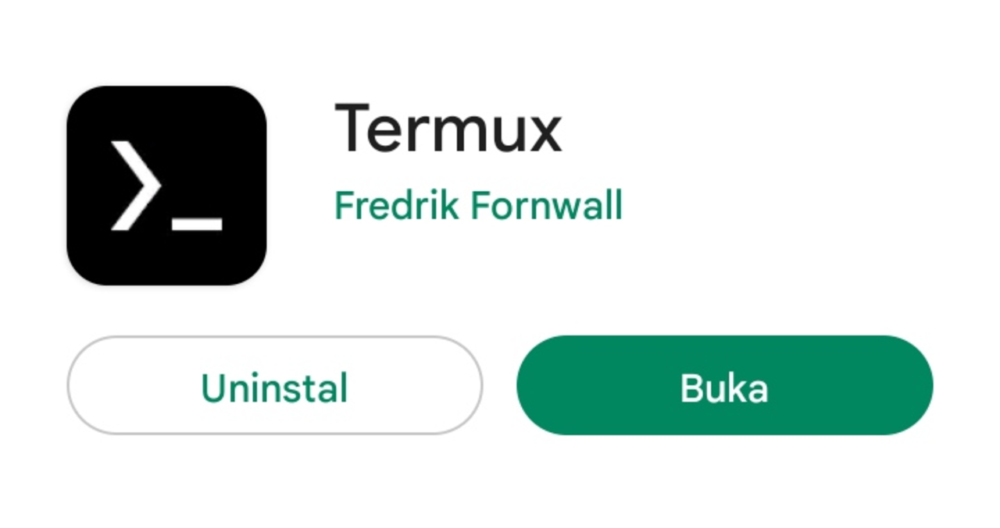

Jika kita menginstal termux dari play store, versi tersebut sudah ditinggalkan dan tidak bisa digunakan untuk beberapa fungsi. Pihak pengembang termux mengatakan hal ini terjadi karena beberapa faktor kebijakan play store.

Tenang saja kamu masih bisa menginstal versi terbaru termux melalui github atau f-droid yang bisa kamu dapatkan melalui link berikut:

-   [F-Droid Termux](https://f-droid.org/en/packages/com.termux/)
    
-   [GitHub Realese Termux](https://github.com/termux/termux-app/releases)
    

> Meskipun bukan dari Play Store, aplikasi tersebut aman dan tidak berbahaya.

#### 2\. Andronix

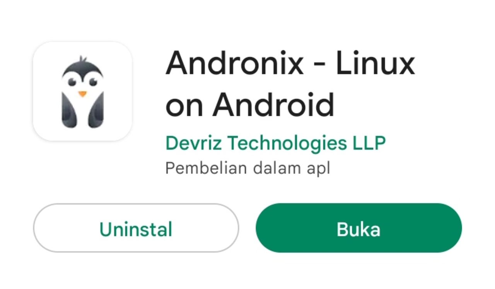

Ada banyak aplikasi yang bisa melakukan penginstalan distro linux di android, namun andronix adalah yang terbaik menurut kami. Beberapa kelebihan yang kami temukan di andronix:

1.  **Mudah untuk digunakan**: semua dokumentasi jelas di website mereka:
    
2.  **Banyak pilihan distro**: berbagai distro populer tersedia untuk di install, seperti kali linux, debian, ubuntu, manjaro, fedora, arch linux, void dan alpine.
    
3.  **Desktop Environment**: untuk masalah tampilan GUI, andronix memiliki pilihan yang beragam untuk itu.
    

#### 3\. VNC Viewer (opsional)

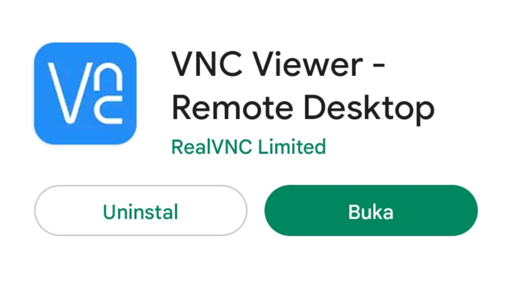

Untuk aplikasi VNC Viewer anda bebas menggunakan yang manapun, aplikasi ini diperlukan untuk mengakses tampilan dari distro linux. Kamu juga bisa tidak menginstalnya jika hanya ingin menggunakan versi distro linux cli only.

### Proses Install Linux

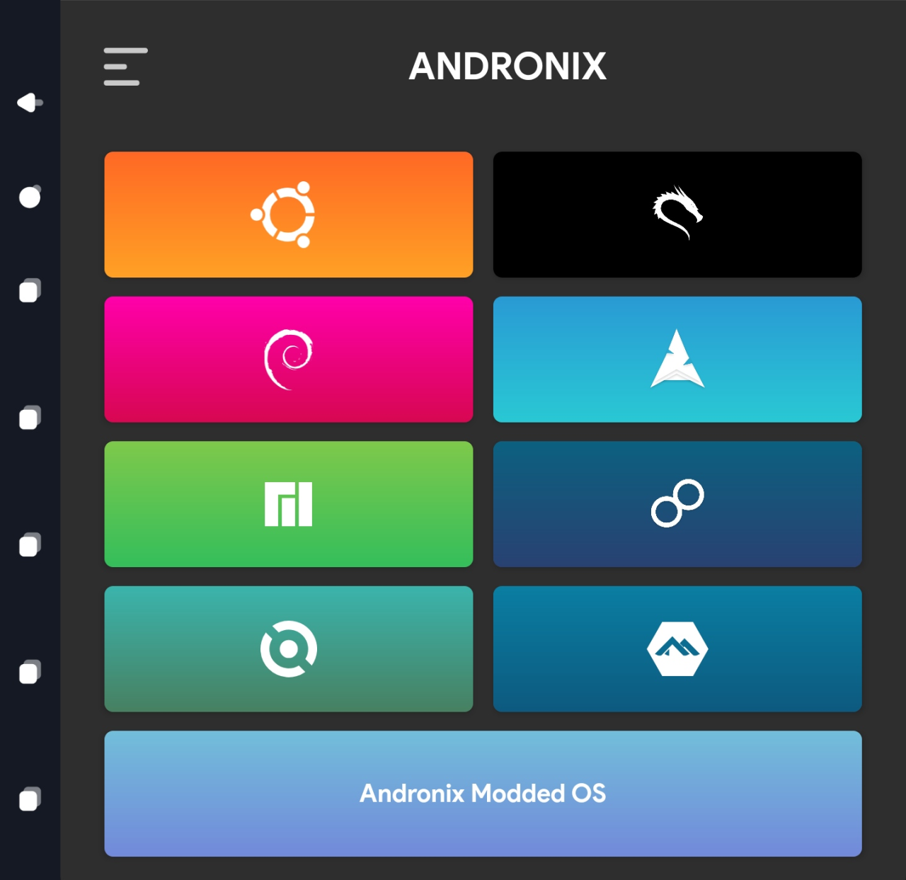

Jika semua aplikasi yang diperlukan telah diinstal, maka buka Andronix dan anda akan melihat tampilan seperti di atas. Silahkan pilih distro linux yang ingin anda pasang pada ponsel android yang anda miliki. Kami menyarankan untuk memilih Ubuntu jika anda pemula, untuk itu tap pada ikon yang berwarna kuning oranye.

> Versi Modded OS adalah versi premium yang telah di optimasi untuk berjalan di android, anda perlu membayar untuk menggunakannya. Versi biasa juga sudah bagus!

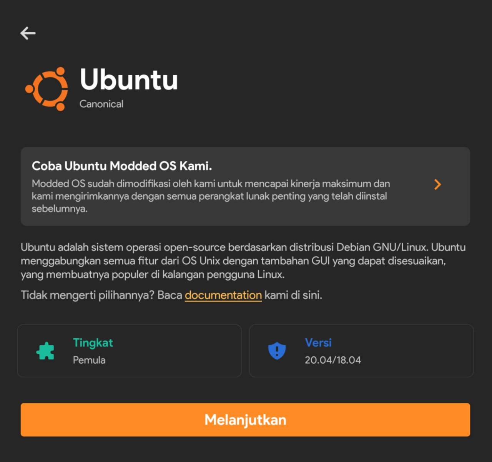

Gambar di atas adalah bagian dari halaman ubuntu di andronix, silahkan klik “Melanjutkan” dengan tombol warna oranye yang nantinya akan berubah menjadi seperti gambar dibawah, mungkin akan sedikit berbeda jika distro linux yang dipilih bukan ubuntu.

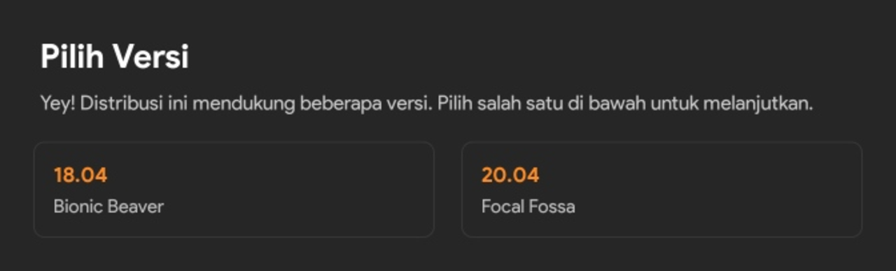

Disini kami memilih versi 20.04, dimana versi tersebut lebih baru dan juga memiliki fitur baru. Silahkan klik versi tersebut dan akan memunculkan tampilan berikut.

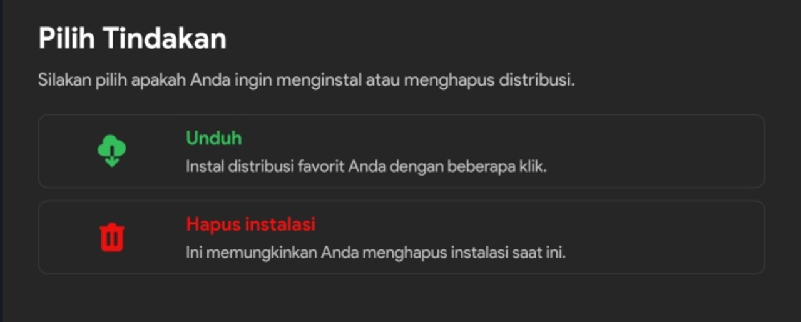

Lalu klik tombol unduh yang akan berlanjut ke proses pemilihan tampilan gui seperti di bawah.

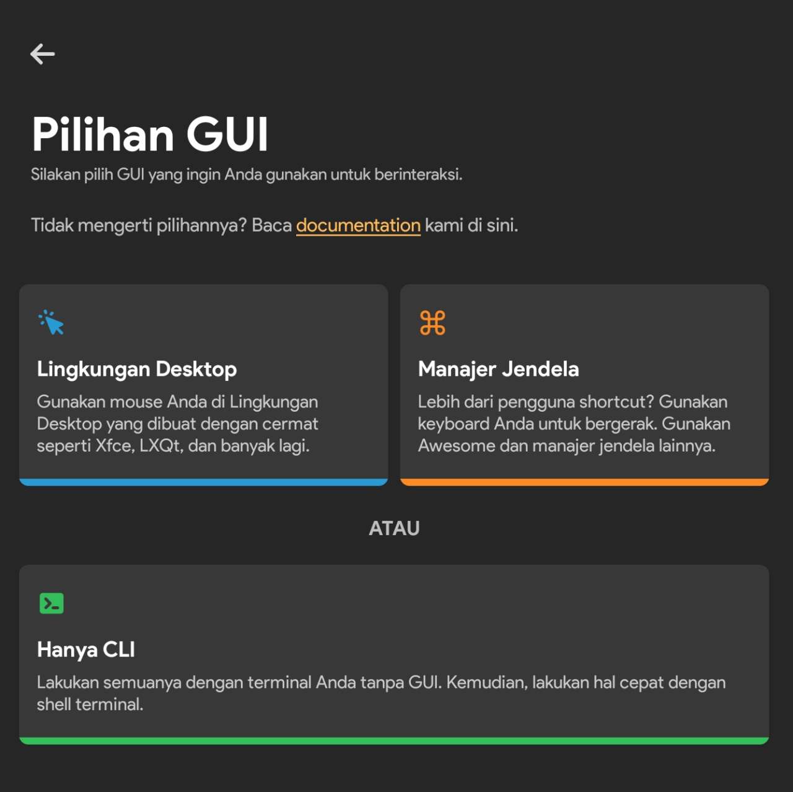

Ada beberapa versi pilihan GUI yang bisa di install yaitu Lingkungan Desktop, Manajer Jendela, atau Hanya CLI. Saat ini kami memilih lingkungan desktop, selain bisa diakses lewat CLI juga bisa di akses lewat VNC Viewer.

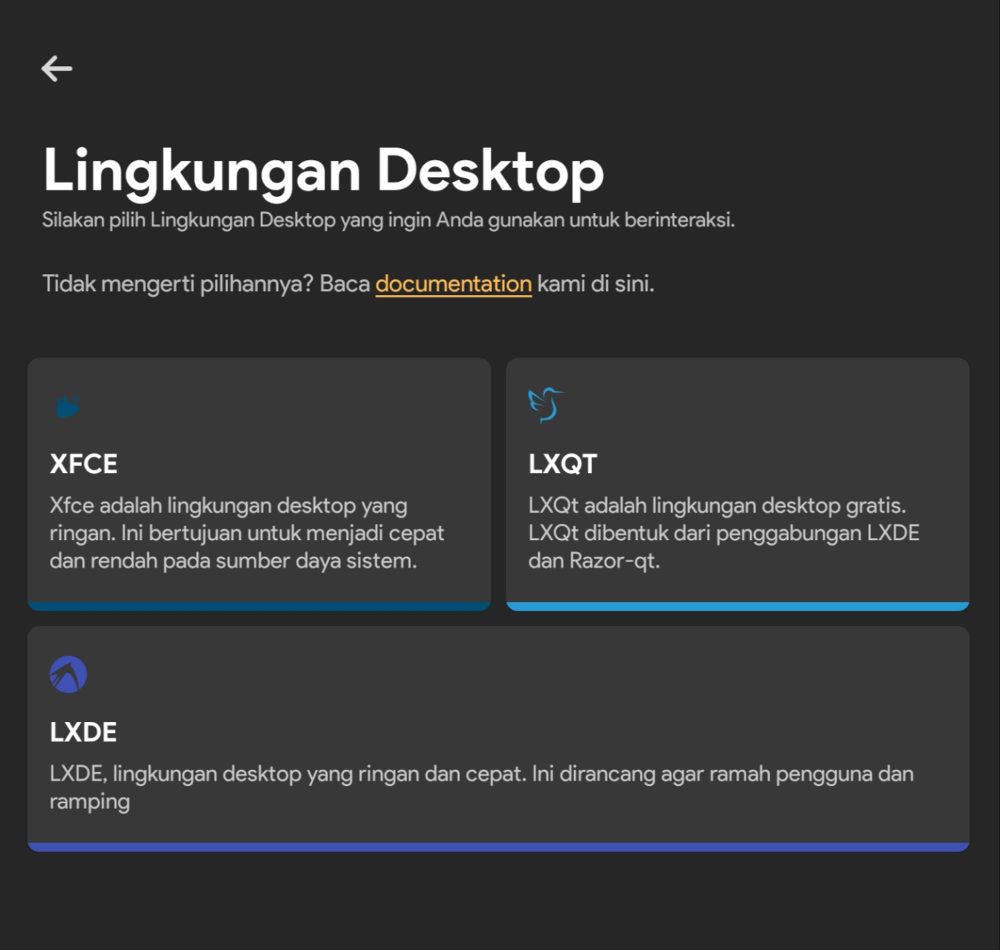

Beberapa lingkungan desktop (desktop environment) juga harus dipilih pada bagian ini tergantung preferensi anda. Namun kami memilih XFCE, selain ringan _desktop environment_ tersebut juga mudah digunakan. Setelah diklik, secara otomatis perintah yang diperlukan untuk menginstal linux di android akan di copy, tandanya seperti gambar berikut.

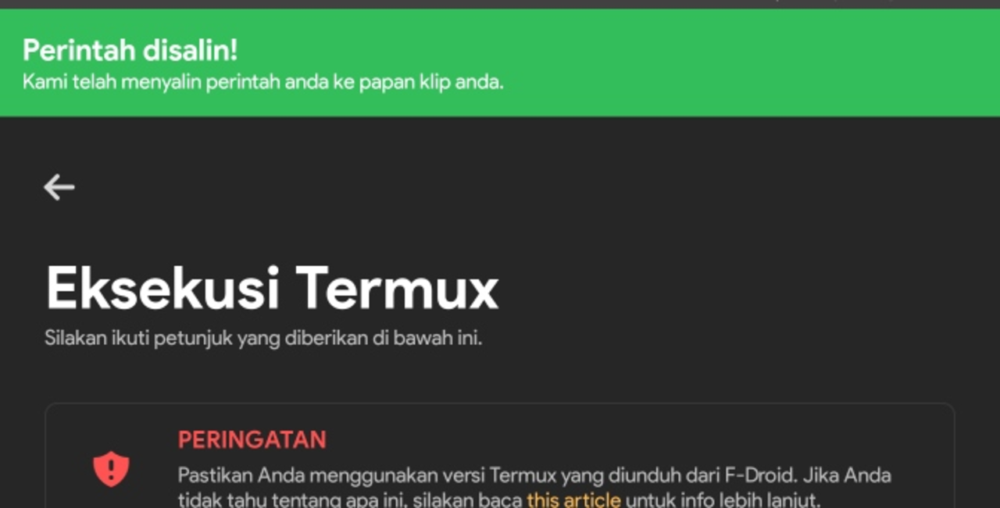

Saat ini perintah telah disalin ke clipboard pada ponsel anda. Sekarang buka termux dan pastekan kode tersebut dengan cara klik dan tahan layar lalu akan muncul pilihan tempel. Perintah yang ditempel kurang lebih seperti berikut.

```
echo "deb https://termux.mentality.rip/termux-main stable main" > $PREFIX/etc/apt/sources.list && cat $PREFIX/etc/apt/sources.list && pkg update -y && pkg install wget curl proot tar -y && wget https://raw.githubusercontent.com/AndronixApp/AndronixOrigin/master/Installer/Ubuntu20/ubuntu20-xfce.sh -O ubuntu20-xfce.sh && chmod +x ubuntu20-xfce.sh && bash ubuntu20-xfce.sh
```

atau jika di aplikasi termux seperti gambar berikut.

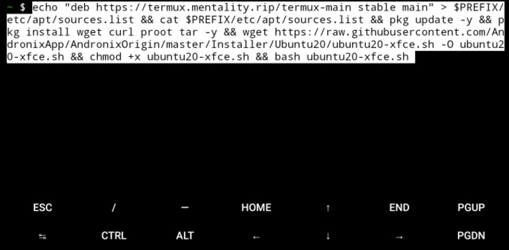

Silahkan tekan enter untuk melakukan proses instalasi, pastikan sinyal jaringan anda stabil. Meski memori yang dibutuhkan hanya kurang dari 4 GB namun untuk berjaga-jaga supaya saat dijalankan tidak terjadi macet (freeze) maka kosongkan memori sebanyak 8 GB.

Tunggu sampai proses instalasi selesai, jika sudah kamu bisa melakukan pengecekan dengan perintah berikut pada aplikasi termux.

```
ls
```

jika terdapat file `start-ubuntu20.sh` maka anda telah berhasil menginstal distro linux di ponsel android yang anda miliki. Nama file bisa berbeda tergantung distro dan versi yang dipilih, namun cirinya adalah `start-[nama_distro][versi_distro].sh`.

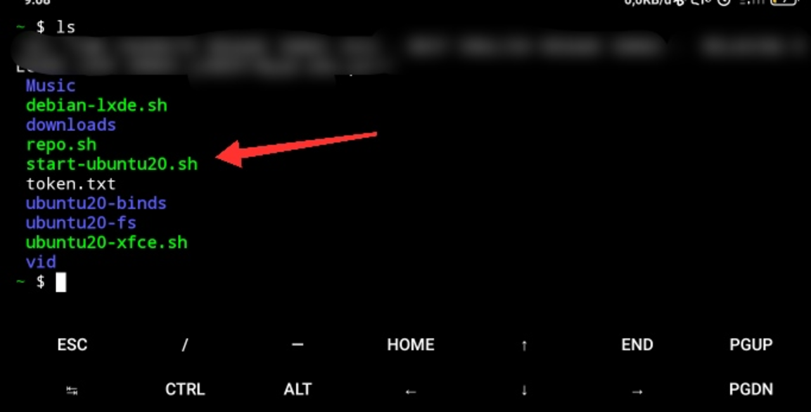

> Kami telah melakukan proses instalasi sebelum artikel ini dibuat, jadi kami tidak menampilkan proses pada termux tersebut.

### Akses Distro Linux dengan VNC Viewer

Sekarang kita telah berhasil menginstal distro linux di ponsel android, namun untuk mengakses tampilan GUI kita perlu aplikasi VNC Viewer. Sebelum itu pastikan anda menjalankan distro linux terlebih dahulu dengan perintah berikut pada termux.

```
./start-ubuntu20.sh
```

Karena kami memilih distro lain maka cukup ketikan `./start-[nama_distro][versi_distro].sh` berikut tampilan-nya.

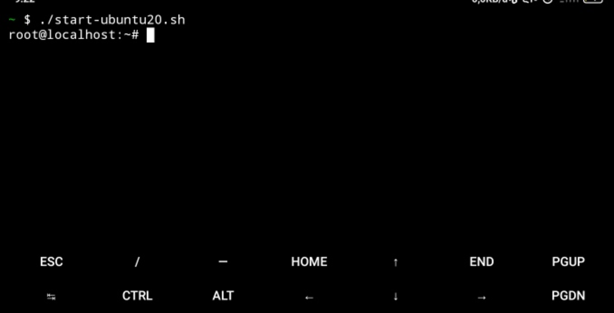

Sekarang jalankan server vnc pada distro linux yang telah di install tadi dengan perintah `vncserver-start`. Jika pertama kalinya anda akan diberi instruksi untuk menyetel kata sandi, silahkan ikuti arahan tersebut. Jika sudah kita lanjutkan ke tahapan berikutnya.

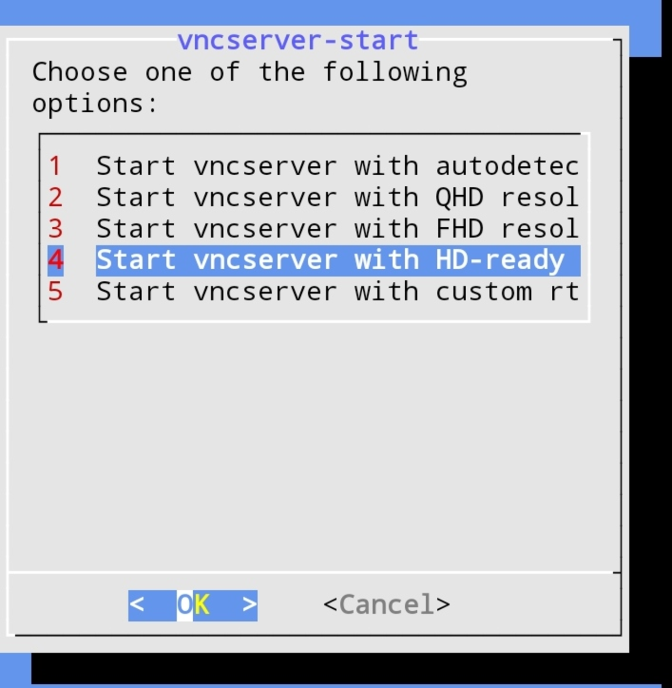

Disini kita di hadapkan dengan berbagai pilihan resolusi layar, kami memilih nomor 4. Gunakan arah panah atas dan bawah untuk menggerakkan pilihan atau ketik nomor antara 1-5, lalu enter.

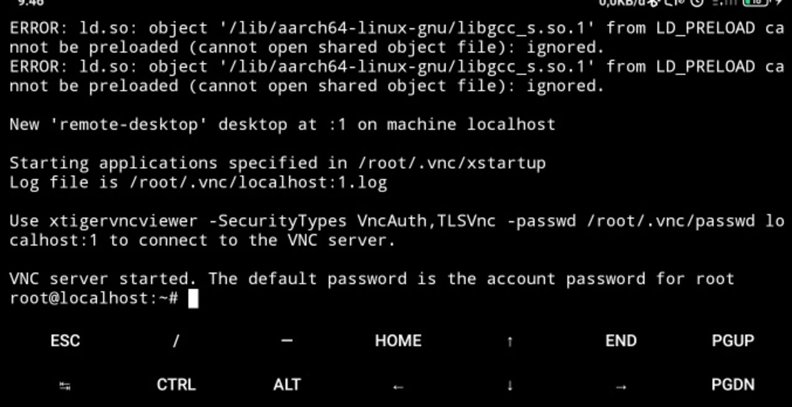

Jika gambar seperti di atas muncul maka anda berhasil menghidupkan server vnc. Sekarang buka aplikasi VNC Viewer dan tekan tombol + seperti berikut.

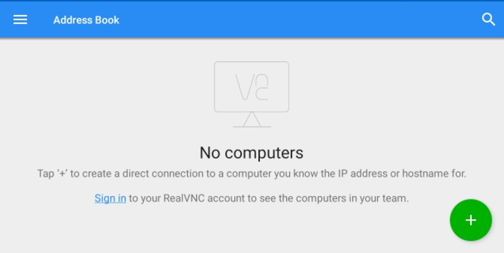

Maka akan muncul popup, lalu isi pada bagian _address_ dengan alamat server vnc linux yang telah kita install tadi dengan `localhost:1` lalu tap create.

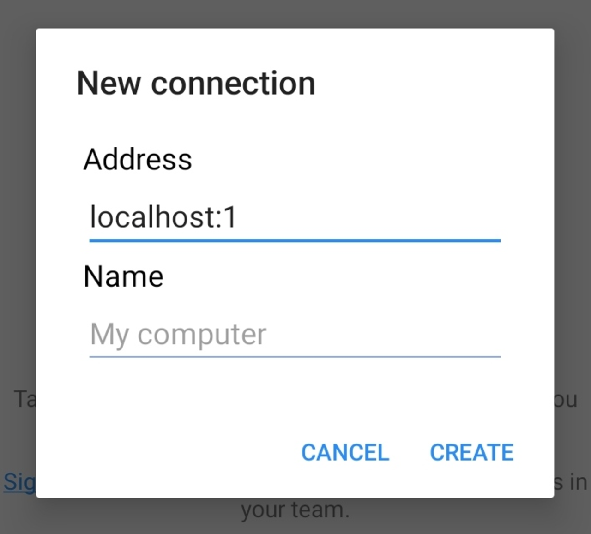

Akan muncul tombol hijau dengan tulisan Connect, silahkan tap tombol tersebut. Jika muncul peringatan “_Unencrypted Connection_” kamu bisa mengabaikannya dengan tap ok. Sehingga akan muncul tampilan untuk memasukan password seperti berikut.

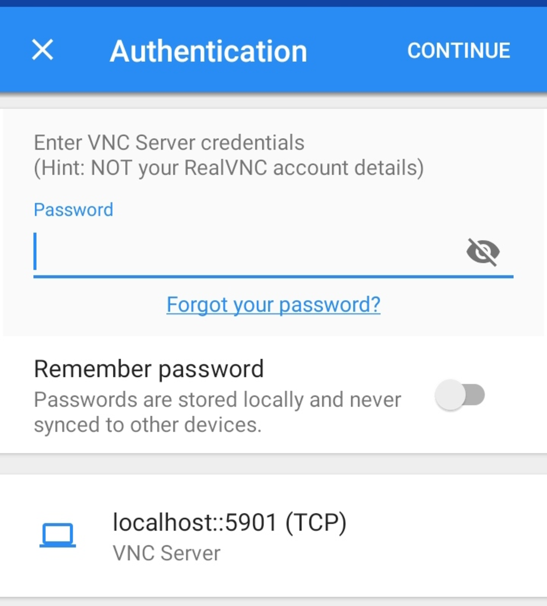

Isi password yang telah anda setel lalu tap continue. Jika muncul tampilan seperti dibawah maka anda telah berhasil mengakses distro linux yang telah di install di android tersebut.

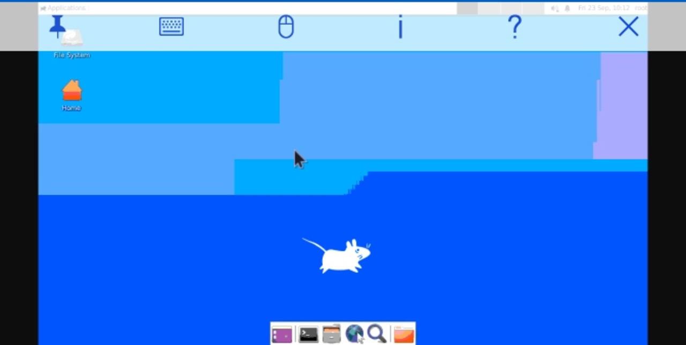

## Akhir Kata

Setelah kita berhasil menginstal distro linux di android tanpa root, sekarang anda bisa mengakses linux tersebut sesuai kebutuhan anda.

Banyak hal yang bisa dilakukan dengan linux tersebut, namun jangan pernah menggunakannya untuk keperluan yang melanggar hukum.