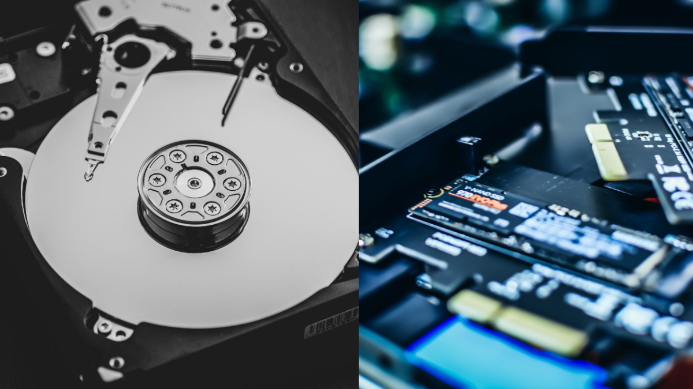

Penyimpanan pada perangkat komputer telah mengalami perubahan, yang dulunya menggunakan HDD kini mulai berganti ke teknologi yang lebih baru yaitu SSD.

Bukan tanpa alasan SSD lebih disukai, sebab penyimpanan ini memiliki teknologi yang lebih canggih untuk perangkat komputer zaman sekarang. Contohnya, SSD memiliki kemampuan membaca dan menulis yang lebih cepat dibandingkan HDD.

Namun, bukan berarti SSD tidak mempunyai kekurangan, semua penyimpanan mempunyai kelebihan dan kekurangan masing-masing. Jadi, pada artikel kali ini memahami apa itu perbedaan SSD dan HDD, untuk menemukan mana yang lebih bagus untuk digunakan.

## Apa itu SSD dan HDD?

Hard Disk Drive (kiri) dan Solid State Drive (kanan)

HDD (_Hard Disk Drive_) adalah penyimpanan tradisional, dimana menggunakan piringan magnet yang berputar untuk membaca dan menulis file. Sehingga, ketika HDD bekerja menimbulkan suara, dan terkadang terdengar keras ketika terjadi kegagalan saat memproses.

Sementara, SSD (_Solid State Drive_) menggunakan teknologi yang lebih baru dan canggih, dimana SSD menggunakan memori flash sehingga membaca dan menulis lebih cepat, irit daya dan ukuran lebih kecil. Dengan teknologi baru ini, SSD tidak menimbulkan suara sebagaimana terjadi pada penyimpanan HDD.

## Perbedaan SSD dan HDD

Simak perbedaan antara penyimpanan SSD dengan HDD berikut ini.

### 1\. Mekanisme Membaca dan Menulis

Perbedaan yang paling mendasar dari SSD dan HDD adalah dari mekanisme kedua penyimpanan tersebut bekerja.

**SSD** menggunakan sistem digital, dimana membaca serta menulis file dilakukan pada kumpulan _flash memory chip_ yang saling berhubungan.

Sedangkan, **HDD** menggunakan sistem mekanik, dimana membaca dan menulis file dilakukan oleh piringan magnet yang berputar.

### 2\. Kecepatan

Karena penyimpanan SSD menggunakan memori flash alih-alih menggunakan komponen bergerak seperti pada HDD, maka SSD dapat menulis dan membaca tanpa jeda. Sehingga, SSD memiliki kemampuan membaca dan menulis yang lebih cepat berkali-kali dibandingkan dengan HDD.

### 3\. Ketahanan

Karena penyimpanan SSD tidak mempunyai bagian yang bergerak, maka secara teori SSD lebih tahan terhadap goncangan dibandingkan dengan HDD. Dan teori tersebut terbukti, ketika HDD terjatuh saat sedang digunakan maka kemungkinan besar data bisa rusak. Sedangkan, apabila SSD terjatuh ketika digunakan, sangat kecil kemungkinan data mengalami kerusakan.

Selain itu, SSD juga lebih andal dalam cuaca ekstrim, sehingga lebih tahan terhadap suhu dingin maupun panas.

### 4\. Masa Pakai SSD dan HDD

SSD memiliki batasan maksimal untuk menulis file atau disebut TBW (_Terabytes Written_). Namun, SSD akan tetap berfungsi meskipun telah melewati batasan TWB-nya walaupun dengan performa yang telah menurun. Diperkirakan SSD mampu menulis dan membaca lebih dari 10 tahun.

Sedangkan HDD, juga memiliki batasan maksimal yang disebut MTBF (_Mean Time Between Failure_). MTBF adalah perkiraan berapa lama HDD bisa menulis dan membaca sebelum gagal. Sayangnya, sulit untuk memperkirakan secara pasti kapan HDD mengalami kegagalan. Akan tetapi, HDD pada umumnya mampu bertahan antara 3-5 tahun.

### 5\. Umur SSD dan HDD

Meski masa pakai dari SSD lebih lama, akan tetapi kemungkinan besar SSD rusak sebelum masa pakai habis. Selain itu, banyak faktor yang bisa menyebabkan kerusakan pada penyimpanan SSD maupun HDD menjadi lebih cepat.

Contohnya, dari bagaimana perangkat disimpan dan kualitas dari komponen penyimpanan. Namun, untuk mengetahui umur dari SSD dan HDD kamu bisa melihat dari lamanya garansi masing-masing produk. Karena biasanya, umur SSD maupun HDD kurang lebih sama dengan masa garansi.

### 6\. Kapasitas Penyimpanan

Jangan khawatir dengan kapasitas yang dimiliki oleh masing-masing penyimpanan. Karena tidak ada perbedaan untuk kapasitas yang tersedia, mulai dari 128GB, 256GB, 512GB, 1TB bahkan 20TB sekalipun tersedia untuk SSD dan HDD.

### 7\. Konsumsi Daya

Karena SSD tidak menggunakan komponen yang bergerak, maka SSD lebih irit daya dibandingkan dengan HDD. SSD menggunakan daya yang kurang dari 5 Watt, sedangkan HDD menggunakan daya antara 5 sampai 15 Watt. Sehingga, jika kamu melakukan upgrade penyimpanan laptop ke SSD, waktu pakai laptop bisa bertambah lebih dari 30 menit.

### 8\. Pemulihan Data

Masing-masing penyimpanan baik SSD maupun HDD, dapat dipulihkan dengan mudah. Contohnya, ketika terkena virus, penghapusan data yang tidak disengaja dan kegagalan sistem.

Namun, karena memiliki mekanisme yang berbeda maka penanganan yang dilakukan juga berbeda. Biasanya pemulihan data pada HDD lebih murah dibandingkan dengan SSD.

### 9\. Harga

SSD memiliki harga yang lebih mahal dua kali lipat atau lebih dibandingkan dengan HDD. Namun, saat ini SDD telah mengalami penurunan harga dan mulai bersaing dengan HDD.

## Mana Yang Harus dipilih antara SSD dan HDD?

Penyimpanan SSD memiliki spesifikasi yang lebih unggul jika dibandingkan dengan HDD, mulai dari kecepatan, ketahanan, masa pakai dan perbandingan lainnya. Tentu, SSD lebih bagus untuk digunakan pada komputer maupun laptop.

Meski harga SSD lebih mahal, akan tetapi sebanding dengan spesifikasi yang ditawarkan. Lebih mudahnya, kita lihat tabel perbandingan berikut ini.

### Tabel Perbandingan

<table><tbody><tr><th colspan="1" rowspan="1">
Faktor Perbandingan
</th><th colspan="1" rowspan="1">
SSD
</th><th colspan="1" rowspan="1">
HDD
</th></tr><tr><td colspan="1" rowspan="1">
<strong>Harga</strong>
</td><td colspan="1" rowspan="1">
Lebih Mahal
</td><td colspan="1" rowspan="1">
Lebih Murah
</td></tr><tr><td colspan="1" rowspan="1">
<strong>Kecepatan</strong>
</td><td colspan="1" rowspan="1">
Lebih Cepat
</td><td colspan="1" rowspan="1">
Lebih Lambat
</td></tr><tr><td colspan="1" rowspan="1">
<strong>Ketahanan</strong>
</td><td colspan="1" rowspan="1">
Tahan Goncangan
</td><td colspan="1" rowspan="1">
Tidak Tahan Goncangan
</td></tr><tr><td colspan="1" rowspan="1">
<strong>Masa Pakai</strong>
</td><td colspan="1" rowspan="1">
Lebih dari 10 tahun
</td><td colspan="1" rowspan="1">
Antara 3-5 tahun
</td></tr><tr><td colspan="1" rowspan="1">
<strong>Umur</strong>
</td><td colspan="1" rowspan="1">
Lebih Pendek
</td><td colspan="1" rowspan="1">
Lebih Panjang
</td></tr><tr><td colspan="1" rowspan="1">
<strong>Konsumsi Daya</strong>
</td><td colspan="1" rowspan="1">
Lebih Irit
</td><td colspan="1" rowspan="1">
Lebih Boros
</td></tr><tr><td colspan="1" rowspan="1">
<strong>Pemulihan Data</strong>
</td><td colspan="1" rowspan="1">
Lebih Mahal
</td><td colspan="1" rowspan="1">
Lebih Murah
</td></tr></tbody></table>

Jadi dapat disimpulkan bahwa SSD adalah pilihan penyimpanan terbaik untuk digunakan, selama harga tidak menjadi hambatan.

## Akhir Kata

Sekian pembahasan mengenai perbedaan antara SSD dan HDD, dimana SSD lebih unggul. Namun, bukan berarti HDD tidak dapat digunakan.

HDD bisa menjadi alternatif, jika digunakan untuk menyimpan data dalam jangka waktu yang lebih lama. Atau memiliki budget yang terbatas.

Selain itu, kamu juga bisa mengkombinasikan kedua penyimpanan ini. Contohnya, SSD sebagai penyimpanan file sistem, sedangkan HDD digunakan sebagai penyimpanan untuk file yang besar seperti Game dan Video.

Semoga kamu tidak salah lagi, saat memilih penyimpanan terbaik yang akan digunakan.