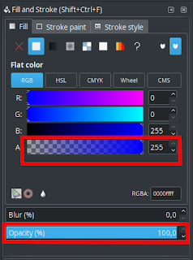

Inkscape merupakan sebuah software atau aplikasi desain grafis vector layaknya CorelDraw dan Illustrator. Inkscape dapat digunakan secara gratis, karena inkscape sendiri adalah sebuah software open source.

Untuk yang masih baru mengenal Inkscape biasanya memiliki masalah seperti pemberian warna fill color atau stroke paint tidak bisa atau malah terlihat tembus pandang. Masalah seperti ini biasanya terjadi karena tingkat transparan sudah disetting ke 0.  
  
Untuk mengatasinya cukup isi bagian yang ditandai warna merah pertama dengan angka 255 atau seret pada warnanya hingga angka menjadi 255. Pastikan opacity diatur ke 100% seret saja pada kolom opacity ke kanan hingga opacity sampai 100.

Itulah permasalahan yang dialami pengguna yang baru menggunakan inkscape. Hati-hati ketika memberikan warna jangan sampai transparan (jika bukan untuk warna yang dimaksudkan transparan). Semoga bermanfa'at..