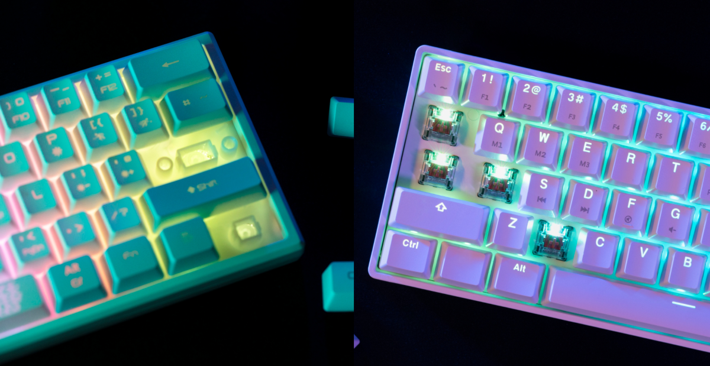

Pada era teknologi digital yang semakin berkembang pesat, keyboard merupakan salah satu perangkat yang digunakan secara luas dalam berbagai aktivitas, baik di tempat kerja maupun di rumah. Salah satu jenis keyboard yang semakin populer adalah mechanical keyboard. Dalam artikel ini, kita akan mengenal lebih lanjut tentang apa itu mechanical keyboard, kelebihan dan kekurangannya, serta manfaat yang dapat diperoleh dari menggunakannya.

## Apa itu Mechanical Keyboard?

Membrane Keyboard (kiri) dan Mechanical Keyboard (kanan), sumber: www.freepik.com

Mechanical keyboard merupakan jenis keyboard yang menggunakan sakelar atau switch mekanik sebagai pengganti membran karet pada keyboard konvensional. Sakelar mekanik ini memiliki konstruksi fisik yang lebih kompleks dan memberikan respons yang lebih baik dibandingkan dengan keyboard membran.

Setiap tombol pada mechanical keyboard memiliki sakelar mekanik individu yang memberikan umpan balik taktis dan suara klik yang khas saat ditekan.

## Kelebihan Mechanical Keyboard

### 1\. Responsif dan Akurat

Salah satu kelebihan utama mechanical keyboard adalah responsifitasnya yang tinggi. Sakelar mekanik pada setiap tombol memberikan umpan balik yang jelas dan taktis saat ditekan, sehingga pengguna dapat merasakan dengan pasti apakah tombol telah terpencet atau tidak.

Hal ini membuat mechanical keyboard sangat cocok digunakan dalam aplikasi yang membutuhkan ketepatan dan kecepatan, seperti gaming dan pengetikan.

### 2\. Daya Tahan yang Tinggi

Mechanical keyboard umumnya memiliki daya tahan yang lebih tinggi daripada keyboard membran. Sakelar mekanik dirancang untuk tahan lama dan mampu menahan penggunaan yang intensif selama bertahun-tahun.

Beberapa jenis sakelar mekanik bahkan dapat bertahan hingga puluhan juta penekanan tombol. Dengan daya tahan yang tinggi ini, mechanical keyboard menjadi pilihan yang baik untuk pengguna yang menginginkan keyboard yang awet dan tahan lama.

### 3\. Kustomisasi dan Pilihan Sakelar yang Beragam

Salah satu keunggulan lain dari mechanical keyboard adalah fleksibilitas dalam customisasi dan pilihan sakelar yang beragam. Setiap jenis sakelar mekanik memiliki karakteristik yang berbeda, seperti tekanan yang diperlukan, suara, dan umpan baliknya.

Pengguna dapat memilih jenis sakelar mekanik yang sesuai dengan preferensi mereka, mulai dari yang memberikan suara klik yang keras hingga yang tanpa suara. Selain itu, beberapa mechanical keyboard juga dilengkapi dengan fitur tambahan, seperti pencahayaan latar belakang yang dapat disesuaikan dan tombol macro yang dapat diprogram sesuai kebutuhan.

### 4\. Perasaan Mengetik yang Luar Biasa

Salah satu kelebihan yang mungkin dirasakan pengguna mechanical keyboard ialah perasaan mengetik yang berbeda dengan keyboard biasanya. Suara yang dihasilkan saat jari menekan tombol mechanical terasa luar biasa. Bahkan beberapa pengguna sering melakukan _modding_ pada keyboard mereka, agar suara yang dihasilkan bisa lebih baik lagi.

## Kekurangan Mechanical Keyboard

### 1\. Harga yang Lebih Mahal

Salah satu kekurangan utama mechanical keyboard adalah harganya yang cenderung lebih mahal dibandingkan dengan keyboard membran. Hal ini disebabkan oleh kompleksitas konstruksi fisik dan kualitas sakelar mekanik yang digunakan. Pengguna yang memiliki anggaran terbatas mungkin perlu mempertimbangkan kembali sebelum membeli mechanical keyboard.

Meskipun saat ini harga mechanical keyboard mulai bersaing dengan keyboard membran, akan tetapi kualitas yang ditawarkan biasanya kurang baik.

### 2\. Suara Klik yang Mengganggu

Meskipun suara klik yang dihasilkan oleh sakelar mekanik dapat menjadi kelebihan bagi sebagian orang, bagi orang lain, suara tersebut dapat mengganggu, terutama di lingkungan kerja yang tenang atau saat digunakan di dekat orang lain.

Beberapa jenis sakelar mekanik yang lebih tenang telah dikembangkan untuk mengatasi masalah ini, tetapi tetap saja suara klik mungkin tetap terdengar.

### 3\. Ukuran dan Berat yang Lebih Besar

Mechanical keyboard umumnya memiliki ukuran dan berat yang lebih besar dibandingkan dengan keyboard membran. Hal ini dapat membuatnya kurang portabel dan membutuhkan ruang yang lebih besar di meja kerja. Jika mobilitas dan ruang kerja terbatas, mechanical keyboard mungkin tidak menjadi pilihan yang ideal.

## Manfaat Mechanical Keyboard

### 1\. Meningkatkan Kecepatan dan Ketepatan Pengetikan

Ketika menggunakan mechanical keyboard, pengguna akan merasakan perbedaan yang signifikan dalam kecepatan dan ketepatan pengetikan. Responsifitas yang tinggi dan umpan balik taktis dari setiap tombol memungkinkan pengguna untuk mengetik dengan lebih cepat dan akurat.

Bagi para penulis, programmer, atau siapa pun yang menggunakan keyboard secara intensif, mechanical keyboard dapat meningkatkan produktivitas dan kenyamanan saat bekerja.

### 2\. Pengalaman Gaming yang Lebih Baik

Bagi para gamer, mechanical keyboard memberikan pengalaman yang lebih baik dalam bermain game. Respons yang cepat dan umpan balik taktis dari setiap tombol memungkinkan pemain untuk merasakan setiap tindakan yang dilakukan dengan lebih jelas dan responsif.

Selain itu, beberapa mechanical keyboard dilengkapi dengan fitur anti-ghosting yang memungkinkan penggunaan beberapa tombol secara bersamaan tanpa adanya konflik.

### 3\. Menjaga Kesehatan dan Mengurangi Kelelahan

Penggunaan mechanical keyboard juga dapat membantu menjaga kesehatan dan mengurangi kelelahan pada pengguna. Sakelar mekanik yang responsif memungkinkan pengguna menekan tombol dengan sedikit tekanan, mengurangi stres pada sendi dan otot jari.

Selain itu, beberapa jenis sakelar mekanik juga dirancang ergonomis, dengan penempatan tombol yang lebih nyaman bagi pengguna. Dengan demikian, mechanical keyboard dapat membantu mengurangi risiko cedera dan kelelahan pada pengguna yang sering menggunakan keyboard dalam waktu lama.

## Kesimpulan

Mechanical keyboard merupakan jenis keyboard yang menggunakan sakelar mekanik untuk memberikan respons yang lebih baik dan umpan balik yang taktis saat ditekan. Kelebihan mechanical keyboard meliputi responsif dan akurat, daya tahan yang tinggi, serta customisasi dan pilihan sakelar yang beragam. Manfaat penggunaan mechanical keyboard termasuk peningkatan kecepatan dan ketepatan pengetikan, pengalaman gaming yang lebih baik, serta menjaga kesehatan dan mengurangi kelelahan.

Dengan kombinasi keunggulan dan manfaat yang dimiliki, mechanical keyboard menjadi pilihan yang populer bagi pengguna yang menginginkan pengalaman mengetik dan bermain game yang lebih baik. Namun, kamu perlu mempertimbangkannya kembali jika budget kamu terbatas. Sebab, mechanical keyboard memiliki harga yang lebih tinggi daripada keyboard membran.