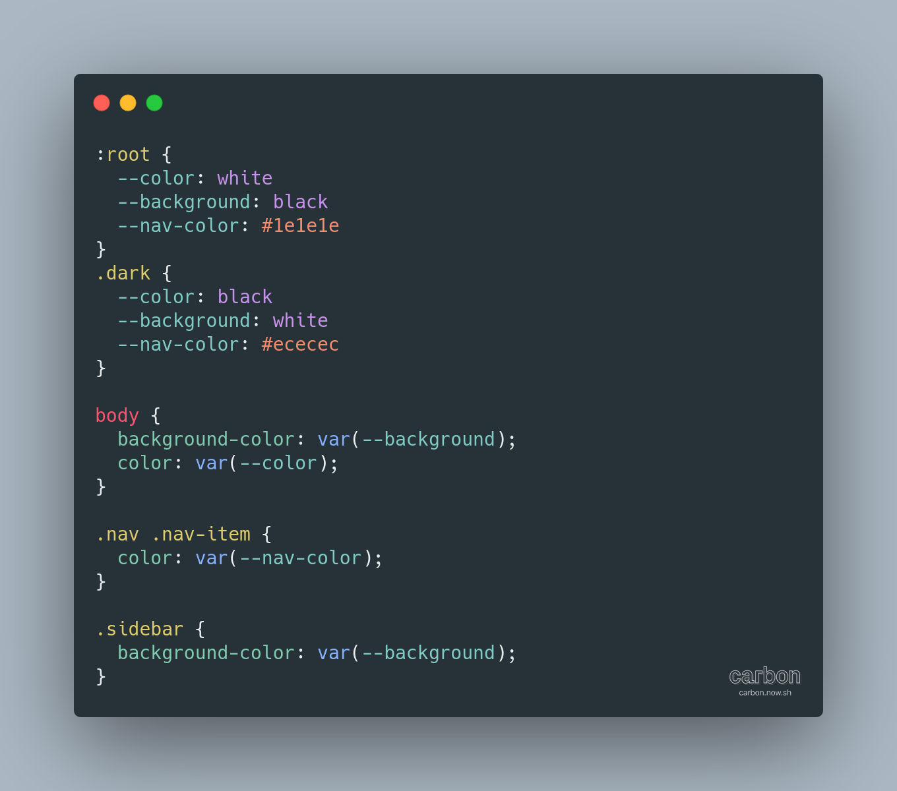
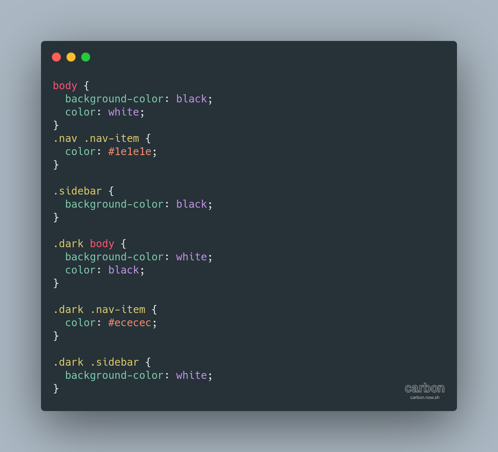

Seiring perkembangan browser CSS berkembang secara terus menerus, hingga hadir sebuah Variabel dalam CSS. Variabel ini berfungsi untuk mendeklarasikan nilai dari sebuah variabel tertentu sehingga bisa digunakan berulang. Variabel ini ditulis dengan `--variabel: nilai` dan digunakan dengan `var(--variable)`.

## Penggunaan Variabel CSS

Misalkan sebuah warna utama yang akan digunakan berulang maka biasanya di deklarasikan terlebih dahulu dalam `:root` seperti berikut.

```
:root {
 --primary: blue
}
```

Maka akan di gunakan seperti berikut:

```
a {
 color: var(--primary);
}
button: {
 background-color: var(--primary);
}
```

## Penggunaan Variabel CSS dalam Dark Mode

Untuk menerapkan variabel maka kamu harus menerapkan di dalam :root dan juga .dark, seperti berikut.

```
:root {
  --body-background: white;
  --body-color: black;
}
.dark {
  --body-background: black;
  --body-color: white;
}
```

Dan pada bagian style body harus menerapkan variabel background dan color tersebut, seperti berikut.

```
/* CSS */
body {
  background-color: var(--body-background);
  color: var(--body-color);
}
```

Jadi ketika `html` tidak menerapkan class `.dark` maka background dari `body` berwarna putih dan color dari body berwarna hitam, sedangkan ketika menerapkan class `.dark` maka background dari `body` adalah hitam dan color berwarna putih.

## Penggunaan Javascript

Sekarang tinggal membuat button yang berfungsi untuk beralih antara mode dark dan mode biasa (light)

```
<button>Dark Mode</button>
```

Tambahkan Javascript supaya tombol tersebut berfungsi

```
var root = document.documentElement
var button = document.querySelector('button')
button.addEventListener('click', event => {
  root.classList.toggle('dark')
})
```

Seperti berikut hasilnya

Untuk sekarang adalah menambahkan script untuk menyimpan pengaturan dark mode tersebut di localStorage browser dan juga script untuk memuat pengaturan tersebut

```
var root = document.documentElement
var button = document.querySelector('button')
button.addEventListener('click', () => {

  root.classList.toggle('dark')

  if (root.classList.contains('dark')) {
    localStorage.setItem('isDark', '1')
  } else {
    localStorage.removeItem('isDark')
  }

})
```

Tambahkan script ini pada bagian head sebelum bagian style

```
<script>
  if (localStorage.getItem('isDark')) {
    document.documentElement.classList.add('dark')
  }
</script>
```

Berikut adalah hasil akhir dari Dark Mode dengan Variabel CSS dan Javascript

## Kenapa Menggunakan Variabel CSS

Dengan menggunakan variabel css maka penggunaan warna yang berulang akan lebih mudah untuk ditulis dalam variabel, karena biasanya dalam sebuah web tidak terlalu banyak warna yang berbeda. Lihat perbandingan dibawah.

Dengan variable:



Tanpa variable:



Lalu apa bedanya? Menurut saya menggunakan variabel lebih simpel karena tidak perlu mendeklarasikan ulang style dark mode untuk bagian tertentu, terutama warna. Jika tidak menggunakan variabel maka penulisan ulang akan menghabiskan banyak waktu dan lebih banyak teks. Itu pendapat saya sendiri ya, jadi kamu bisa memilih sendiri tergantung seleramu mana yang paling mudah.

**Referensi:**

[Kontrol Mode Terang/Gelap dengan JavaScript dan PHP](https://dte.web.id/teknis/mode-terang-dan-gelap)