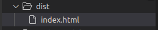
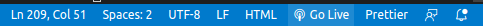
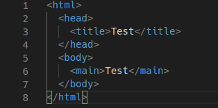
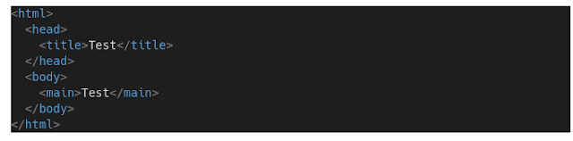
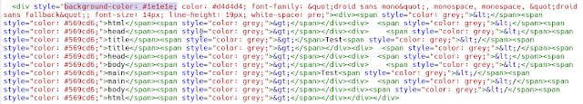
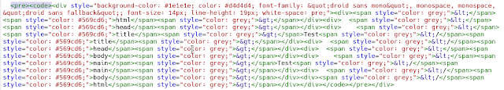
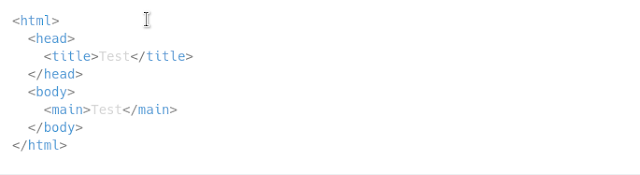

Syntax Highlighter merupakan sebuah fitur yang digunakan dalam bahasa pemrograman dengan menggunakan beberapa warna berbeda pada setiap kata. Syntax Highlighter bertujuan supaya kode pemrograman mudah dibaca Manusia atau seorang programmer yang menulis kode pemrograman tersebut. 

Jika anda menulis kode pemrograman HTML dalam Notepad dimana notepad tidak punya fitur syntax highlighter lalu kode pemrograman anda sangat panjang dan anda ingin mencari komentar yang pernah anda buat, maka anda tidak akan bisa dengan mudah membacanya secara satu persatu, mungkin masih bisa diakali dengan fitur pencarian. Hal tersebut dikarenakan warna yang sama antara komentar di HTML , kode tag HTML, maupun teks biasa.

Dalam sebuah website yang menjabarkan tutorial bahasa pemrograman tidak sedikit yang menggunakan syntax highlighter supaya tampilan lebih menarik dan mudah dibaca. Untuk menerapkan syntax highlighter bisa dengan memasang highlight js namun ternyata highlight js **sangat berat untuk loading blog**, solusinya adalah dengan menerapkan css pada tag pre dan code. Tapi ternyata dengan menerapkan css saja highlighting nya tidak jauh berbeda dengan yang ada pada notepad hanya background dan text nya saja yang berubah.

Jadi bagaimana cara supaya syntax highlighter terlihat berwarna namun tidak memperlambat loading blog? Pertama anda harus install yang namanya [Visual Studio Code](https://code.visualstudio.com/). Selanjutnya ialah membuka dan membuat file baru dengan format file disesuaikan dengan bahasa pemrograman, misalkan kalau javascript format file harus NAMA-FILE.js begitupun html atau xml.

Atau bisa juga dengan mengubahnya dikiri bawah, lihat pilihan yang HTML ubah dari sana tinggal cari nama bahasa pemrograman yang kamu pakai.

Sekarang tinggal anda ketikan kode pemrograman dan copy semua kode yang diperlukan.

Buka blogger dan paste kode tersebut di postingan dalam tampilan menulis, tampilan highlighter akan seperti berikut. 

Lalu buka dalam tampilan html dan hapus background dari code yang di paste tadi

Dan tambahkan kode \<pre>\<code>

Sekarang highlighter tidak akan memiliki background, seperti berikut.

  
Syntax highlighter ringan ini berhasil saya praktikan dengan menggunakan Linux distro KDE Neon, silahkan dicoba di Windows, Mac OS X ataupun sistem operasi lainya. Mungkin dengan software lain seperti atom ataupun sublime.  Warna bisa disesuaikan dengan tema yang ada pada Visual Studio Code, jangan lupa tambahkan css background untuk pre dan kode jika background ingin terlihat hitam.