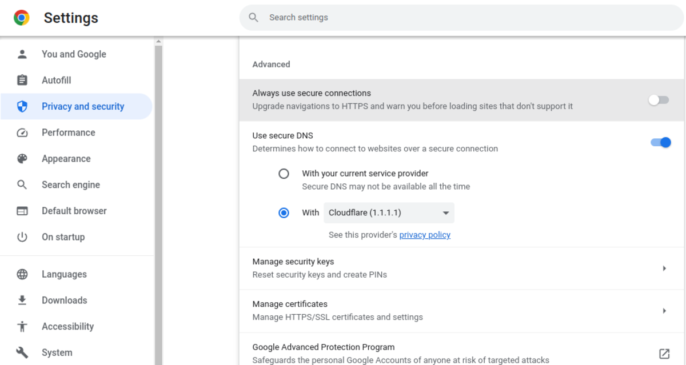
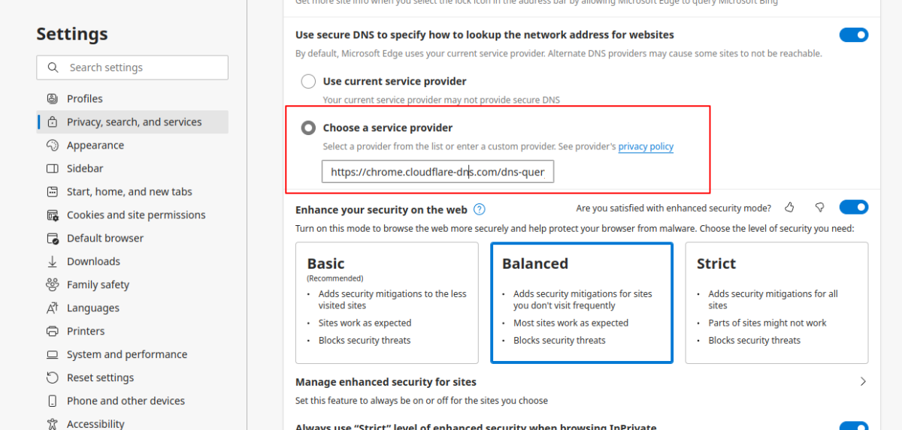
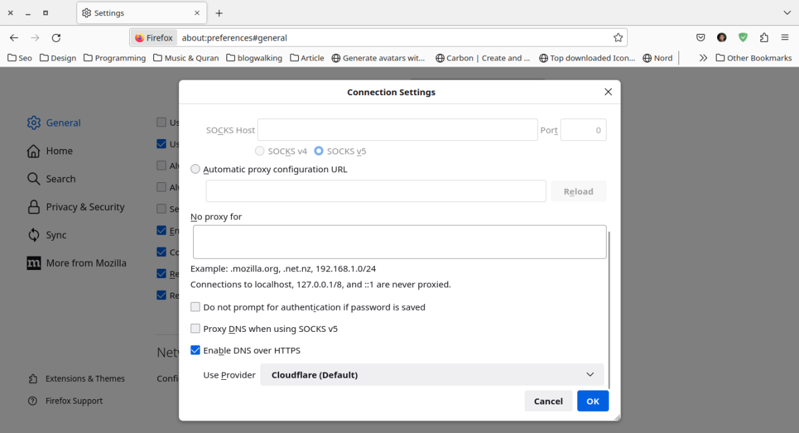

Internet Service Provider (ISP) biasanya melakukan pemblokiran pada situs yang melanggar sesuai peraturan dari pemerintah, di Indonesia kominfo yang mengatur hal tersebut. Nah, pada artikel ini akan menjelaskan bagaimana cara mengakses situs web yang diblokir ISP dengan mudah.

## Latar Belakang

Suatu hari, Saya mencari informasi seperti biasa pada _search engine_ Google. Ternyata informasi yang saya cari tersebut sangat sedikit yang membahas, dan informasi tersebut berada pada web reddit dimana reddit ini telah diblokir oleh pemerintah Indonesia.

Akibatnya saya harus menggunakan VPN untuk mengakses informasi tersebut, belakangan ternyata Chrome mengeluarkan fitur dimana dengan fitur tersebut bisa digunakan untuk mengakses situs web yang diblokir.

## Membuka Blokir Situs Web dengan DNS

Untuk membuka blokir situs web paling mudah adalah dengan mengubah settingan DNS, alih-alih menggunakan DNS bawaan ISP kita bisa mengubahnya ke DNS lain seperti dari Cloudflare, OpenDNS dan Google.

Cara termudah adalah dari pengaturan browser yang digunakan, pengaturan ini tersedia pada browser versi terbaru Chrome, Firefox serta browser lain yang berbasis Chromium seperti Edge, Brave dan Vivaldi.

Pada browser Chrome kamu bisa mengaksesnya melalui Settings -> Privacy and Security -> Advanced, lalu aktifkan pada bagian _Use secure DNS_ lalu gunakan Cloudflare. Jika kamu belum menemukan pengaturan tersebut, gunakan bilah pencarian dan ketikan kueri "DNS".

Untuk browser berbasis Chromium seperti Edge dan Brave, mungkin sedikit berbeda namun kamu bisa menemukan pengaturan tersebut dengan bilah pencarian.

Untuk browser Firefox pengaturan DNS berada pada halaman Settings -> General -> Network Settings, lalu centang pada bagian "Enable DNS over HTTPS" dan pilih provider Cloudflare.

Pada browser Chrome di smartphone juga tersedia opsi mengubah dns, yang bisa diakses dari Setelan -> Privasi dan Keamanan -> Gunakan DNS Aman, silahkan centang Gunakan DNS Aman lalu pilih penyedia lain seperti Cloudflare.

Atau bisa mengunduh aplikasi 1.1.1.1 dari Google Play maupun App Store dan menggunakannya untuk merubah DNS pada smartphone kalian sehingga bisa membuka situs web yang diblokir oleh ISP.

## Akhir Kata

Cara membuka situs web yang diblokir pemerintah atau ISP dengan mudah ini jangan sampai digunakan untuk hal-hal yang ilegal seperti mengakses situs judi dan pornografi. Gunakan dengan bijak, karena cara yang saya berikan tidak dimaksudkan untuk hal-hal ilegal tersebut.