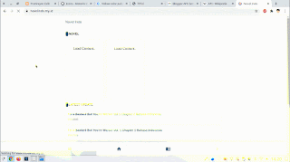
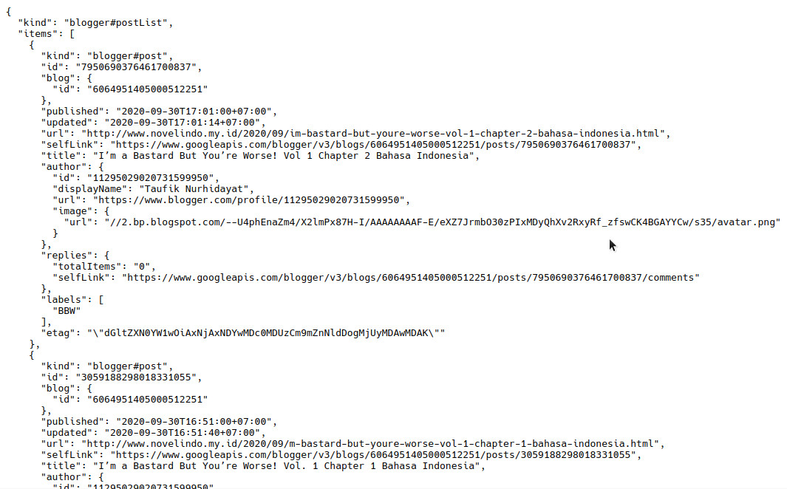
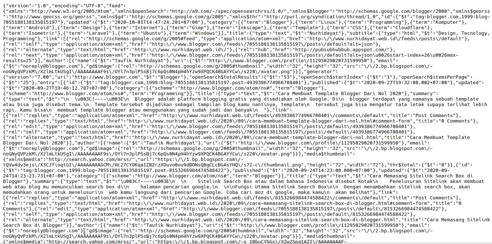

Blogger api memungkinkan kamu untuk berinteraksi dengan server blogger untuk menampilkan, membuat, menghapus sebuah postingan ataupun komentar.

## Apa Itu API

API adalah sebuah alat interaksi yang memungkinkan untuk berinteraksi antara beberapa perangkat, seperti server dan client. Dengan API memungkinkan backend dan frontend saling berhubungan, seperti menampilkan sebuah postingan dengan mengambil dari database ataupun sebaliknya yaitu membuat postingan dengan menambahkan database.

## Apa Itu Blogger API

Seperti yang saya sebutkan di awal kalimat dan beberapa pengertian API, bahwasanya API bisa memungkinkan kamu membuat atau menampilkan postingan dan komentar. Saya sendiri kurang memahami apa fungsi API itu sendiri, tetapi jika mengenai Blogger API yang pasti kamu bisa membuat widget related posts, post list by label, latest comment, next prev by label dan lain sebagainya.

  
Berikut salah satu contoh yang saya buat dengan menggunakan blogger API V3.



## Kelebihan Blogger API V3

Dengan menggunakan Blogger API V3, ada beberapa kelebihan diantaranya:

### **1\. Data Terstruktur Lebih Baik**

Blogger API V3 terstruktur lebih baik, tidak berantakan seperti dari url feeds yang diubah ke json. Berikut contohnya:



Lebih rapi jika dibandingkan dengan url feeds.



Meskipun sudah diubah menjadi lebih gampang dibaca url feeds ini tetap kurang rapi.

### **2\. Mudah Dikostumisasi**

Jika url feeds biasanya akan menampilkan content postingan sesuai yang diatur dari feeds blogger, jika kita tidak mengaturnya maka content postingan akan dimuat sepenuhnya dan hal ini akan berpengaruh pada ukuran dari url feeds tersebut. 

Jika mengatur feeds content postingan untuk tidak ditampilkan maka akan berpengaruh pada thumbnails yang tidak tampil sedangkan di Blogger API v3 kamu bisa menampilkan atau tidaknya content postingan sehingga ukuran pun jadi lebih rendah.

### **3\. Mendukung Framework**

Dengan menggunakan amp tentunya kamu tidak bisa menambahkan script related posts seperti biasa, karena pada amp tidak diperbolehkan untuk menggunakan script tambahan. Dengan Blogger API V3 kamu bisa membuat widget related post dibantu dengan plugin amp-mustache dan amp-list, hal ini karena Blogger API v3 sudah terstruktur dengan baik.

Edited:

Setelah saya telusuri ternyata AMP juga bisa dibilang framework javascript, jadi bukan hanya AMP saja yang didukung tetapi framework seperti Angular, React dan Vue sangat bisa di intregrasikan dengan Blogger API v3 ini.

## Kekurangan Blogger API V3

Tentu terdapat kelemahan pada Blogger API V3, diantaranya.

### **1\. Lebih Ribet**

Karena di Blogger API kamu memerlukan sebuah api key yang digunakan untuk mengautentikasai bahwa yang menggunakan api tersebut bukan sembarang orang. Bagi pengguna yang mungkin ingin pasang cepat akan terasa terganggu, tapi bagi saya hal ini tidak masalah.

### **2\. Kurang Mendukung Url Blogspot**

Bukan berarti tidak mendukung tetapi lebih rentan jika blog kamu tanpa custom domain. Karena api key harus disetting dari alamat domain blog yang kamu gunakan, jika tidak disetting semua orang yang tahu api key akan dapat mengaksesnya dan jika ada yang jahil mungkin blog kamu akan berakhir dengan di copy semua postingan dan tidak membekas sedikitpun alias postingan kamu dihapus semua. 

Update: Untuk menghapus dan mengupdate sebuah postingan memerlukan OAUTH 2.0, jadi aman saja jika orang mengakses api mu nggak akan sampai hilang postinganya.

Masalahnya kamu tidak bisa menerapkan url seperti _/_[_contoh.blogspot.com/_](http://contoh.blogspot.com/*) harus [_contoh.blogspot.com_](http://contoh.blogspot.com) _yang bisa menyebabkan api diakses dari url_ [_2contoh.blogspot.com_](http://2contoh.blogspot.com) _sedangkan jika menggunakan custom domain kita bisa menyetting dengan_ .[contoh.com/\*](http://contoh.com/*) jadi orang lain tidak bisa membuat subdomain dengan domain kita sendiri sehingga aman digunakan.

## Cara Memanggil API

Terdapat berbagai cara untuk memanggil api, tergantung dari bahasa yang digunakan.

Untuk format url yang didukung adalah

```
https://www.googleapis.com/blogger/v3/users/userId
https://www.googleapis.com/blogger/v3/users/self
https://www.googleapis.com/blogger/v3/users/userId/blogs
https://www.googleapis.com/blogger/v3/users/self/blogs
https://www.googleapis.com/blogger/v3/blogs/blogId
https://www.googleapis.com/blogger/v3/blogs/byurl
https://www.googleapis.com/blogger/v3/blogs/blogId/posts
https://www.googleapis.com/blogger/v3/blogs/blogId/posts/bypath
https://www.googleapis.com/blogger/v3/blogs/blogId/posts/search
https://www.googleapis.com/blogger/v3/blogs/blogId/posts/postId
https://www.googleapis.com/blogger/v3/blogs/blogId/posts/postId/comments
https://www.googleapis.com/blogger/v3/blogs/blogId/posts/postId/comments/commentId
https://www.googleapis.com/blogger/v3/blogs/blogId/pages
https://www.googleapis.com/blogger/v3/blogs/blogId/pages/pageId
```

Contoh menggunakan Javascript.

```
<html>
  <head>
    <title>Blogger API Example</title>
  </head>
  <body>
    <div id="content"></div>
    <script>
      function handleResponse(response) {
        document.getElementById("content").innerHTML += "<h1>" + response.title + "</h1>" + response.content;
      }
    </script>
    <script
    src="https://www.googleapis.com/blogger/v3/blogs/blogId/posts/postId?callback=handleResponse&key=YOUR-API-KEY"></script>
  </body>
</html>
```

Atau bisa menggunakan fetch url.

```
<head>
    <title>Blogger API Example</title>
  </head>
  <body>
    <div id="content"></div>
 	<script>
      const api_url = "https://www.googleapis.com/blogger/v3/blogs/blogId/posts?key=YOUR-API-KEY"
      async function getapi(url) { 
          const response = await fetch(url); 
          var data = await response.json(); 
          show(data); 
      }
      getapi(api_url); 
      function show(data) { 
          let tab='';
          for (e of data.items){
          tab+=`<h1>${e.title}</h1>`
          }
          document.getElementById("content").innerHTML = tab;
      }
    </script>
  </body>
</html>
```

Cara mana saja kamu bisa menentukan, tetapi saya suka dengan cara kedua yaitu dengan fetch sehingga kita bisa mengatur apakah script akan dieksekusi atau tidak dengan menggunakan if condition. Untuk tutorial seperti cara mendapatkan api key dan cara membuat widget related posts serta tutorial lain akan diposting di lain hari ketika saya sedang sanggup menulis.

List Blogger API v3:

-   [Cara Membuat Blogger API Key](https://www.nurhidayat.web.id/2020/10/cara-membuat-blogger-api-key.html)
    
-   [Widget Related Articles dengan Blogger API](https://www.nurhidayat.web.id/2020/09/cara-membuat-related-posts-dibawah-postingan-blogger.html)