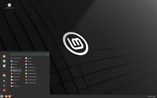
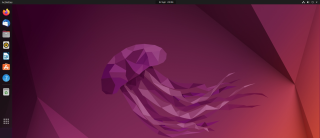
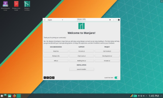
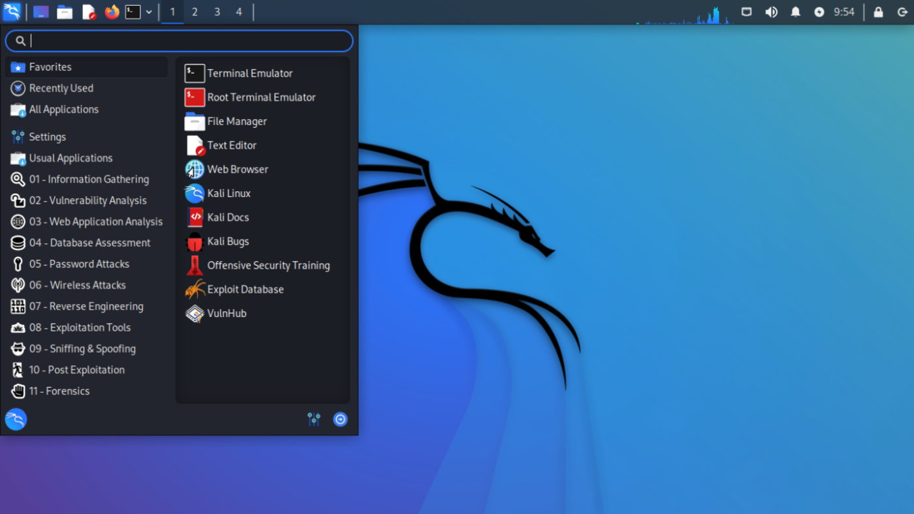
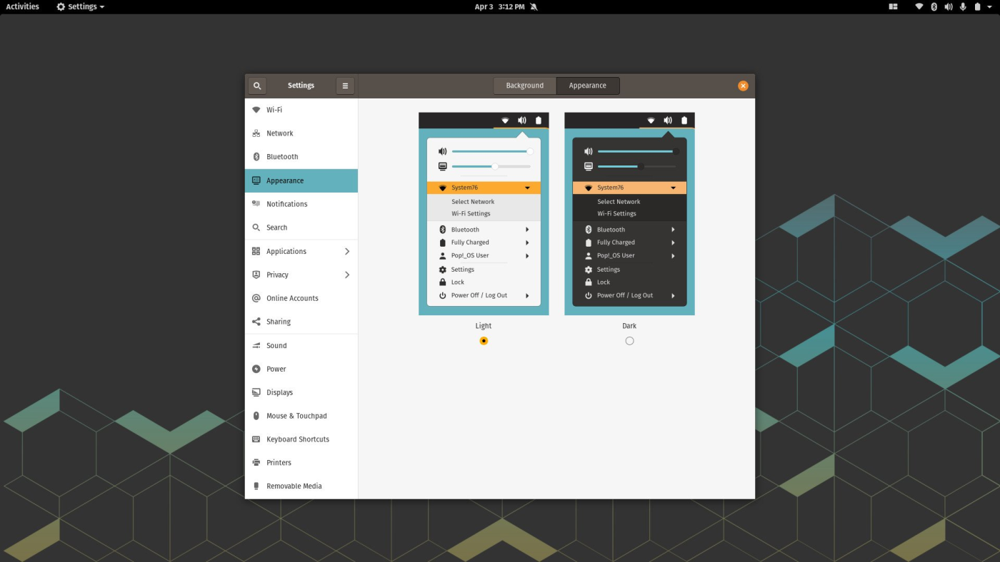
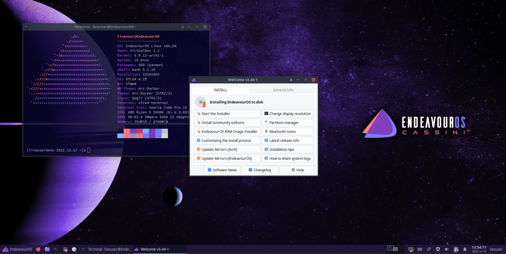
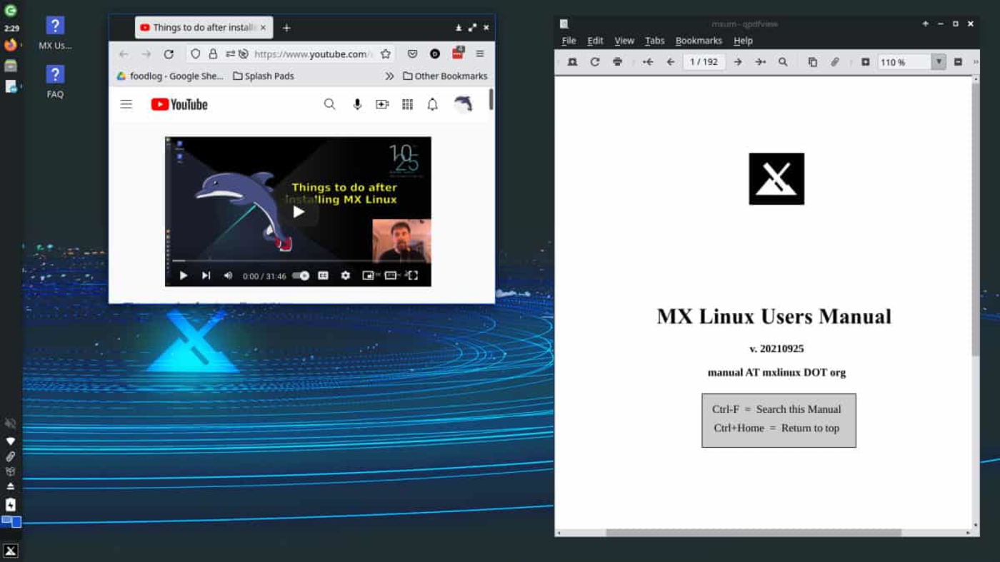

Dengan semakin banyaknya distribusi Linux yang tersedia saat ini, pengguna seringkali mencari alternatif yang sesuai ketika mereka terbiasa dengan sistem operasi tersebut. Pada tahun 2023, diperkirakan telah ada lebih dari 600 distro Linux yang tersedia, dengan sekitar 500 di antaranya masih aktif dikembangkan.

Faktor utama penyebab keberagaman distribusi Linux adalah karena sifatnya yang open source, sehingga memungkinkan siapa saja untuk me-modifikasi dan mendistribusikan sistem operasi mereka sendiri. Selain itu, ketersediaan pilihan dan tidak perlu membayar lisensi menjadikan Linux pilihan favorit bagi pengguna yang ingin mencari pilihan yang sesuai. Karenanya, pengguna Linux sering mencoba berbagai distribusi yang ada untuk mencari sistem operasi yang nyaman dan sesuai dengan kebutuhan mereka.

Berikut adalah daftar OS/Distro Linux Terbaik pada tahun 2023 yang telah dipilih berdasarkan kriteria tertentu. Daftar ini ditujukan untuk semua orang, baik itu pemula maupun pengguna khusus, yang ingin mencari distro terbaik untuk kebutuhan mereka.

## Distro Linux Terbaik 2023

### 1\. Linux Mint

Linux Mint merupakan turunan dari distro Ubuntu, salah satu kelebihannya adalah kemudahan dalam proses instalasi sehingga cocok untuk pemula yang ingin mencoba linux.

Bagi kamu yang baru beralih dari sistem operasi Windows, tidak perlu khawatir karena UI (User Interface) dan UX (User Experience) pada Linux Mint sangat mirip dengan Windows. Hal ini akan mempermudah kamu untuk beradaptasi dengan cepat pada sistem operasi Linux dan memaksimalkan penggunaannya tanpa perlu belajar dari awal.

Linux Mint menyediakan 3 pilihan Desktop Environment yang dapat dipilih, yaitu Cinnamon, XFCE, dan Mate. Cinnamon merupakan Desktop Environment bawaan dari Linux Mint dan kami sangat merekomendasikan untuk memilih Desktop Environment tersebut karena selain stabil, Cinnamon juga cukup ringan untuk dijalankan pada komputer dengan spesifikasi standar. Dengan demikian, pengguna Linux Mint dapat menjalankan tugas sehari-hari dengan lancar tanpa mengalami kendala performa.

Popularitas dari linux mint sudah tidak diragukan lagi, hal ini terbukti pada halaman distrowatch dimana linux mint tetap bertahan pada urutan 5 besar.

#### Kelebihan

1.  Linux Mint sangat ramah bagi pemula karena memiliki antarmuka yang intuitif dan mudah digunakan.
    
2.  Sistem operasi ini sangat stabil untuk digunakan sehingga tidak khawatir dengan kendala error.
    
3.  Tidak terinstall snap, untuk pengguna yang tidak menyukai software manager snap. Namun kamu tetap bisa menginstall snap secara manual.
    
4.  Linux Mint didukung oleh komunitas yang aktif dan responsif, sehingga pengguna dapat dengan mudah menemukan solusi atas masalah yang dihadapi.
    
5.  Keamanan di Linux Mint terjamin karena sistem operasi ini memiliki update keamanan yang rutin, serta fitur pengamanan yang cukup baik.
    
6.  Dukungan update jangka panjang selama 5 tahun.
    

#### Kekurangan

1.  Kurang kompatibel untuk bermain game.
    
2.  Kurang mendukung PPA, sekalipun kamu menambahkan secara manual bisa menyebabkan error pada sistem.
    

### 2\. Ubuntu

Ubuntu adalah distro turunan dari Debian, juga menjadi induk dari distro lain seperti Linux Mint. Distro Ubuntu juga merupakan Distro Linux yang paling banyak digunakan terutama pengguna pemula dan server.

Meski masih ramah untuk pemula namun mungkin kamu perlu penyesuaian dengan Desktop Environment bawaan dari Ubuntu yaitu Gnome.

Sebenarnya kamu juga bisa menggunakan Desktop Environment lain seperti XFCE, KDE Plasma, Mate, Budgie dan yang lainnya. Namun kamu hanya mendapat dukungan dari komunitas dan update jangka panjang 3 tahun.

Jika menyangkut software yang kompatibel maka Ubuntu adalah juaranya, dengan dukungan ppa dan snap membuat Ubuntu dapat menjalankan berbagai macam software dengan baik.

#### Kelebihan

1.  Dukungan komunitas Ubuntu yang luas dan aktif.
    
2.  Ramah pengguna pemula.
    
3.  Dukungan jangka panjang sampai 5 tahun.
    
4.  Keamanan yang terjamin.
    

#### Kekurangan

1.  Hanya tersedia Gnome DE yang didukung langsung oleh pengembang ubuntu.
    
2.  Driver sering bermasalah terutama dengan hardware baru.
    
3.  UI dan UX yang kurang familiar dengan pengguna Windows maupun Mac.
    

### 3\. Manjaro

Distro Arch mungkin sedikit menantang untuk beberapa pengguna, namun berkat manjaro semua kesulitan terkait Arch Linux sirna bahkan seorang pemula sekalipun dapat menginstall dan menjalankan Manjaro dengan mudah.

Manjaro adalah Distro Linux yang cocok untuk siapapun, entah itu developer, gamer desainer bahkan pemula sekalipun. Dengan dukungan software yang luas menjadi kelebihan tersendiri bagi distro Manjaro.

Kamu juga bisa memilih Desktop Environment yang sesuai seperti KDE Plasma, XFCE dan Gnome. Jika masih kurang tersedia desktop environment lain seperti Budgie, Cinnamon dan Mate yang didukung oleh komunitas Manjaro. Atau kamu lebih suka window manager untuk meningkatkan produktivitas, maka gunakan i3wm atau sway.

#### Kelebihan

1.  Distro berbasis Arch yang ramah pemula.
    
2.  Stabilitas dan Kompatibilitas yang luar biasa.
    
3.  Software Manager yang bisa di andalkan.
    
4.  Berbagai pilihan Desktop Environment.
    
5.  Teknologi yang selalu update.
    
6.  Support game, bahkan steam telah terinstall secara bawaan.
    

#### Kekurangan

1.  Rolling Realese, yang berarti sering update sehingga kemungkinan menemukan bug atau error bisa terjadi.
    
2.  Kemungkinan melakukan konfigurasi secara manual.
    

### 4\. Fedora

Fedora adalah salah satu distro linux terbaik yang didasarkan dari kernel linux, seperti halnya distro Debian. Distro Fedora di sponsori oleh Red Hat, dan keduanya memiliki hubungan yang sangat erat bahkan Red Hat Enterprise Linux dikembangkan dengan dasar dari Fedora.

Salah satu fitur yang paling menarik dari Fedora ialah mendukung banyak arsitektur seperti Desktop, Server, IoT dan masih banyak lagi. Jika kamu tidak menyukai _desktop environment_ bawaan GNOME, kamu bisa menggantinya dengan _environment_ yang lain berkat adanya Fedora Spin. Dengan Fedora Spin kamu bisa memilih _desktop environment_ sesuai keinginan seperti KDE, XFCE, LXQT, LXDE, Budgie, Mate, Cinnamon dan Soas atau kamu bisa menggunakan window manager seperti i3 dan Sway.

Fedora sangat cocok digunakan oleh para pengembang karena distro ini menawarkan teknologi open source terbaru kepada pengguna. Selain itu Fedora juga didukung oleh Red Hat dimana banyak programmer berpengalaman yang melakukan kontribusi. Bahkan Linus Torvalds menggunakan Fedora untuk melakukan pengembangan.

#### Kelebihan

1.  Mendukung banyak arsitektur.
    
2.  Fedora sangat andal dan stabil serta fleksibel.
    
3.  Menyediakan keamanan yang sangat terjamin.
    
4.  Didukung komunitas _developer_ yang sangat luas.
    
5.  Mendukung banyak alat grafis.
    
6.  Memiliki firewall yang sangat kuat.
    
7.  Alat open source yang selalu terbaru.
    

#### Kekurangan

1.  Memakan waktu untuk melakukan _set-up_ Fedora, namun hal itu sesuai dengan apa yang akan kamu dapatkan.
    
2.  Tidak dapat berjalan pada _hardware_ lama. Dengan adanya teknologi yang baru membutuhkan _hardware_ yang lebih baru juga.
    
3.  Fitur baru kemungkinan bermasalah.
    

### 5\. Kali Linux

Distro Linux kali ini sedikit berbeda dibandingkan dengan distro lainnya, karena Kali Linux merupakan distro yang khusus untuk permasalahan keamanan jaringan. Dengan berbagai software networking telah tersedia secara bawaan menjadikan Kali sebagai distro linux terbaik terutama untuk penetration test.

Untuk tampilan interface terbilang cukup simple karena menggunakan Desktop Environment XFCE sebagai bawaan, Desktop Environment KDE Plasma dan Gnome juga tersedia sebagai opsi lain. Meski memiliki ui dan ux yang simple bukan berarti kali linux mudah digunakan bagi pemula, sebagian besar tools yang ada hanya berupa cli atau dijalankan via terminal saja.

Satu hal yang unik dari tampilan Kali Linux adalah mode Undercover, dimana ketika fitur ini diaktifkan maka tampilan-nya akan berubah seperti Windows 10.

#### Kelebihan

1.  Multi devices, kali linux dapat di install secara langsung sebagai sistem operasi pada komputer dan smartphone, atau wsl pada windows dan menggunakan termux di android.
    

#### Kekurangan

1.  Sedikit lemot dibandingkan dengan distro lainnya.
    
2.  Tidak ramah pemula karena dirancang khusus untuk penetration.
    
3.  Beberapa tools bermasalah.
    

### 6\. Pop!\_OS

Jika kamu ingin bermain game pada sistem operasi linux, kamu harus mempertimbangkan Pop!\_OS. Hampir semua driver untuk perangkat keras berjalan dengan mulus pada distro Pop!\_OS. Distro yang satu ini juga salah satu turunan dari distro Ubuntu sehingga masih mudah untuk digunakan.

Fitur paling menarik yang ditawarkan dari Pop!\_OS ialah autotiling, dengan fitur tersebut setiap window yang terbuka akan secara otomatis teratur sehingga kamu bisa lebih fokus saat bekerja dan tentunya meningkatkan produktivitas.

#### Kelebihan

1.  Driver yang telah terinstall secara bawaan sehingga bermain game menjadi lancar.
    
2.  Memiliki fitur autotiling untuk mengatur window.
    

#### Kekurangan

1.  Hanya tersedia Gnome sebagai Desktop Enviromnet untuk distro Pop!\_OS.
    

### 7\. EndeavourOS

Distro linux terbaik selanjutnya adalah EndevourOS yang merupakan turunan dari Arch Linux. Meski distro ini masih baru namun popularitasnya melonjak dan mengalahkan Manjaro yang juga sama-sama berbasis Arch Linux.

Bedanya dengan manjaro adalah tidak banyak aplikasi bawaan yang terinstall, sehingga kamu perlu penyesuaian kembali saat pertama kali menginstall distro Endeavour.

Secara bawaan EndeavourOS menggunakan XFCE sebagai Desktop Environment mereka, namun menariknya EndeavourOS memiliki pilihan Desktop Environment yang cukup banyak saat proses install. Hal ini terjadi berkat software penginstal bernama Calamares yang memungkinkan untuk memasang XFCE, Cinnamon, Budgie, Mate, Gnome, KDE Plasma, LXQT dan i3.

Namun saya tidak menyarankan EndeavourOS untuk pemula, karena bisa saja kamu kesulitan untuk mengaturnya. Namun kamu bisa bisa bertanya pada komunitas endeavour yang sangat cepat tanggap, jika membutuhkan bantuan.

Hal paling menarik dari EndeavourOS ialah performanya yang cepat dan ringan, hal ini dikarenakan teknologi yang selalu terkini, lebih sedikit source dan desktop environment XFCE yang ringan.

#### Kelebihan

1.  Installer yang sangat mudah digunakan.
    
2.  Banyak pilihan Desktop Environment.
    
3.  Ringan, karena hanya terdapat sedikit aplikasi yang ter-install secara bawaan jadi ringan untuk dijalankan.
    
4.  Komunitas yang sangat tanggap.
    

#### Kekurangan

1.  Bug yang mengganggu, meskipun sistem nya stabil namun kami menemukan beberapa bug seperti pada tampilan. Namun bug tersebut masih aman.
    
2.  Tidak ramah untuk pemula, hampir semua konfigurasi dilakukan lewat cli dan file config sehingga kurang cocok untuk pemula.
    

### 8\. MX Linux

MX Linux adalah distro turunan Debian yang dikembangkan oleh komunitas antiX dan MX. Distro MX dirancang sebagai sistem operasi desktop yang elegan namun efisien, menawarkan stabilitas tinggi dan kinerja yang solid.

Dibandingkan dengan distro Linux lainnya, MX Linux tidak menonjol dalam hal keistimewaan yang spesifik karena pengembangnya tidak fokus pada hal tersebut. Namun, MX Linux fokus pada menyediakan sistem operasi dengan basis yang solid dan desktop yang ramah pengguna. MX Linux juga dikenal sebagai distro yang ringan meskipun tidak se-ringan Arch Linux, hal ini dikarenakan penggunaan default desktop environment XFCE. Namun, jika kamu tidak menyukai XFCE, kamu dapat memilih opsi lain seperti KDE Plasma sebagai alternatif.

#### Kelebihan

1.  Sistem yang solid, ramah pengguna dan sangat stabil.
    
2.  Dapat berjalan pada sistem dengan perangkat yang tidak terlalu tinggi.
    

#### Kekurangan

1.  Teknologi tidak mutakhir, mungkin untuk alasan stabilitas teknologi yang digunakan pada MX Linux beberapa versi lebih rendah dibandingkan dengan yang terbaru.
    

## Cara Memilih Distro Linux Terbaik

Kami mencoba sendiri beberapa distro linux pada list tersebut untuk mengalami secara langsung pengalaman saat menggunakannya. Penilaian dilakukan berdasarkan stabilitas, kompatibilitas, keamanan dan juga popularitas dari masing-masing distro.

Kenapa popularitas dijadikan acuan? Semakin banyak orang menggunakan sebuah distro, maka semakin besar kemungkinan bahwa distro tersebut sangatlah bagus. Dengan banyaknya pengguna, maka komunitas pun akan semakin ramai sehingga

## Akhir Kata

Jika kamu adalah seseorang yang telah mencoba berbagai macam distro linux, maka kamu akan menyadari bahwa hampir semua distro tidak jauh berbeda secara fungsi. Sama hal-nya dengan nasi, jika dimakan rasanya tidak jauh berbeda namun apabila dibarengi dengan lauk maka rasa bisa jauh berbeda tergantung lauk yang ada.

Jadi apakah kamu sudah memilih atau masih mencoba-coba salah satu distro terbaik yang saya tulis? Atau ada distro lain yang mungkin tidak saya ketahui? Jika ada distro lain yang tidak saya sebutkan silahkan tulis dibagian komentar.