Linux terkenal dengan command line atau baris perintah yang sering diketik pada aplikasi terminal. Sering disebut juga dengan command prompt, shell, terminal, console atau apapun itu pada dasarnya tetap sama yaitu sebuah interface atau tampilan text yang digunakan untuk mengatur sebuah program maupun sistem itu sendiri.

Jika di Windows sobat bisa menemukan CMD dan Shell, di linux juga tidak jauh berbeda. Pada sistem operasi berbasis Linux command line sangat penting, oleh karena itu kita harus tahu dasar-dasar dari Command Line inux.Disini sobat akan belajar dasar-dasar dari baris perintah atau command line pada Linux. Apa saja perintah dasar di linux?

## Membuka Terminal Linux

Untuk membuka terminal linux cukup tekan **CTRL**+**Alt**+**T** sobat juga bisa langsung mencari aplikasi terminal jika shortcut tadi tidak berjalan. Saat mengetikan command line kita harus memperhatikan huruf-hurufnya karena command line bersifat case sensitive yang sangat memperhatikan huruf besar dan kecil, jadi hati-hati saat mengetikan command line di linux ataupun di os lainya. Karena command line bersifat case sensitive berarti jika sobat mengetikan mkdir dan MKDIR maka bisa dipastikan tidak akan sama hasil dari eksekusinya. 


## Menampilkan Path Direktori

Untuk menampilkan path atau lokasi dari direktori yang bisa disebut juga folder kita harus menggunakan `pwd`.

```
pwd
```

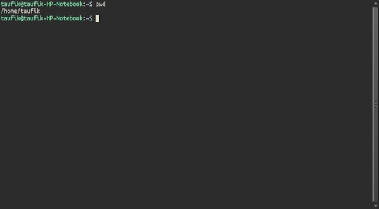

## Mengubah/Pindah Direktori

Setelah mengetahui cara menampilkan lokasi direktori sekarang saatnya untuk mengubah direktori, dengan command ini sobat bisa pindah dari direktori home ke direktori Documents misalnya. Commandnya ialah `cd` contohnya sebagai berikut.

```
cd Documents
```

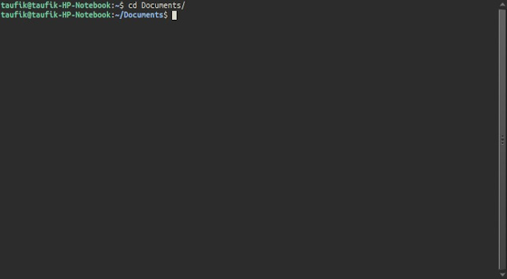

Untuk kembali ke direktori home cukup ketikan `cd` saja, jika sobat sebagai super user maka akan kembali ke direktori root atau /

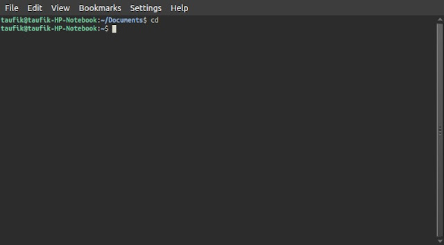

Untuk sebuah direktori atau folder yang memiliki nama disertai space sobat bisa gunakan garis miring terbalik "\\" contoh

```
cd Command\ Linux
```

atau bisa juga dengan disertai tanda kutif satu ataupun dua (" '), gunakan salah satu jangan digabungkan keduanya contohnya

```
cd "Command Linux"
```

Untuk kembali ke direktori sebelumya hanya satu langkah bisa menggunakan

```
cd ..
```

Jika dua langkah kebelakang maka seperti berikut

```
cd ../..
```

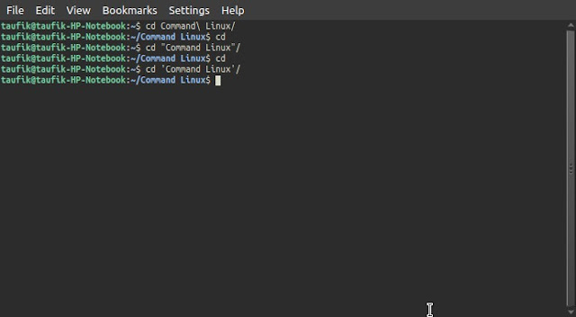

dan seterusnya.

## Membuat Direktori

Sekarang lanjut ke bagian membuat direktori, membuat direktori kita gunakan `mkdir`. `mkdir` adalah kependekan dari make directory contoh

```
mkdir CommandDasarLinux
```

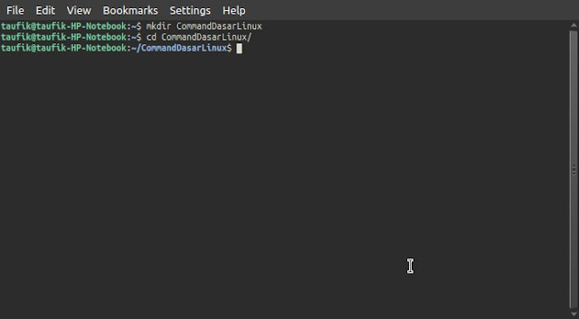

Jika ingin membuat sebuah direktori disertai spasi misalkan direktori "Command Dasar Linux", maka gunakan prinsip yang sama dengan pindah direktori yaitu dengan tanda kutif satu atau dua (",') dan garis miring terbalik (\\) berikut contohnya.

```
mkdir Command\ Dasar\ Linux
```

  
atau

```
mkdir "Command Dasar Linux"
```

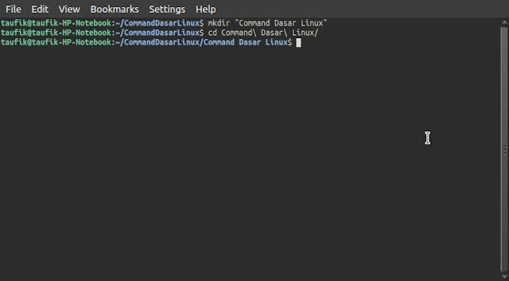

Sobat juga bisa membuat dua atau lebih direktori secara langsung contohnya

```
mkdir dir1 dir2 dir3
```

## Menampilkan Isi Direktori

Setelah membuat direktori dengan command linux maka kita harus bisa melihat apakah direktori tersebut berhasil dibuat. Tambahkan -a jika ingin melihat file tersembunyi.

```
ls
```

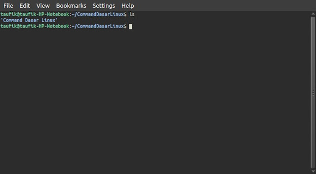

Bisa juga dengan langsung menyertakan direktori tujuan, misal

```
ls "Command Dasar Linux"/
```

## Membuat dan Menampilkan Isi Text

Untuk membuat file juga menampilkan isi text dari file text kita gunakan `cat`, contoh untuk membuat file baru seperti berikut.

```
cat> command.txt
```

lalu bisa kita isi dengan text dan jika sudah selesai kita bisa tekan **CTR**+**C**

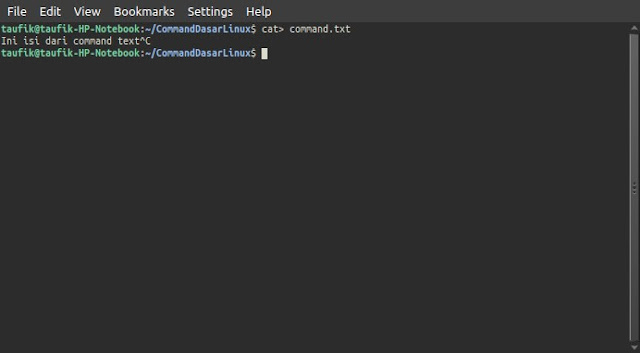

Untuk menampilkan isi dari text bisa langsung menggunakannya tanpa tanda >

```
cat command.txt
```

jika menuliskan lebih dari satu file maka akan menampilkan isi text per block

```
cat command.txt lorem.txt
```

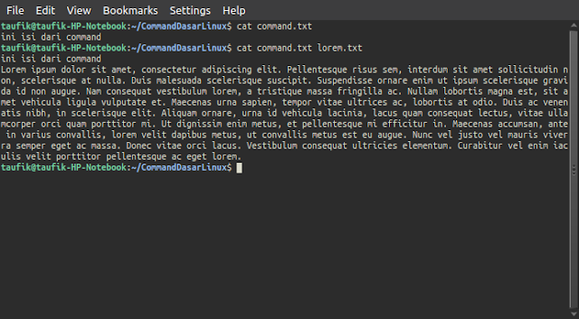

menyatukan 2 atau lebih file text dengan `cat`

```
cat file.txt command.txt > gabungan.txt
```

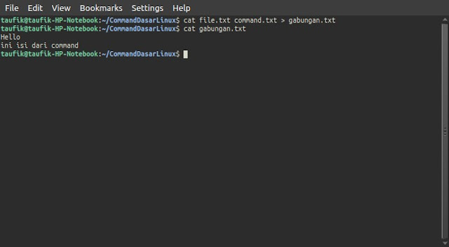

## Memindahkan dan Merubah Nama File

Sekarang sobat sudah terdapat beberapa file dan ingin memindahkanya maka gunakan `mv`  

```
mv gabungan.txt Command\ Dasar\ Linux/
```

  
Jika merubah nama file gunakan command sebagai berikut `mv namalama namabaru` contohnya.

```
mv gabungan.txt baru.txt
```

  

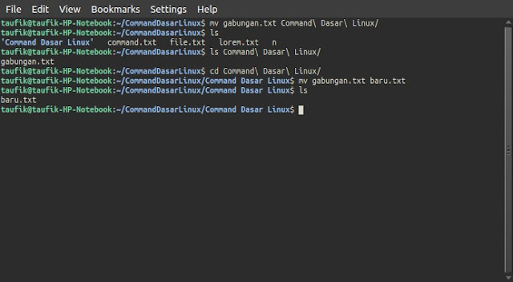

## Copy File

Jika ingin memebuat sebuah backup dari file kita bisa menggunakan copy dengan command `cp namafile direktoritujuan`. Command ini bisa digunakan untuk file maupun direktori beserta isinya. Contoh penerapan.

```
cp baru.txt Dir
```

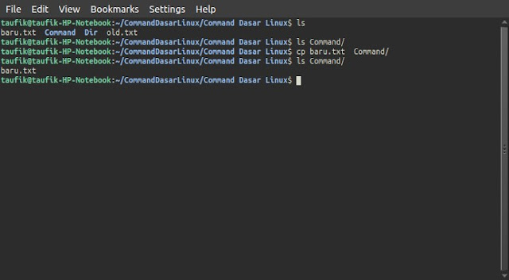

## Menghapus File dan Direktori

Menghapus direktori bisa menggunakan `rmdir`, tapi command tersebut tidak bisa menghapus file dan jika direktori tersebut terdapat file maka tidak bisa menggunakan command `rmdir` ternyata hal ini bermaksud sebagai pengaman jika sobat hanya ingin menghapus direktori saja dan jika ingin menghapus semua direktori dan subdirektori kosong tambahkan -p pada command semua direktori dan subdirektori bisa terhapus jika tidak ada file didalamnya. Jika sobat mau menghapus direktori , subdirektori beserta isi file maka sobat bisa gunakan `rm -r`, command ini bisa menghapus file dan direktori beserta isinya. Contoh pemakaian.

```
rmdir CommandLinux/
```

Jika menghapus file dan direktori yang berisi file

```
rm -r Command/
rm -r old.txt
```

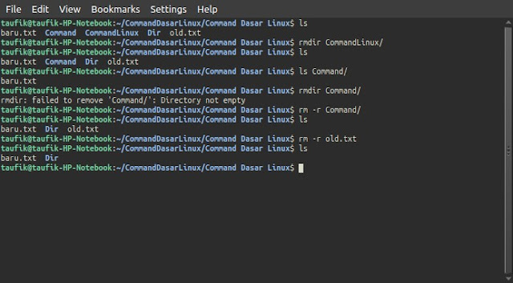

## Tips Command Line Linux

Gunakan tab saat mengetik command, contoh ketika mengetik cd Command maka ketika cd C tekan tab dan otomatis huruf C menjadi Command, jika terdapat dua C misal yang satu " Command" dan yang satu "Cubby" maka harus ketik Co lalu tab jika C saja tidak akan bekerja.

## Akhir Kata

Sebenarnya masih banyak command line dasar yang harus dipelajari sedangkan saya biasanya hanya menggunakan itu saja.  Itupun masih jarang, sekarang linux udah mendukung GUI hampir sepenuhnya jadi untuk pengguna awal perintah dasar linux tersebut sudah cukup untuk dipakai.