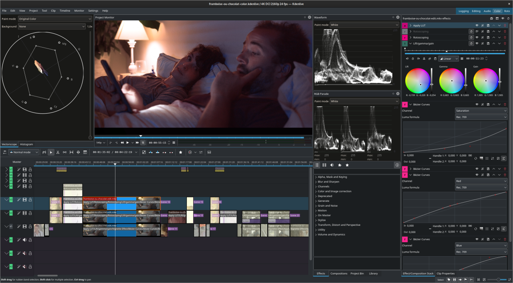
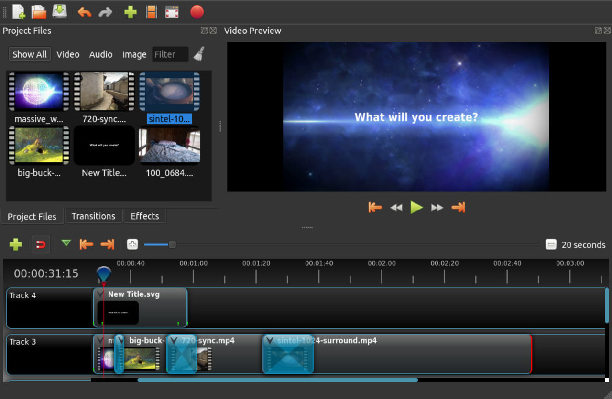
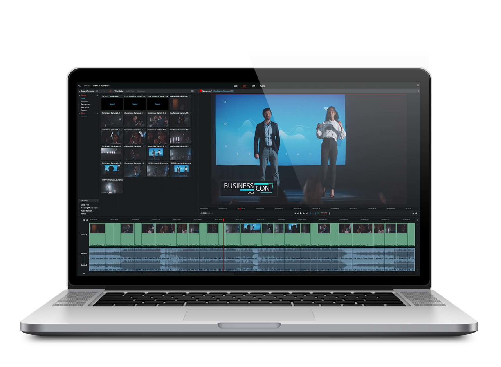
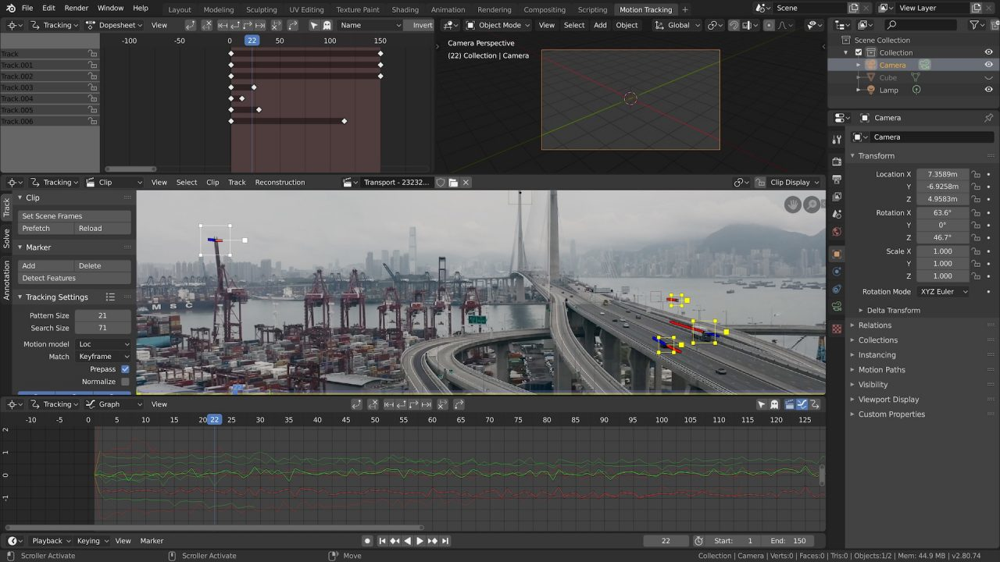
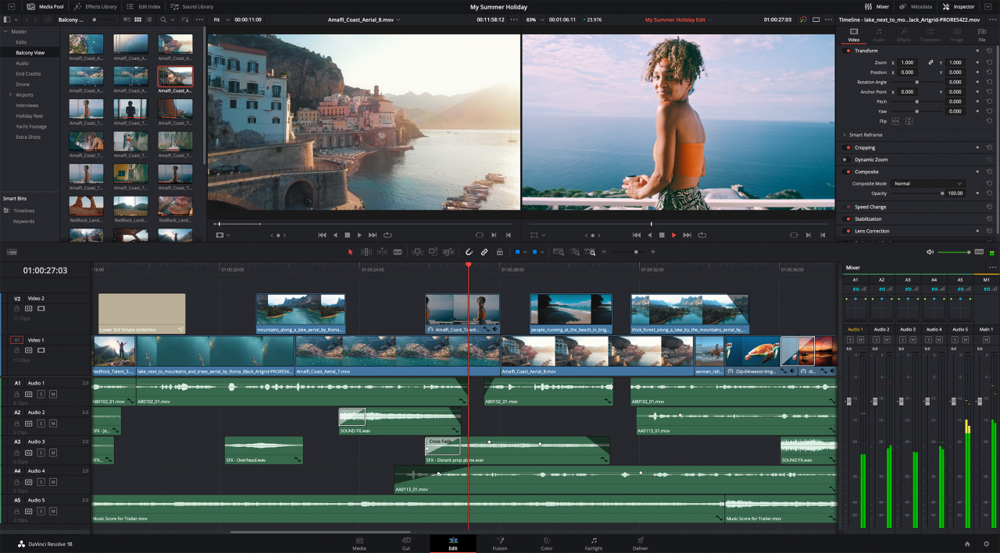

Kamu mungkin saja sedang membutuhkan **software edit video** namun kamu adalah pengguna linux, masalahnya software seperti Adobe Premiere Pro tidak dapat digunakan karena tidak mendukung sistem operasi linux.

Kamu bisa tenang karena kali ini saya akan merangkum **Software Edit Video Terbaik Untuk Linux**, yang bisa kamu gunakan untuk membuat konten video maupun film pendek dan mungkin akan kamu share di sosial media maupun hanya lingkup keluarga atau teman.

## Software Edit Video Untuk Linux

### 1\. Kdenlive

**Kdenlive** merupakan _software open source_ sehingga gratis untuk digunakan. Kdenlive dikembangkan oleh organisasi KDE yang juga mengembangkan _desktop environment_ **KDE Plasma**, organisasi ini telah banyak mengembangkan software open source yang bagus seperti **Krita**, **LabPlot** dan **Elisa**. Kdenlive juga _multi platform_ yang artinya tidak hanya dapat berjalan di **Linux** saja, software ini juga tersedia untuk **Windows** dan **Mac OS**.

Fitur yang didapatkan dengan Kdenlive cukup komplit mulai dari transisi, pengaturan audio, efek dan fitur lainya. Hampir semua format video maupun audio dapat dibaca oleh software ini karena _library FFmpeg_ yang sangat mumpuni.

### 2\. OpenShot

Software edit video selanjutnya adalah OpenShot yang juga _free open source software_, sama seperti Kdenlive yang dapat mendukung hampir semua format video maupun audio. Fitur yang ditawarkan juga cukup lengkap untuk mengedit video.

Selain dapat dijalankan di Linux, OpenShot juga bisa berjalan di Windows dan Mac OS. OpenShot adalah pilihan yang dapat kamu coba, jika kamu menginginkan tampilan UI yang sederhana.

### 3\. Lightworks

Lightworks adalah software edit video yang mempunyai fitur dasar seperti di Adobe Premiere dengan fitur tambahan yang unik, namun Lightworks tersedia untuk sistem operasi Linux. Tidak seperti software yang saya sebutkan di awal, Lightworks tidak open source meski gratis untuk digunakan dengan beberapa batasan.

Lightworks telah digunakan dikalangan profesional, dan telah menciptakan banyak film kelas Hollywood.

### 4\. Blender

Meski Blender merupakan software yang populer untuk editing dan rendering 3D, namun ternyata bisa juga digunakan sebagai software untuk mengedit video. Dengan lisensi open source membuat Blender gratis untuk digunakan dan tentunya tersedia untuk Linux. Perlu diketahui bahwa telah banyak serial Hollywood yang telah dibuat menggunakan blender, seperti Agent 327 dan Hardcore Henry.

Meski populer, untuk menggunakan Blender kamu akan kesulitan jika tidak mengetahui caranya. Karena Blender memiliki tampilan yang rumit, maka kamu perlu mempelajarinya terlebih dahulu.

### 5\. Davinci Resolve

Davinci Resolve merupakan software edit video untuk sekelas film Hollywood. Star Wars, Deadpool 2 juga Robin Hood menggunakan Davinci Resolve dalam proses pembuatan film-nya.

Davinci bukanlah editor video biasa, software ini memiliki fitur yang sangat lengkap untuk pasca produksi, edit video dan audio serta fitur koreksi warna yang sangat canggih.

## Alternatif Lain

Bagi yang masih belum puas dengan daftar diatas, kamu bisa mencoba software edit video untuk linux berikut ini.

1.  Shortcut
    
2.  Flowblade
    
3.  Cinelarra
    
4.  Avidemux
    
5.  Pitivi
    
6.  VidCutter
    

## Akhir Kata

Entah software apa yang kamu gunakan untuk mengedit video, hasil tidak hanya tergantung pada proses editing saja. Banyak faktor yang bisa membuat video/film/konten kamu menarik.

Nah itulah software edit video untuk sistem operasi Linux terbaik yang bisa kamu gunakan, semoga artikel ini bisa bermanfaat.