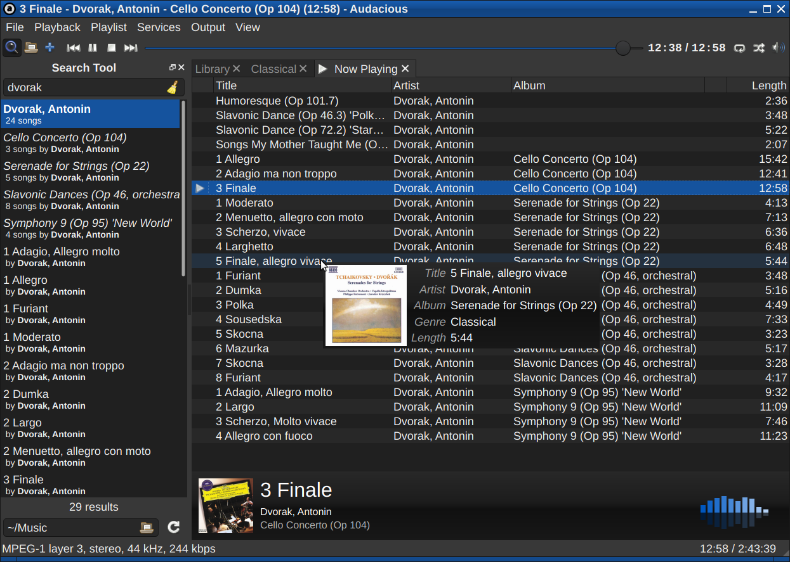
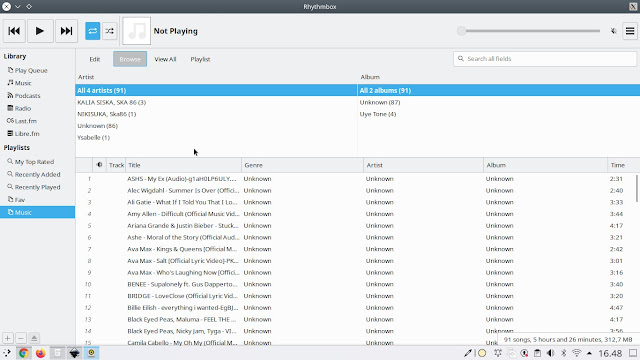
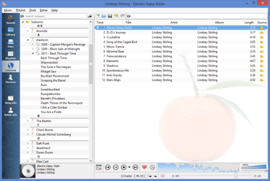
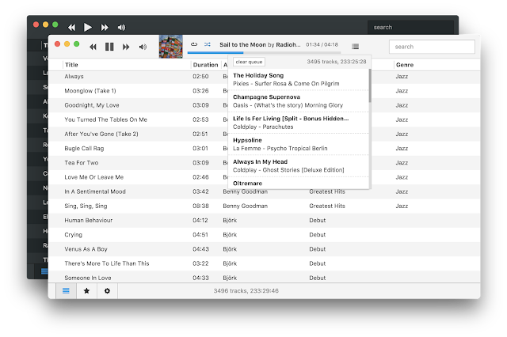
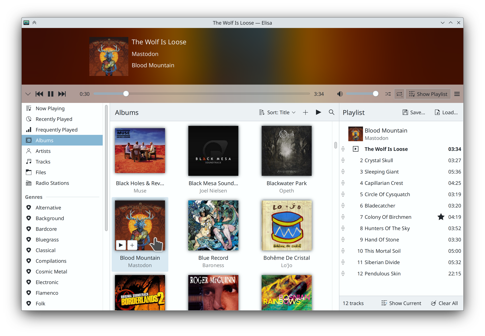
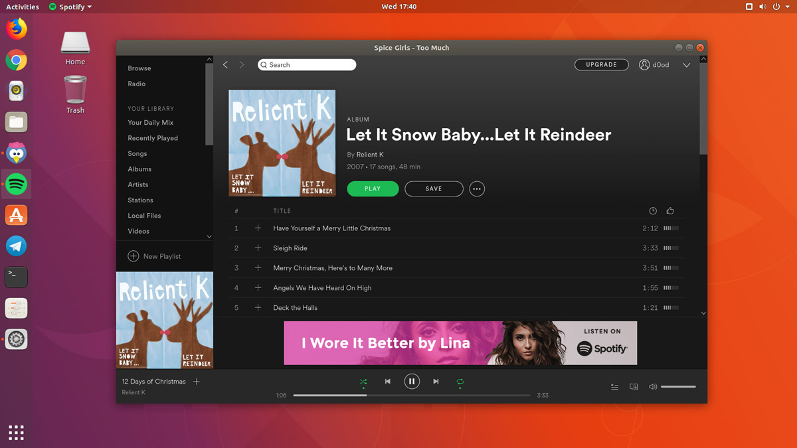
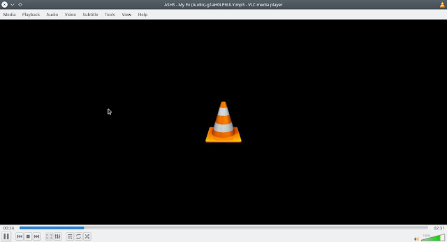

Memutar Audio atau Musik merupakan sebuah kebiasaan dijaman sekarang ini. Terdapat berbagai pemutar Musik di linux yang bisa kamu coba berikut ini.

## 1\. Audacious

[Audacious](https://audacious-media-player.org/) adalah pemutar musik yang dibuat dengan Qt sebagai UI dan didasarkan pada XMMS. Audacious sangat ringan digunakan, karena tidak memerlukan banyak sumber daya untuk dijalankan.

Audacious dapat dengan mudah menambahkan music dengan drag dan drop ataupun impor, putar dari CD maupun internet semuanya bisa. Audacious juga bisa mengatur equalizer grafis atau ubah jangkauan dinamis dengan efek audio sehingga pengalaman memutar musik lebih bagus.

## 2\. Rhythmbox

[Rythmbox](https://wiki.gnome.org/Apps/Rhythmbox) adalah pemutar musik open source terbaik menurut saya, cukup ringan digunakan. Rythmbox adalah proyek **GNOME**, jika kamu pengguna Ubuntu atau distro dengan Desktop Environtment **GNOME** kemungkinan besar sudah terpasang pemutar musik yang satu ini.

Selain itu Rythmbox juga bisa melakukan streaming podcast ataupun radio online seperti [last.fm](http://last.fm) dan [libre.fm](http://libre.fm). Kamu juga bisa mengedit informasi dari sebuah lagu dari software ini serta bisa memasang plugin pihak ketiga.

## 3\. Clementine

[Clementine](https://www.clementine-player.org/id/) ibuat dengan Qt, clementime merupakan salah satu pemutar musik terbaik di linux dengan banyak fitur dan juga multiplatform. Clementime bisa memutar musik secara streaming dari internet seperti spotify dan soundcloud, bahkan bisa memutar dari penyimpanan cloud seperti Google Drive dan Dropbox. Berikut fitur lengkapnya:

-   Cari dan putar pustaka musik lokal Anda.
    
-   Dengarkan radio internet dari Spotify, Grooveshark, SomaFM, Magnatune, Jamendo, [SKY.fm](http://SKY.fm), Digitally Imported, [JAZZRADIO.com](http://JAZZRADIO.com), Soundcloud, Icecast dan Subsonic servers.
    
-   Cari dan putar lagu yang telah Anda unggah ke Box, Dropbox, Google Drive, dan OneDrive
    
-   Membuat daftar-putar cerdas dan daftar-putar dinamis.
    
-   Daftar-putar bertab, impor dan ekspor M3U, XSPF, PLS dan ASX.
    
-   Dukungan lembar CUE.
    
-   Putar CD audio.
    
-   Visualisasi dari projectM.
    
-   Lirik dan biografi dan foto artis.
    
-   Transkode musik menjadi MP3, Ogg Vorbis, Ogg Speex, FLAC atau AAC.
    
-   Sunting tag pada berkas MP3 dan OGG, kelola musik Anda.
    
-   Ambil tag yang hilang dari MusicBranz.
    
-   Temukan dan unduh Podcast.
    
-   Unduh sampul album yang hilang dari [Last.fm](http://Last.fm) dan Amazon.
    
-   Lintas-Platfom - bekerja pada Windows, Mac OS X dan Linux.
    
-   Notifikasi desktop asli pada Linux (libnotify) dan Mac OS X (Growl).
    
-   Kendali jarak jauh menggunakan sebuah Perangkat Android, Wii Remote, MPRIS atau perintah-baris.
    
-   Salin musik ke iPod, iPhone, MTP atau pemutar USB dengan penyimpan massal.
    
-   Manajer atrean.
    

## 4\. Museeks

[Museeks](https://museeks.io/) merupakan pemutar musik di linux yang dibuat menggunakan nodejs dan react yang sangat mudah digunakan serta UI yang clean. Tidak terlalu banyak fitur karena mungkin pembuatnya hanya ingin membuat sebuah pemutar musik yang sangat simpel.

Berikut fitur yang dibawa Museeks

-   computer Cross-platform music player (Linux, macOS and Windows)
    
-   headphones Supported formats: mp3, mp4, m4a/aac, flac, wav, ogg, 3gpp
    
-   sparkles Clean and polished
    
-   star2 Playlists
    
-   musical\_score Queue management
    
-   curly\_loop Shuffle, loop
    
-   sunrise\_over\_mountains Covers support
    
-   nerd\_face Dark theme
    
-   speedboat Playback speed control
    
-   sleeping Sleep mode blocker
    
-   loud\_sound Minimize to tray
    
-   arrows\_counterclockwise .m3u import/export
    

## 5\. Elisa

[Elisa](https://kde.org/applications/en/elisa) adalah software pemutar musik terbaik yang dikembangkan oleh KDE, elisa tersedia di Linux dan Windows. Bagi kamu pengguna Desktop Environment KDE maka Elisa adalah pemutar musik yang cocok untukmu karena akan terlihat lebih konsisten.

Tidak banyak keterangan mengenai fitur dari pemutar musik yang satu ini di website projectnya, sehingga saya menyimpulkan bahwa software Elisa seperti pemutar musik pada umumnya.

## 6\. Spotify

[Spotify](https://www.spotify.com/id/download/) adalah layanan streaming musik yang bisa kamu dapatkan secara gratis, spotify tidak hanya tersedia untuk Windows, Mac, Android dan IOS tetapi tersedia juga untuk Linux.

[_omgubuntu.co.uk_](http://omgubuntu.co.uk)_: Spotify Snap_

## 7\. VLC

[VLC](https://www.videolan.org/vlc/index.id.html) adalah salah satu software open source yang populer, kemungkinan besar kamu mengetahui software yang satu ini. Selain sebagai pemutar video, VLC juga adalah software pemutar audio sehingga kamu bisa memutar musik langsung dengan VLC.

Kamu lebih suka yang mana?