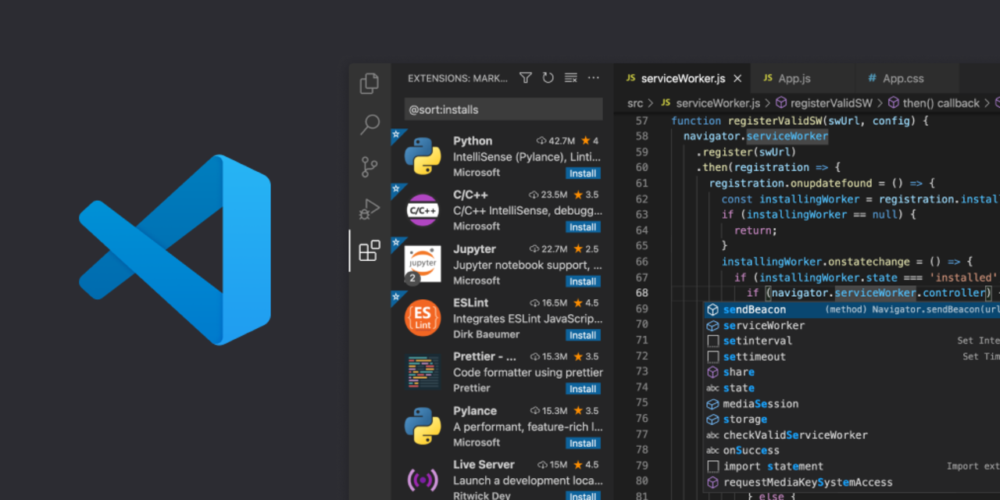
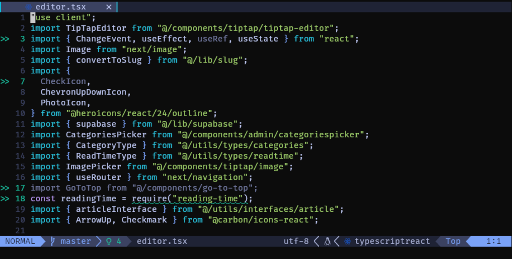
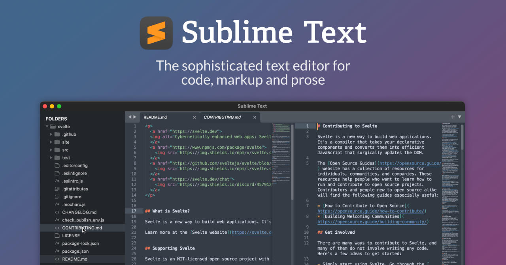
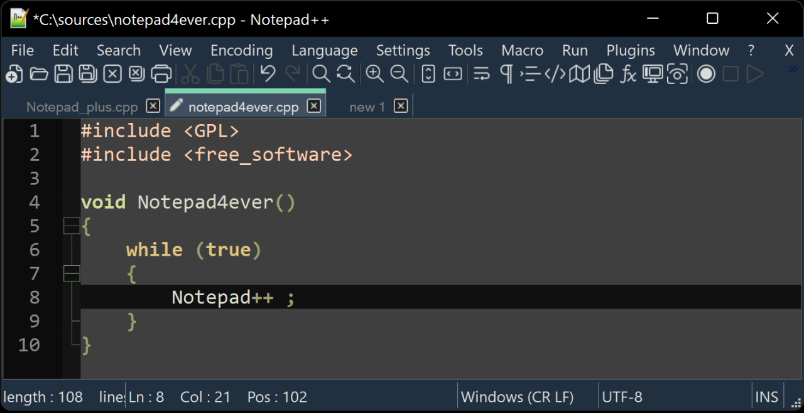

Text editor adalah aplikasi yang digunakan para programmer atau pembuat program untuk membuat, mengubah atau mengedit file yang berbentuk teks atau source code. Bagi kamu yang bingung memilih Text Editor untuk pemrograman maka postingan ini sangat tepat bagi mu.

## Visual Studio Code

Visual Studio Code (VS Code) merupakan code text editor terbaik yang paling populer dan banyak digunakan para programmer. VS Code dibuat oleh Microsoft yang bisa kamu gunakan secara gratis.

VS Code juga memiliki fitur yang luar biasa seperti IntelliSense, Extension dan Plugin, Git Integration, dan fitur-fitur lainnya. Selain itu VS Code juga mendukung multi platform dari Windows, Mac dan Linux.

**Kelebihan VS Code:**

1.  **Multi Platform**: Kamu bisa menggunakan VS Code pada sistem operasi Windows, Mac dan Linux.
    
2.  **Open Source**: Visual Studio Code adalah versi yang telah diberikan beberapa perubahan dari versi open source dengan nama Code - OSS, meski berbeda nama namun secara fungsi semuanya sama saja.
    
3.  **Mudah Digunakan**: Dengan desain UI/UX yang sangat baik menjadikan VS Code mudah digunakan bahkan pemula sekalipun, pengguna juga dapat dengan mudah beradaptasi dengan VS Code. Untuk kasus yang lebih kompleks mungkin akan ada sedikit tantangan untuk menyelesaikan-nya.
    
4.  **Ekstensi dan Plugin**: Kamu bisa memasang, mengelola, menghapus ekstensi atau plugin dengan mudah pada VS Code.
    
5.  **Bahasa Pemrograman**: VS Code mendukung banyak bahasa pemrograman yang luas seperti C, C++, HTML, CSS, JavaScript, TypeScript, XML dan lain-lain.
    

**Kekurangan VS Code:**

1.  **Penggunaan Memori yang Tinggi**: VS Code dikembangkan dengan Electron sebuah framework yang dapat membuat aplikasi lintas platform dengan javascript. Namun, Electron dibangun dengan Chrome sehingga ketika membuka VS Code sama saja dengan membuka browser. Untuk pengguna dengan komputer yang memiliki ram sedikit mungkin tidak dapat berjalan dengan mulus bahkan kemungkinan mengalami galat sangat besar.
    

## 2\. Vim / Neovim

Vim dan Neovim adalah salah satu code text editor terbaik untuk pemrograman, bedanya Vim dan Neovim berjalan pada terminal sehingga menggunakan lebih sedikit memori dibanding code text editor lainnya. Neovim dibuat dengan bahasa pemrograman lua sehingga lebih cepat dibandingkan dengan Vim.

Hal terpenting yang perlu kamu ketahui mengenai Vim ialah tidak adanya UI/UX sehingga hanya dapat menggunakan keyboard sebagai akses pada Vim seperti menyimpan file, melakukan undo dan redo, pindah baris maupun text hanya menggunakan keyboard saja. Untuk Neovim sendiri mendukung mouse untuk melakukan beberapa aksi terbatas.

**Kelebihan Vim / Neovim**

1.  **Kostumisasi**: Vim dan Neovim dapat dikonfigurasi dengan sangat luas mulai dari tampilan, bahasa yang didukung bahkan dapat dikonfigurasi untuk menjalankan _Language Server Protocol_ sehingga memiliki fitur seperti pada VS Code.
    
2.  **Andal dan Cepat**: Vim maupun Neovim hanya menggunakan keyboard dan perintah sebagai akses pada program sehingga proses yang dilakukan lebih cepat. Selain itu Vim dan Neovim juga sangat cepat dan menggunakan sedikit memori.
    

**Kekurangan**:

1.  **Waktu Pembelajaran**: Untuk terbiasa menggunakan Vim maupun Neovim dengan maksimal, mulai dari konfigurasi dan memasang plugin sampai benar-benar siap digunakan membutuhkan waktu yang tidak sedikit. Namun waktu yang digunakan sangat sepadan dengan apa yang akan kamu dapatkan.
    
2.  **Non GUI**: Untuk pengguna yang terbiasa menggunakan mouse untuk klik sana-sini, kemungkinan kamu akan kurang menyukainya.
    

## Sublime Text

Sublime Text merupakan salah satu text editor terbaik untuk pemrograman. Jika VS Code terlalu berat dan Neovim terlalu sulit digunakan, maka Sublime Text sangat cocok untukmu.

Sublime Text dibuat dengan bahasa pemrograman C++ dan Python sehingga sangat ringan digunakan dibandingkan VS Code yang dibuat dengan Electron. Hampir semua fitur VS Code dapat ditemukan di text editor satu ini. Bahkan untuk integrasi sistem Git lebih baik dibandingkan VS Code.

## Notepad++

Jika kamu sudah terbiasa dengan Notepad, maka text editor Notepad ++ adalah penggantinya. Notepad++ cocok untuk pemrograman skala kecil, seperti HTML dan CSS tidak menutup kemungkinan untuk digunakan dalam skala yang lebih besar. Saya sendiri menggunakan Notepad ++ untuk pertama kali pemrograman saya dalam membuat template Blogger, dan kinerja dari text editor ini sangat cepat bila dibandingkan dengan VS Code.

Jika dibandingkan text editor lainya, kekurangan Notepad++ hanya tersedia untuk sistem operasi Windows saja.

Itulah Text Editor Terbaik untuk Pemrograman, saya sendiri menggunakan Text Editor Neovim karena ringan dan bisa berjalan di Android. Apa text editor yang menemanimu dalam pemrograman?