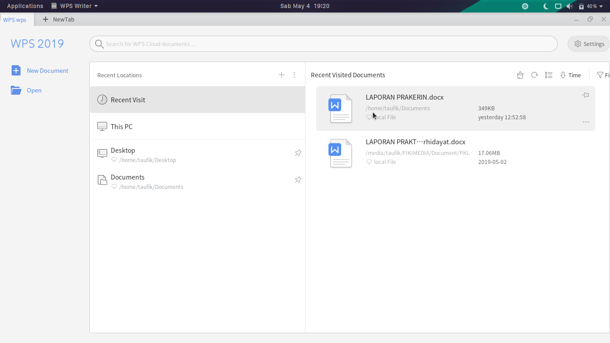
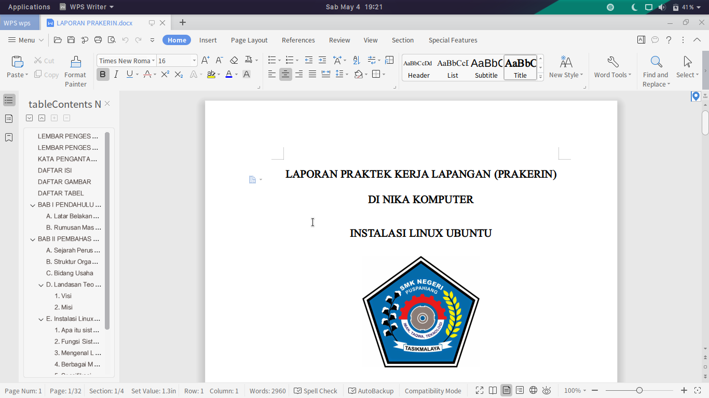

WPS Office adalah office suite yang 100% compatible dengan Microsoft Office. Salah satu alasan mengapa WPS Office alternatif Microsoft office adalah WPS Office bisa didapatkan secara gratis. Bukankah lebih baik menggunakan alternatif daripada menggunakan Microsoft Office namun bajakan? Dan yang paling penting adalah WPS bisa digunakan pada linux.

Beberapa waktu lalu saya menginstall ubuntu dan menggantikan Windows 10, awalnya sangat bagus dengan mengubah tampilan sesuai keinginan. Namun mengalami kendala dikala ada tugas dari sekolah yang belum terselesaikan, saya mencoba LibreOffice dan kesanya cukup bagus tetapi semua tugas saya menjadi tidak rapi setelah saya save dan membukanya dilain hari, dan yang lebih parah document saya error mulai dari nomor halaman, gambar, dan sebagainya. Hingga saya menginstall ulang laptop dengan deepin os yang katanya tampilanya sangat bagus, dan disana saya mencoba wps yang kesan awal cukup mengejutkan.

Saya tertarik dengan tampilanya yang tampil lebih modern dan mudah digunakan daripada LibreOffice yang terkesan ketinggalan, meskipun sudah ada update terbaru namun tetap saja WPS lebih enak dipandang mata.

<table><tbody><tr><td colspan="1" rowspan="1"></td></tr><tr><td colspan="1" rowspan="1">
Interface Dari WPS
</td></tr></tbody></table>

<table><tbody><tr><td colspan="1" rowspan="1"></td></tr><tr><td colspan="1" rowspan="1">
Edit Dokumen di WPS
</td></tr></tbody></table>

  
Berikut beberapa alasan saya lebih memilih WPS:

## Bisa Digunakan Secara Gratis

Ya, siapa yang tidak tahu bahwa Microsoft Office tidaklah gratis dan harganya yang bisa dibilang mahal. Mungkin orang lebih memilih Microsoft Office dan mengaktivasinya dengan cara yang ilegal atau bisa dibilang membajak. Bagi saya sangat tidak menyenangkan jika menggunakan software bajakan karena saya sedang membuat program pada diri saya untuk tidak menggunakan software bajakan. WPS Office gratis untuk individu, tetapi saya membaca beberapa artikel bahwa WPS Office akan menyisipkan watermark pada setiap halaman setelah habis masa percobaan selama 30 hari. 

> Saya membaca beberapa artikel, untuk WPS Office gratis versi terbaru tidak menampilkan watermark lagi.

## Ukuran Yang Lebih Kecil

Dengan ukuran tidak lebih dari 300MB bukankah lebih baik daripada Microsoft Office yang bisa mencapai beberapa Giga. Karena ukuranya yang kecil maka memungkinkan ruang penyimpanan kita lebih lega, dan untuk memuatnya pun lebih ringan. Sangat memungkinkan WPS menjadi alternatif Microsoft Office?

## Kompatibel Dengan Microsoft Office

Pihak WPS mengatakan produk mereka 100% kompatibel dengan Microsoft Office, saya belum mencobanya karena perangkat saya menggunakan linux bukan windows. Tapi kata-kata mereka bisa dipegang.

## Multi Platform

WPS Office bisa digunakan diberbagai perangkat, mulai dari Windows, Android, IOS, dan Linux. Hal inilah kenapa saya menggunakanya, sebagai pengguna linux saya tidak bisa menggunakan Microsoft Office meskipun bisa menggunakan wine tetapi menurut saya sangat ribet dan saya tidak pernah membeli microsoft office, bukankah sama saja saya membajaknya.

  
Mungkin hal itulah yang membuat saya menggunakannya, tetapi tentu ada kekurangan dari WPS Office salah satunya sebagai berikut.

## Terdapat Iklan

Menurut penelusuran saya dari web resminya terdapat WPS Premium dan fitur WPS Premium adalah tidak adanya iklan, yang berarti untuk versi gratis saya tidak menemukanya pada sistem operasi Linux. Mungkin pada Windows, Android dan IOS menyisipkan Iklan.

  
Mungkin hanya itu kekurangan yang saya temukan dari WPS Office, dan sangat fitur yang ada pada Microsoft Office tidak ada pada WPS Office. Tapi menurut saya WPS Office sudah cukup untuk individu.  

> Ternyata WPS Office untuk platform Linux dengan versi flatform lainya berbeda, untuk versi linux dikembangkan secara open source yang membuatnya gratis untuk digunakan. Tapi untuk Windows, Android dan IOS sangat berbeda. Semoga membantu.😊